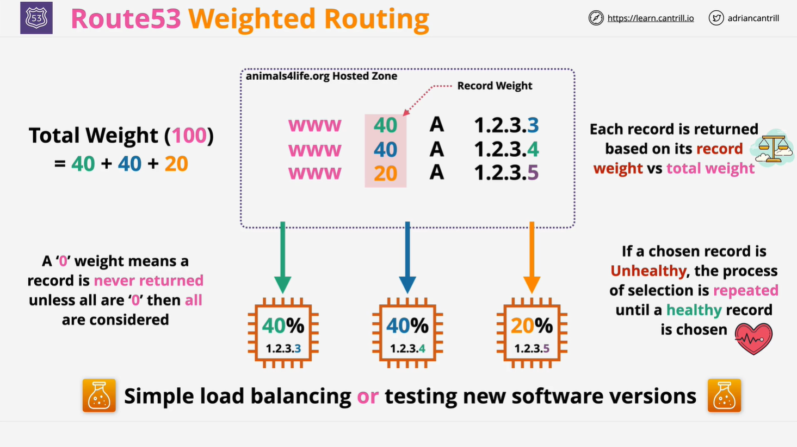

# AWS Route 53 Weighted Routing

## Overview

This lesson covers **Weighted Routing**, a type of routing policy in **AWS Route 53** that enables simple load balancing and controlled traffic distribution. It is particularly useful for **gradual software rollouts** and **traffic distribution across multiple resources**.

## What is Weighted Routing?

Weighted Routing allows you to **assign weights to multiple DNS records** with the same name, determining how often each record is returned in response to DNS queries.

Key features include:

- **Traffic Distribution**: Requests are distributed among multiple endpoints based on their assigned weight.
- **Weighted Control**: You can specify a numerical weight for each record to control its proportion of DNS responses.
- **Health Check Integration**: If a selected record fails a health check, Route 53 skips it and selects another.
- **Gradual Rollouts**: Useful for testing new software versions by directing a small percentage of traffic to a new instance.

## How Weighted Routing Works

1. **Create Multiple DNS Records**

   - Each record shares the same hostname (e.g., `www.example.com`).
   - Records can point to different **IP addresses** or **resources** (e.g., EC2 instances).

2. **Assign Weights**

   - Each record is given a **weight value** that determines its proportion of returned responses.
   - Example:
     - **Record A**: Weight `40`
     - **Record B**: Weight `40`
     - **Record C**: Weight `20`
   - The total weight = `40 + 40 + 20 = 100`.
   - Route 53 returns:
     - **Record A → 40% of the time**
     - **Record B → 40% of the time**
     - **Record C → 20% of the time**

3. **Handling a Weight of Zero**

   - A weight of `0` means the record is **never returned**.
   - This is useful for temporarily **removing** a resource from DNS resolution.
   - If **all records** have a weight of `0`, then all records are returned equally.

4. **Health Check Integration**
   - Weighted Routing can be **combined with health checks**.
   - If a record is **unhealthy**, it is **skipped**, and the selection process repeats.
   - **Important:** Unhealthy records are **not removed from weight calculations**. They are only **skipped** when selected.

## Example Scenario: Load Balancing

Imagine you have **three EC2 instances** handling web traffic:

| Instance | IP Address  | Assigned Weight | Percentage of Traffic |
| -------- | ----------- | --------------- | --------------------- |
| EC2-1    | 192.168.1.1 | 40              | 40%                   |
| EC2-2    | 192.168.1.2 | 40              | 40%                   |
| EC2-3    | 192.168.1.3 | 20              | 20%                   |

When users access `www.example.com`, Route 53 distributes DNS responses as follows:

- **40% of requests → EC2-1 (192.168.1.1)**
- **40% of requests → EC2-2 (192.168.1.2)**
- **20% of requests → EC2-3 (192.168.1.3)**

If EC2-3 becomes **unhealthy**, it is **skipped**, and traffic is distributed **only between EC2-1 and EC2-2**.

## Example Scenario: Software Rollout

Suppose you are **deploying a new version of your application** on a separate server and want to direct **5% of users** to the new version while keeping **95% on the stable version**.

| Server         | IP Address  | Assigned Weight | Traffic Distribution |
| -------------- | ----------- | --------------- | -------------------- |
| Stable Version | 192.168.1.1 | 95              | 95%                  |
| New Version    | 192.168.1.2 | 5               | 5%                   |

- This method allows for a **gradual deployment** and rollback if issues arise.

## Weighted Routing vs. Other Routing Policies

| Routing Policy          | Traffic Control           | Health Checks | Use Case                                                             |
| ----------------------- | ------------------------- | ------------- | -------------------------------------------------------------------- |
| **Simple Routing**      | ❌ No                     | ❌ No         | Single static resource (e.g., a web server).                         |
| **Failover Routing**    | ❌ No                     | ✅ Yes        | Active-standby setup (e.g., primary web server with an S3 failover). |
| **Multi-Value Routing** | ✅ Yes (random selection) | ✅ Yes        | Multiple healthy endpoints with random DNS responses.                |

|
