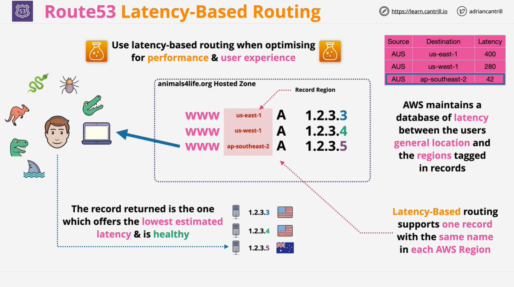

# AWS Route 53 Latency-Based Routing

## Overview

**Latency-Based Routing (LBR)** in **AWS Route 53** is a routing policy designed to improve application performance by directing users to the **lowest-latency resource**. This is particularly useful for **global applications** where users are spread across different geographical regions.

### Key Features:

- **Optimized for performance**: Routes users to the AWS region with the **lowest latency**.
- **Uses AWS latency database**: AWS maintains a latency database to determine the best region for each user.
- **One record per AWS region**: Each DNS record can be associated with **one AWS region**.
- **Supports health checks**: If a selected resource is **unhealthy**, Route 53 selects the next **lowest latency** resource.

## How Latency-Based Routing Works

### Step 1: Creating DNS Records

- In **Route 53**, we create a **hosted zone** for a domain (e.g., `example.com`).
- We then create **multiple records** with the **same name** (e.g., `www.example.com`).
- Each record is assigned an **IP address** (A record) or **domain name** (CNAME) that maps to a specific AWS region.

### Step 2: Assigning AWS Regions

Each record is associated with an AWS region where the infrastructure is located:

| Record Name     | Type | IP Address  | AWS Region     |
| --------------- | ---- | ----------- | -------------- |
| www.example.com | A    | 192.168.1.1 | US East 1      |
| www.example.com | A    | 192.168.2.1 | US West 1      |
| www.example.com | A    | 192.168.3.1 | AP Southeast 2 |

### Step 3: AWS Latency Database

- AWS **maintains a latency database** that tracks network latencies between regions.
- When a **user makes a DNS request**, Route 53:
  1. **Identifies the user's location** using an **IP lookup service**.
  2. **Queries the AWS latency database** to determine the **lowest-latency region**.
  3. **Returns the IP address of the resource in that region**.

### Example:

- A **user in Australia** requests `www.example.com`.
- AWS checks the latency database:
  - **US East 1**: 250 ms
  - **US West 1**: 200 ms
  - **AP Southeast 2**: **50 ms** (lowest)
- **Route 53 returns the AP Southeast 2 record**.

## Latency-Based Routing with Health Checks

- **Health checks** ensure that only **healthy** endpoints are used.
- If the **lowest-latency record fails**, Route 53 selects the **next best option**.

### Example:

1. A user in **Australia** is routed to **AP Southeast 2**.
2. **AP Southeast 2 becomes unhealthy**.
3. **Next lowest latency region (US West 1) is used**.

> ⚠️ **Important:** The AWS latency database is **not real-time** and does not account for **local network issues**. It is updated periodically.

## Use Cases

| Use Case                         | Benefit                                                  |
| -------------------------------- | -------------------------------------------------------- |
| **Global applications**          | Improves user experience by reducing latency.            |
| **Multi-region AWS deployments** | Ensures traffic goes to the nearest AWS region.          |
| **Gaming applications**          | Provides lower ping times for players.                   |
| **Streaming services**           | Reduces buffering by directing users to the fastest CDN. |
| **Enterprise SaaS platforms**    | Enhances performance for worldwide customers.            |

## Latency-Based Routing vs. Other Routing Policies

| Routing Policy            | Traffic Control    | Health Checks | Use Case                                                      |
| ------------------------- | ------------------ | ------------- | ------------------------------------------------------------- |
| **Simple Routing**        | ❌ No              | ❌ No         | Static, single-record responses.                              |
| **Failover Routing**      | ❌ No              | ✅ Yes        | Active-standby architecture (e.g., primary & backup servers). |
| **Weighted Routing**      | ✅ Yes (manual)    | ✅ Yes        | Traffic distribution based on weights (e.g., A/B testing).    |
| **Multi-Value Routing**   | ✅ Yes (random)    | ✅ Yes        | Random selection among multiple healthy records.              |
| **Latency-Based Routing** | ✅ Yes (automatic) | ✅ Yes        | Directs users to the lowest-latency resource.                 |

### Key Differences:

- **Simple Routing**: Always returns the same record.
- **Failover Routing**: Redirects to a backup if the primary is down.
- **Weighted Routing**: Manually distributes traffic based on assigned weights.
- **Multi-Value Routing**: Randomly selects from multiple healthy records.
- **Latency-Based Routing**: **Automatically** selects the best resource **based on latency**.

## Summary

- **Latency-Based Routing** improves performance by directing users to the **nearest, lowest-latency AWS region**.
- Uses AWS's **latency database** to determine the best region for each request.
- **Supports health checks**: If a record is unhealthy, the next best option is chosen.
- **Great for global applications** like gaming, streaming, and enterprise services.
- **Does not account for real-time network issues**, but significantly improves performance.

## Next Steps

- **Create a latency-based routing policy** in Route 53.
- **Test latency behavior** using AWS's `dig` or `nslookup` commands.
- **Combine with health checks** for better reliability.
- **Continue to the next lesson** to learn more about AWS networking.
