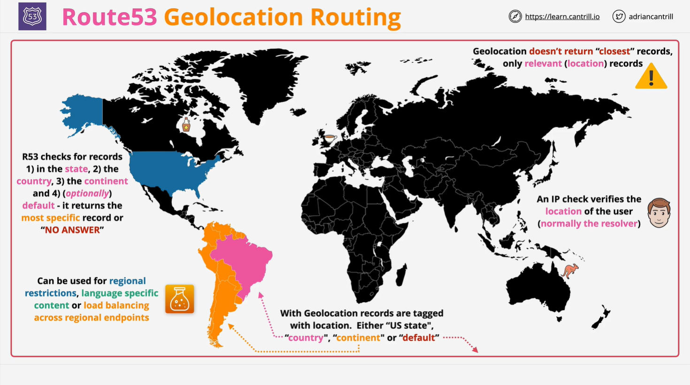

# AWS Route 53 Geo Location Routing

## Overview

**Geo Location Routing (GLR)** in **AWS Route 53** is a routing policy that **routes traffic based on the user's geographic location** instead of network latency. It allows you to control the distribution of DNS responses based on the **country, continent, or state** from which a request originates.

### Key Features:

- **Routes traffic based on geographic location** rather than latency.
- **Uses ISO country and continent codes** to tag DNS records.
- **Supports US state-level granularity**.
- **Allows default records** for unmatched locations.
- **Does not return the closest record**, only the **most relevant** one.

## How Geo Location Routing Works



### Step 1: Creating DNS Records

- In **Route 53**, we create a **hosted zone** for a domain (e.g., `example.com`).
- We then create **multiple records** with the **same name** (e.g., `www.example.com`).
- Each record is **tagged with a geographic location**.

### Step 2: Assigning Geographic Locations

Each record can be assigned one of the following location types:

| Record Name     | Type | IP Address  | Location                       |
| --------------- | ---- | ----------- | ------------------------------ |
| www.example.com | A    | 192.168.1.1 | US (Country)                   |
| www.example.com | A    | 192.168.2.1 | SA (Continent - South America) |
| www.example.com | A    | 192.168.3.1 | CA (Country - Canada)          |
| www.example.com | A    | 192.168.4.1 | NY (State - New York, USA)     |
| www.example.com | A    | 192.168.5.1 | Default                        |

### Step 3: User Location Identification

- When a **DNS request** is made, **Route 53 identifies the user’s location** using **IP lookup services**.
- Based on this **location**, Route 53 **matches it against the tagged records**.

## Geo Location Record Selection Process

1. **Checks the user's state (for US users only)**:

   - If a **record exists for the user’s state**, return that record.
   - Example: A user in **California (CA)** gets a record specifically tagged with **CA**.

2. **Checks the user's country**:

   - If **no state record matches**, Route 53 checks the **country**.
   - Example: A **user in Canada** receives a record tagged **CA** (Canada).

3. **Checks the user's continent**:

   - If **no country record matches**, Route 53 checks the **continent**.
   - Example: A **user in Brazil** gets a record tagged **SA** (South America).

4. **Returns the default record (if defined)**:

   - If **no specific location-based record** matches, Route 53 **returns the default record**.

5. **Returns "No Answer" if no match exists**:
   - If **no record matches** and **no default is set**, the DNS query **fails**.

## Key Differences: Geo Location vs. Latency-Based Routing

| Feature                   | Geo Location Routing                                      | Latency-Based Routing                               |
| ------------------------- | --------------------------------------------------------- | --------------------------------------------------- |
| **Routing Criterion**     | User's **geographic location** (IP-based)                 | **Network latency** between user & AWS regions      |
| **Routing Goal**          | Restrict/control access based on location                 | Improve application **performance**                 |
| **Closest Resource?**     | ❌ No                                                     | ✅ Yes                                              |
| **Best for?**             | Content restrictions, compliance, language-specific sites | Global applications needing low-latency connections |
| **Health Check Support?** | ✅ Yes                                                    | ✅ Yes                                              |

## Key Limitations

- **Geo Location Routing does NOT return the closest record**.
- **Requires an explicit match** (state → country → continent → default).
- **If no matching record exists and no default is set, the request fails**.
- **IP-based location may not always be accurate** due to proxies and ISP configurations.

## Use Cases

| Use Case                            | Benefit                                                                     |
| ----------------------------------- | --------------------------------------------------------------------------- |
| **Restricting content by region**   | Control access based on geographic policies (e.g., GDPR, US-only services). |
| **Language-based content delivery** | Show region-specific content (e.g., `es.example.com` for Spain).            |
| **Load balancing across regions**   | Distribute traffic based on user locations.                                 |
| **Local compliance**                | Ensure users access data centers based on legal/regulatory requirements.    |
| **Targeted marketing**              | Serve region-specific promotions, pricing, or ads.                          |

## Configuration Example

Below is an **example configuration** in **AWS Route 53** for **Geo Location Routing**.

```json
{
  "HostedZoneId": "Z3ABCDEFGHIJKL",
  "ChangeBatch": {
    "Changes": [
      {
        "Action": "CREATE",
        "ResourceRecordSet": {
          "Name": "www.example.com",
          "Type": "A",
          "SetIdentifier": "US-Only",
          "GeoLocation": { "CountryCode": "US" },
          "TTL": 300,
          "ResourceRecords": [{ "Value": "192.168.1.1" }]
        }
      },
      {
        "Action": "CREATE",
        "ResourceRecordSet": {
          "Name": "www.example.com",
          "Type": "A",
          "SetIdentifier": "EU-Only",
          "GeoLocation": { "ContinentCode": "EU" },
          "TTL": 300,
          "ResourceRecords": [{ "Value": "192.168.2.1" }]
        }
      },
      {
        "Action": "CREATE",
        "ResourceRecordSet": {
          "Name": "www.example.com",
          "Type": "A",
          "SetIdentifier": "Default",
          "GeoLocation": {},
          "TTL": 300,
          "ResourceRecords": [{ "Value": "192.168.3.1" }]
        }
      }
    ]
  }
}
```

### Explanation:

1. **US-Based Traffic**:
   - Requests from **users in the US** will receive the **192.168.1.1** record.
2. **European Continent Traffic**:

   - Requests from **users in Europe** will receive the **192.168.2.1** record.

3. **Default Record**:
   - If the request does not match any specific country/continent, Route 53 **returns the default record** (`192.168.3.1`).

## Summary

- **Geo Location Routing** directs DNS requests based on **geographic location**, not **network proximity**.
- **Hierarchy of Selection**: **State (US) → Country → Continent → Default**.
- **If no relevant record exists and no default is set, Route 53 returns no answer**.
- **Best for content restriction, language-based routing, and regional load balancing**.
- **Not ideal for optimizing performance**—use **Latency-Based Routing** instead.

## Next Steps

- **Create a Geo Location routing policy** in AWS Route 53.
- **Test DNS resolution** from different locations using `dig` or `nslookup`.
- **Understand compliance needs** before using this policy.
- **Proceed to the next lesson** for more AWS networking insights.
