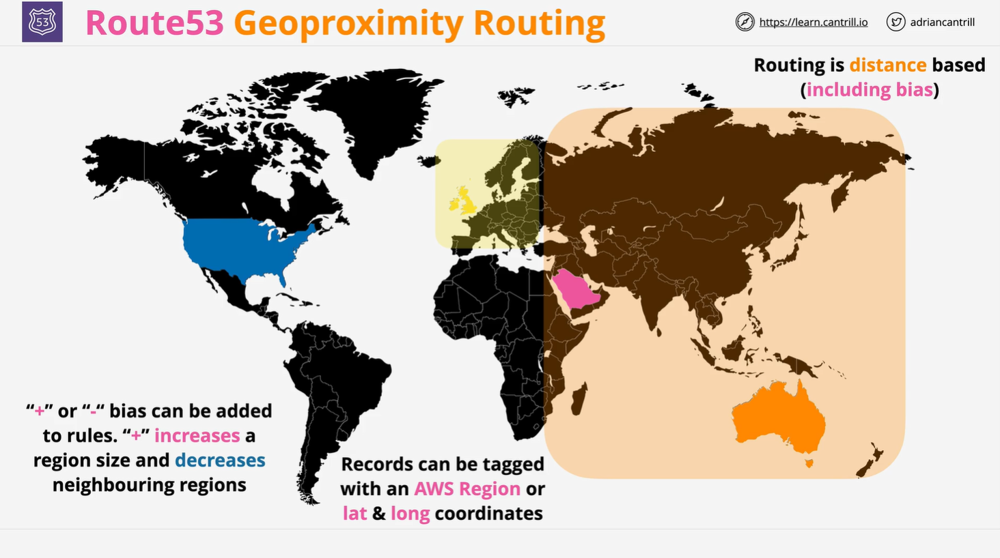

# AWS Route 53 Geo Proximity Routing

## Overview

**Geo Proximity Routing (GPR)** in **AWS Route 53** is a routing policy that directs users to **the closest resource based on geographic distance** rather than network latency. It allows for **custom traffic shaping** using a **bias value** to expand or shrink a resource’s effective service area.

### Key Features:

- **Routes traffic based on geographic distance**, not latency.
- **Supports AWS and external resources** (lat/lon coordinates).
- **Uses a bias to adjust service area** for more control.
- **Helps influence routing decisions beyond physical distance**.

## How Geo Proximity Routing Works



### Step 1: Defining Resources

- Each resource is assigned a **geographic location**.
- **AWS resources** (e.g., EC2, ALB) use **AWS region identifiers** (e.g., `us-east-1`, `ap-southeast-2`).
- **Non-AWS resources** require **latitude and longitude coordinates**.

### Step 2: Mapping User Requests

- When a **DNS request** is made, Route 53 **calculates the geographic distance** between:
  - The **user's IP-based location**.
  - The **defined resource locations**.
- The **nearest resource** is selected based on **pure geographic distance**.

### Step 3: Applying Bias (Optional)

- A **bias** allows you to **increase or decrease a resource's service area**.
- A **positive (+) bias** makes a resource appear **closer** than it actually is.
- A **negative (-) bias** makes a resource appear **farther** than it actually is.

## Example Scenario

### Without Bias

Let's assume we have **three resources** in **different locations**:

- **USA** (`us-east-1`)
- **UK** (`eu-west-2`)
- **Australia** (`ap-southeast-2`)

A user in **Saudi Arabia**:

- **10,000 km from Australia**
- **6,700 km from the UK**

**By default**, Route 53 routes the user to the **UK resource** (since it's geographically closer).

### With Bias Applied

| Resource Location                | Bias  | Effect                                                                      |
| -------------------------------- | ----- | --------------------------------------------------------------------------- |
| **UK (`eu-west-2`)**             | `+10` | Expands service area to include **more surrounding countries**.             |
| **Australia (`ap-southeast-2`)** | `+50` | Expands service area to include **Saudi Arabia**, even though it's farther. |

Now, **Saudi Arabian users are routed to Australia** instead of the UK due to the **bias shifting the calculation**.

## Key Differences: Geo Proximity vs. Geo Location vs. Latency-Based Routing

| Feature                     | Geo Proximity Routing                                | Geo Location Routing            | Latency-Based Routing  |
| --------------------------- | ---------------------------------------------------- | ------------------------------- | ---------------------- |
| **Routing Criterion**       | Distance-based                                       | Location-based (ISO codes)      | Latency-based          |
| **Bias Support?**           | ✅ Yes                                               | ❌ No                           | ❌ No                  |
| **AWS & External Support?** | ✅ Yes                                               | ✅ Yes                          | ✅ Yes                 |
| **Closest Resource?**       | ✅ Yes (unless bias applied)                         | ❌ No                           | ✅ Yes                 |
| **Best for?**               | Traffic control by adjusting effective service areas | Content restriction, compliance | Optimizing performance |

## Key Limitations

- **Distance-based, not latency-based**: It does not guarantee the best network performance.
- **Requires defined locations**: AWS resources use regions; non-AWS require lat/lon.
- **Bias can override natural routing**: If applied incorrectly, traffic may route inefficiently.

## Use Cases

| Use Case                                        | Benefit                                                    |
| ----------------------------------------------- | ---------------------------------------------------------- |
| **Adjust traffic flow based on business needs** | Expand or shrink service areas to match demand.            |
| **Regional load balancing with custom rules**   | Ensure traffic is evenly distributed based on needs.       |
| **Regulatory compliance**                       | Route users within allowed regions using bias adjustments. |
| **Improve failover strategies**                 | Shift traffic dynamically in case of partial outages.      |

## Configuration Example

Below is an **example configuration** in **AWS Route 53** for **Geo Proximity Routing** with **bias adjustments**.

```json
{
  "HostedZoneId": "Z3ABCDEFGHIJKL",
  "ChangeBatch": {
    "Changes": [
      {
        "Action": "CREATE",
        "ResourceRecordSet": {
          "Name": "www.example.com",
          "Type": "A",
          "SetIdentifier": "US-Region",
          "GeoProximityLocation": { "AWSRegion": "us-east-1", "Bias": 0 },
          "TTL": 300,
          "ResourceRecords": [{ "Value": "192.168.1.1" }]
        }
      },
      {
        "Action": "CREATE",
        "ResourceRecordSet": {
          "Name": "www.example.com",
          "Type": "A",
          "SetIdentifier": "UK-Region",
          "GeoProximityLocation": { "AWSRegion": "eu-west-2", "Bias": 10 },
          "TTL": 300,
          "ResourceRecords": [{ "Value": "192.168.2.1" }]
        }
      },
      {
        "Action": "CREATE",
        "ResourceRecordSet": {
          "Name": "www.example.com",
          "Type": "A",
          "SetIdentifier": "Australia-Region",
          "GeoProximityLocation": { "AWSRegion": "ap-southeast-2", "Bias": 50 },
          "TTL": 300,
          "ResourceRecords": [{ "Value": "192.168.3.1" }]
        }
      }
    ]
  }
}
```

### Explanation:

1. **US Resource (`us-east-1`)**

   - **No bias applied** (neutral).
   - Traffic goes to this region only if it's **naturally the closest**.

2. **UK Resource (`eu-west-2`)**

   - **Bias of +10** applied.
   - Slightly **expands the service area** around the UK.

3. **Australia Resource (`ap-southeast-2`)**
   - **Bias of +50** applied.
   - **Significantly expands the service area**, allowing traffic from **Saudi Arabia** to route here instead of the UK.

## Summary

- **Geo Proximity Routing** directs traffic to **the nearest resource based on physical distance**.
- **Bias values** allow manual adjustments, expanding or shrinking a resource's effective range.
- **Different from Geo Location Routing**, which works strictly on **ISO location codes**.
- **Different from Latency-Based Routing**, which focuses on **network performance** rather than physical distance.
- **Best for scenarios where traffic shaping based on geography is needed**.

## Next Steps

- **Set up Geo Proximity Routing in AWS Route 53**.
- **Experiment with bias values** to see how they influence routing decisions.
- **Use AWS Route 53 Traffic Flow** for advanced routing strategies.
- **Proceed to the next lesson** in the AWS SA-C03 course.
