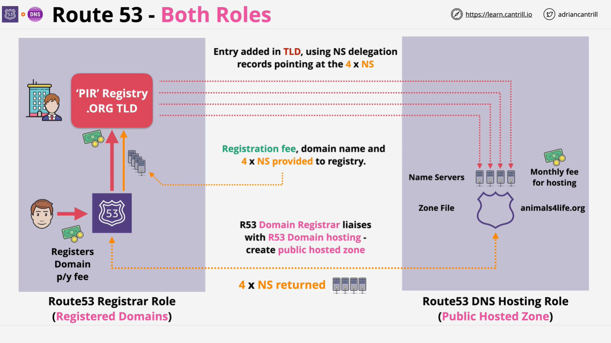
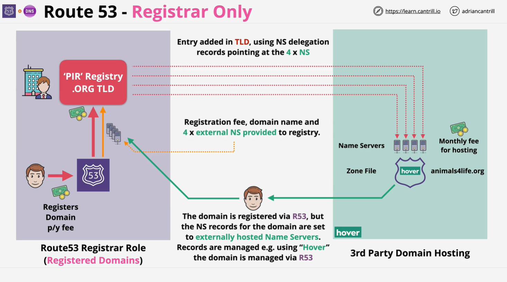
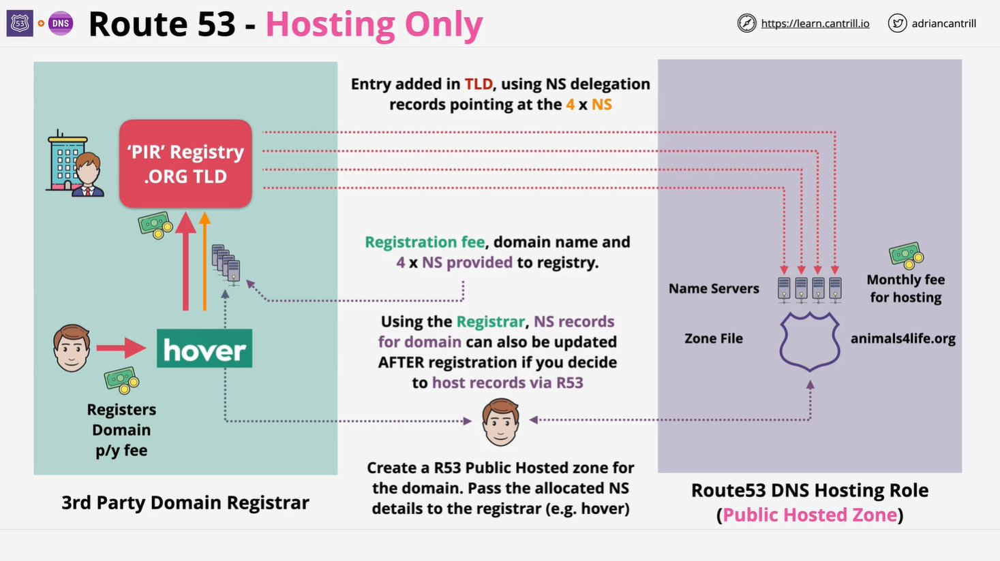

# AWS Route 53 Interoperability

## Overview

**Route 53 Interoperability** refers to how AWS Route 53 can function as a **domain registrar** or **DNS hosting provider** independently, or perform both roles together. While Route 53 typically handles both domain registration and DNS hosting, it is possible to use them separately, integrating with third-party services.

## Key Concepts

When registering a domain using Route 53, AWS performs two distinct functions:

1. **Domain Registration** - Registers a domain name on behalf of the user.
2. **DNS Hosting** - Provides DNS services by allocating name servers and managing zone files.

These two functions can be provided together or separately depending on the architecture.

## Domain Registration Process in Route 53

When a domain is registered using AWS Route 53, the following steps occur:

1. **Payment Processing:**

   - The user pays an upfront fee for domain registration (annually or for multiple years).

2. **DNS Server Allocation:**

   - Route 53 assigns four DNS name servers to handle domain resolution.

3. **Zone File Creation:**

   - A hosted zone file is created and stored on the allocated name servers.

4. **Registry Communication:**

   - Route 53 communicates with the domain registry responsible for the domain's **top-level domain (TLD)** (e.g., `.com`, `.org`).

5. **Registrar-Registry Relationship:**

   - Route 53 acts as a **registrar**, liaising with the **registry** to officially register the domain.

6. **Name Server Registration:**
   - The registry stores the domain entry and assigns the four name servers, completing the registration.

Once this process is complete, the domain is live and ready for use on the internet.

## Components of Domain Management

### **1. Traditional Architecture - Using Route 53 for Both Registration & Hosting**

This is the most common setup where **Route 53 handles both roles**:

- **Domain Registrar Role:** Manages domain name registration (found in "Registered Domains" in Route 53 Console).
- **DNS Hosting Role:** Hosts DNS records in the **Public Hosted Zone** of Route 53.

**Steps:**

1. User registers a domain via Route 53.
2. Route 53 assigns four name servers.
3. A hosted zone is created for DNS records.
4. The domain is registered with the TLD registry, linking to the assigned name servers.
5. The domain is live on the internet.
6. The user pays a **one-time** domain registration fee and a **monthly** DNS hosting fee.

This is the **default and recommended setup** as it offers better integration and management.

### **2. Route 53 as a Registrar Only (Using Third-Party DNS Hosting)**

In this setup, Route 53 **only registers the domain**, while another provider handles **DNS hosting**.

**Example: Route 53 + Hover (Third-Party DNS Provider)**

1. User registers a domain via Route 53.
2. Route 53 liaises with the TLD registry.
3. A third-party DNS provider (e.g., Hover) creates a hosted zone.
4. The third-party provider assigns its own name servers.
5. The user manually updates Route 53 with these name servers.
6. The registry now points to the third-party DNS servers instead of AWS Route 53.

**Disadvantages:**

- Requires more **manual configuration**.
- No benefit from **Route 53's powerful DNS services**.
- Increased complexity and potential for misconfigurations.

This setup is **not common** because it offers **no major advantage** over fully using Route 53.

### **3. Route 53 as a DNS Host Only (Using a Third-Party Registrar)**

In this setup, a **third-party registrar** handles domain registration, but Route 53 is used for **DNS hosting**.

**Example: Hover (Registrar) + Route 53 (DNS Hosting)**

1. A domain is registered with **Hover** (or another registrar).
2. Hover liaises with the TLD registry for domain registration.
3. The user creates a **public hosted zone** in Route 53.
4. Route 53 assigns four name servers.
5. The user updates Hover's domain settings to point to Route 53 name servers.
6. The registry updates the domain with Route 53's name servers.

**Advantages:**

- Useful for businesses with **existing domain registrations** but wanting **AWS’s powerful DNS features**.
- Route 53 provides **scalability, latency-based routing, and failover capabilities**.

This architecture is **common in enterprises** that need advanced DNS management but have legacy domains registered with other providers.

## Summary

| Configuration                 | Domain Registered With | DNS Hosted With | Use Case                                                    |
| ----------------------------- | ---------------------- | --------------- | ----------------------------------------------------------- |
| **Traditional (Recommended)** | Route 53               | Route 53        | Best for full AWS integration, automation, and ease of use. |
| **Registrar Only**            | Route 53               | Third-Party     | Rare; adds complexity with little benefit.                  |
| **DNS Host Only**             | Third-Party            | Route 53        | Common when migrating legacy domains to AWS DNS.            |

- **Route 53 has two roles: Registrar & DNS Hosting.**
- You can use **both roles together** or **separate them**.
- **DNS hosting in Route 53 is the most valuable feature**; using Route 53 only as a registrar is uncommon.
- **Businesses often migrate existing domains to Route 53 for DNS hosting** while keeping their existing registrar.

## Key Takeaways

1. **Always differentiate** between a **registrar** (who registers the domain) and a **DNS host** (who provides name servers and manages records).
2. **Route 53 as a full-service provider** (Registrar + DNS Hosting) is the **recommended** setup.
3. **If migrating domains**, you can keep your third-party registrar but benefit from **Route 53’s DNS hosting**.
4. **Avoid using Route 53 as a registrar only** unless there is a **specific requirement**.
5. **Understanding this architecture is crucial** for developers and engineers working with DNS-based applications and troubleshooting domain issues.

## Conclusion

AWS Route 53 provides a **scalable, highly available DNS service**. While it offers both **domain registration** and **DNS hosting**, these functions can be used separately based on business needs.

For **best performance and ease of management**, using Route 53 for **both** is recommended. However, if working with existing domain registrars, Route 53’s DNS hosting can still provide significant value in managing records, failover strategies, and load balancing.

By understanding the distinction between **registrars and DNS hosts**, engineers and developers can better architect their AWS-based applications and domain management strategies.
