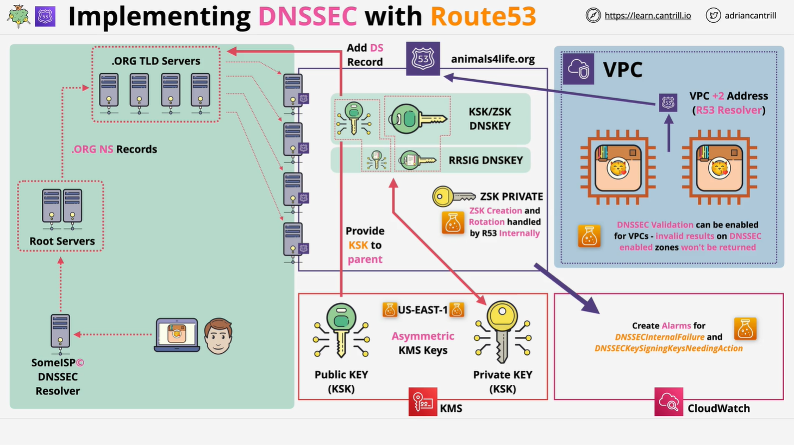

# Implementing DNSSEC in AWS Route 53

## Prerequisites

Before implementing DNSSEC in Route 53, it's recommended to have an understanding of:

- DNS and DNSSEC fundamentals.
- How Route 53 normally processes DNS queries.

## Route 53 DNS Resolution Process



A typical DNS resolution process in Route 53 follows these steps:

1. A DNS query starts from a client machine.
2. The query is sent to a DNS resolver.
3. The resolver queries the root DNS servers.
4. The root servers direct the query to the `.org` top-level domain (TLD) servers.
5. The TLD servers forward the query to the authoritative Route 53 name servers.
6. Route 53 returns the requested DNS record.

## Enabling DNSSEC in Route 53

Enabling DNSSEC in Route 53 can be done through the AWS Management Console or AWS CLI. The process involves:

### 1. Key Management with AWS KMS

- Route 53 generates an asymmetric key pair in AWS Key Management Service (KMS), creating:
  - A **public key**
  - A **private key**
- These keys are used to generate the **Key Signing Key (KSK)**.
- KMS keys must be created in the **us-east-1** region.

### 2. Generating the Zone Signing Key (ZSK)

- Route 53 internally creates and manages the **Zone Signing Key (ZSK)**.
- KMS is **not involved** in ZSK creation.

### 3. Publishing DNSSEC Records

- Route 53 adds the **public** parts of the KSK and ZSK into the hosted zone as DNSKEY records.
- The **private** KSK is used to sign the DNSKEY records, generating **RR-SIG** records.
- These signatures allow DNS resolvers to validate the DNSKEY records.

### 4. Establishing Chain of Trust with Parent Zone

To complete DNSSEC setup, a **Delegation Signer (DS) record** must be added to the parent domain:

- If the domain is registered in Route 53, this can be done via the **Registered Domains** section.
- If the domain is registered outside AWS, the DS record must be added manually at the domain registrar.
- The DS record contains a hash of the **public KSK**.

## Monitoring and Validation

### Configuring CloudWatch Alarms

It is recommended to configure CloudWatch alarms for:

1. **DNSSEC internal failures**
2. **KSK issues requiring action**

### Enabling DNSSEC Validation for VPCs

- If enabled, AWS will validate DNSSEC signatures for queries within the VPC.
- If a signature is invalid, the DNS record is **not returned**.

## Step-by-Step Implementation

### 1. Enabling DNSSEC via AWS Console

- Navigate to **Route 53** > **Hosted Zones**
- Select the hosted zone (e.g., `animalsforlife.org`).
- Click on **DNSSEC Signing** > **Enable DNSSEC Signing**.
- Create a new **KSK** using AWS KMS.

### 2. Verifying DNSSEC Records

Before enabling DNSSEC, running the following command should return **no DNSSEC results**:

```sh
dig animalsforlife.org DNSKEY +dnssec
```

After enabling DNSSEC, running the same command should now return **DNSKEY records**.

### 3. Establishing Chain of Trust

- Navigate to **Registered Domains** in Route 53.
- Select `animalsforlife.org` and go to **Manage Keys**.
- Copy the **public KSK** from the hosted zone and enter it in the **DS Record** section.
- The parent zone (`.org`) will now recognize this domain as DNSSEC-signed.

### 4. Verifying DS Record Propagation

Check if the `.org` top-level domain has received the DS record:

```sh
dig org NS +short
```

- Pick one of the `.org` name servers.
- Query for the DS record:

```sh
dig animalsforlife.org DS @<org-NS-server>
```

If successful, the response should contain the DS record for `animalsforlife.org`.

### 5. Testing Signed DNS Records

1. Create a test DNS record (`test.animalsforlife.org`):

   - Type: A record
   - Value: `1.1.1.1`
   - TTL: 1 minute

2. Run a standard DNS query:

```sh
dig test.animalsforlife.org A
```

3. Run a DNSSEC query:

```sh
dig test.animalsforlife.org A +dnssec
```

- The response should now include an **RR-SIG record**, indicating that the DNS record is signed.

## Conclusion

By following these steps, DNSSEC is successfully enabled for Route 53-hosted zones. This setup ensures:

- Data integrity by preventing DNS spoofing.
- End-to-end trust from the root DNS servers to the hosted zone.

This process involves multiple steps, including KMS key creation, enabling DNSSEC signing, and establishing trust with the parent zone. Careful monitoring with CloudWatch is recommended to detect any issues in the setup.
