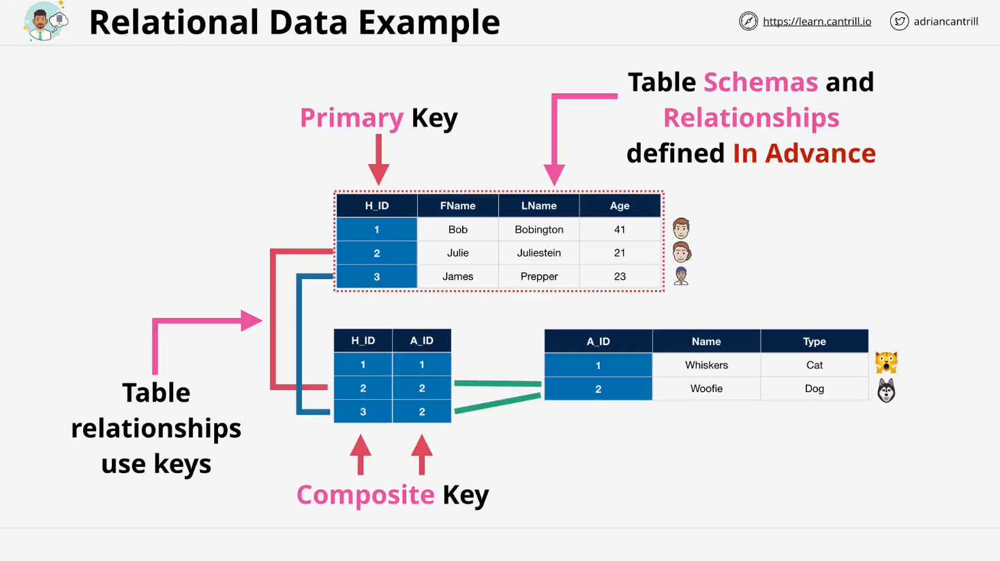

# Database Fundamentals

## Introduction

This lesson introduces fundamental database concepts relevant to AWS Solutions Architect certification. It covers the distinction between relational and non-relational databases, database schemas, relationships, and primary keys.

## Database Overview

Databases are systems designed to store and manage data. They are broadly classified into:

1. **Relational Databases (SQL-based)**
2. **Non-Relational Databases (NoSQL-based)**

Each type has different ways of storing, retrieving, and managing data.

## Relational Databases (SQL-based)

Relational databases follow a structured approach to data storage and retrieval.

### Characteristics

- Data is stored in **tables** consisting of **columns** (attributes) and **rows** (records).
- A **schema** defines the structure, specifying attribute names, data types, and valid values.
- Relationships between tables are **predefined** and fixed.
- Use **Structured Query Language (SQL)** for data manipulation.
- Tables have a **primary key**, which uniquely identifies each row.

### Example: A Simple Pet Database

Consider a database storing human and pet information.

#### **Human Table**

| Human ID (Primary Key) | First Name | Last Name | Age |
| ---------------------- | ---------- | --------- | --- |
| 1                      | John       | Doe       | 30  |
| 2                      | Julie      | Smith     | 25  |
| 3                      | James      | Brown     | 40  |

#### **Animal Table**

| Animal ID (Primary Key) | Name     | Type |
| ----------------------- | -------- | ---- |
| 1                       | Whiskers | Cat  |
| 2                       | Woofie   | Dog  |

#### **Join Table (Human-Animal Relationship)**

| Human ID | Animal ID |
| -------- | --------- |
| 1        | 1         |
| 2        | 2         |
| 3        | 2         |

### **Explanation**

- **Human Table:** Stores human details with a unique `Human ID`.
- **Animal Table:** Stores pet details with a unique `Animal ID`.
- **Join Table:** Establishes a **many-to-many relationship**, allowing a human to have multiple pets and vice versa.
- The **composite key** in the join table consists of `Human ID` and `Animal ID`, ensuring uniqueness.

### **Limitations of Relational Databases**

- **Fixed Schema:** The structure must be defined before data insertion.
- **Rigid Relationships:** Relationships between tables are predefined, making changes difficult.
- **Not Ideal for Rapidly Changing Relationships:** Example: Social networks where connections change frequently.

## Non-Relational Databases (NoSQL)

NoSQL databases do not follow the rigid structure of SQL-based databases.

### Characteristics

- **Flexible Schema:** No strict structure; data can be added without predefined attributes.
- **Various Data Models:** Includes key-value stores, document stores, column-family stores, and graph databases.
- **Scalability:** Designed for high availability and large-scale applications.
- **Ideal for Dynamic Relationships:** Example: Social networks.

## Conclusion

- **SQL Databases** are structured, relational, and suitable for fixed-schema applications.
- **NoSQL Databases** offer flexibility and are better for dynamic and evolving relationships.
- Understanding when to use each type is crucial for database design and AWS solutions architecture.

This concludes Part 1 of the database fundamentals lesson. Part 2 continues from where this lesson ends.
