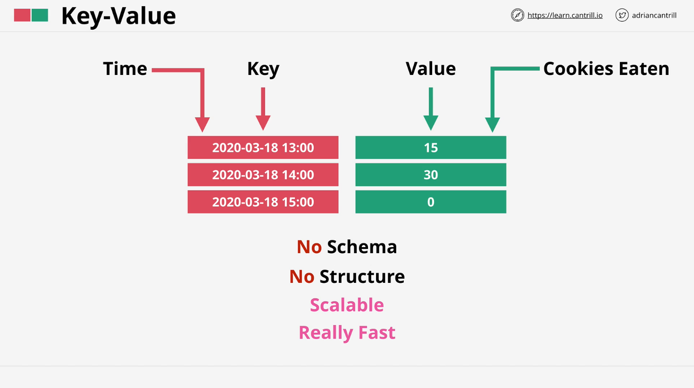
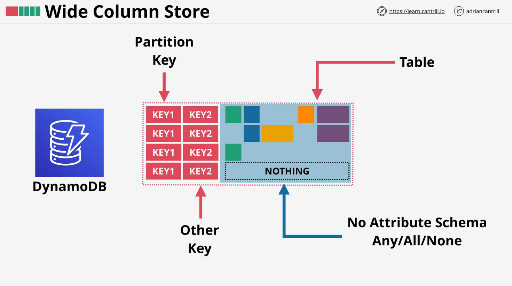
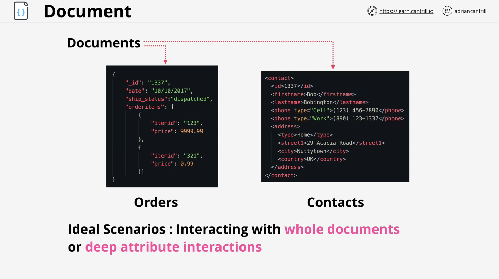
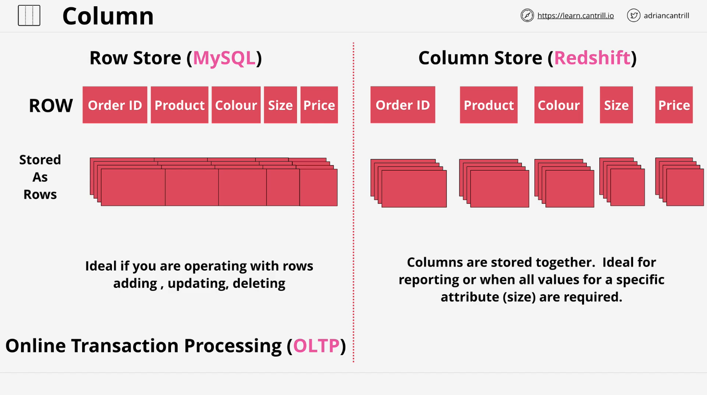
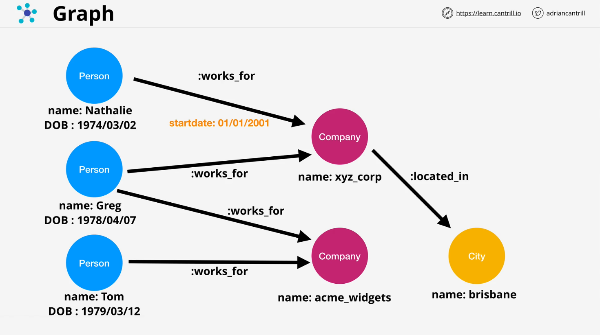

# NoSQL Databases

## Introduction

This lesson continues from the previous discussion on NoSQL databases, explaining different types and their use cases. Understanding these databases is crucial for AWS Solutions Architects, especially when choosing the right database for different application requirements.

## Types of NoSQL Databases

### 1. **Key-Value Databases**

- **Structure:** Consists of unique keys and associated values.
- **Example Use Case:** Storing sensor data, such as tracking the number of cookies eaten by animals in a rescue center.
- **Characteristics:**
  - No schema or structure.
  - Extremely scalable and fast.
  - Commonly used for in-memory caching (e.g., Redis, AWS DynamoDB in key-value mode).
- **AWS Services:** Amazon DynamoDB (when used in key-value mode), ElastiCache (for in-memory caching).
- **Exam Tip:** If a question mentions simple key-value pairs or in-memory caching, a key-value store is usually the best answer.

### 2. **Wide Column Stores**

- **Structure:**
  - Similar to key-value but allows multiple keys.
  - Each row has a primary key (partition key) and an optional secondary key (sort key).
- **Example Use Case:** Managing user sessions, storing log data, or applications with dynamic data structures.
- **Characteristics:**
  - Supports flexible schema.
  - Extremely scalable.
  - Not relational but allows structured data access.
- **AWS Service:** Amazon DynamoDB (when used in wide-column mode), Apache Cassandra.
- **Exam Tip:** Look for scenarios with high scalability needs and varying data structures.

### 3. **Document Databases**

- **Structure:**
  - Stores data as documents (JSON, XML, etc.).
  - Each document has a unique ID.
  - Documents can contain nested structures.
- **Example Use Case:** Order management systems, content management systems, user profiles.
- **Characteristics:**
  - Schema-less, but structured data can be queried.
  - Flexible indexing for deep queries.
  - Supports hierarchical relationships.
- **AWS Service:** Amazon DocumentDB, MongoDB (on AWS).
- **Exam Tip:** Suitable for applications needing flexible document structures, such as catalogs and user profiles.

### 4. **Columnar Databases**

- **Structure:**
  - Stores data by columns instead of rows.
  - Each column’s data is stored together for fast retrieval.
- **Example Use Case:** Analytics and reporting systems.
- **Characteristics:**
  - Efficient for reading large datasets and aggregations.
  - Poor at handling frequent updates or transactions.
- **AWS Service:** Amazon Redshift (data warehousing solution).
- **Exam Tip:** If the question refers to reporting, analytics, or OLAP (Online Analytical Processing), a columnar database is usually the answer.

### 5. **Graph Databases**

- **Structure:**
  - Uses nodes (entities) and edges (relationships) to store and query data.
- **Example Use Case:** Social networks, fraud detection, HR systems.
- **Characteristics:**
  - Optimized for relationship-based queries.
  - Relationships are stored within the database, making queries efficient.
- **AWS Service:** Amazon Neptune.
- **Exam Tip:** Look for scenarios involving highly connected data, such as social media connections or recommendation engines.

## Conclusion

Understanding these NoSQL database types is crucial for designing scalable and efficient solutions in AWS. For the AWS SA C03 exam, identifying the right database type based on the scenario is key.

### **Quick Exam Guide:**

| Database Type     | Best For                         | AWS Service                            |
| ----------------- | -------------------------------- | -------------------------------------- |
| Key-Value Store   | Simple, fast lookups, caching    | DynamoDB (KV mode), ElastiCache        |
| Wide Column Store | Scalable, semi-structured data   | DynamoDB (Wide Column mode), Cassandra |
| Document Store    | JSON/XML-based storage, flexible | DocumentDB, MongoDB                    |
| Columnar DB       | Analytics, reporting             | Redshift                               |
| Graph DB          | Relationship-heavy data          | Neptune                                |

By mastering these database types, you will be better equipped to answer questions in the AWS SA C03 exam and design scalable, efficient architectures.
