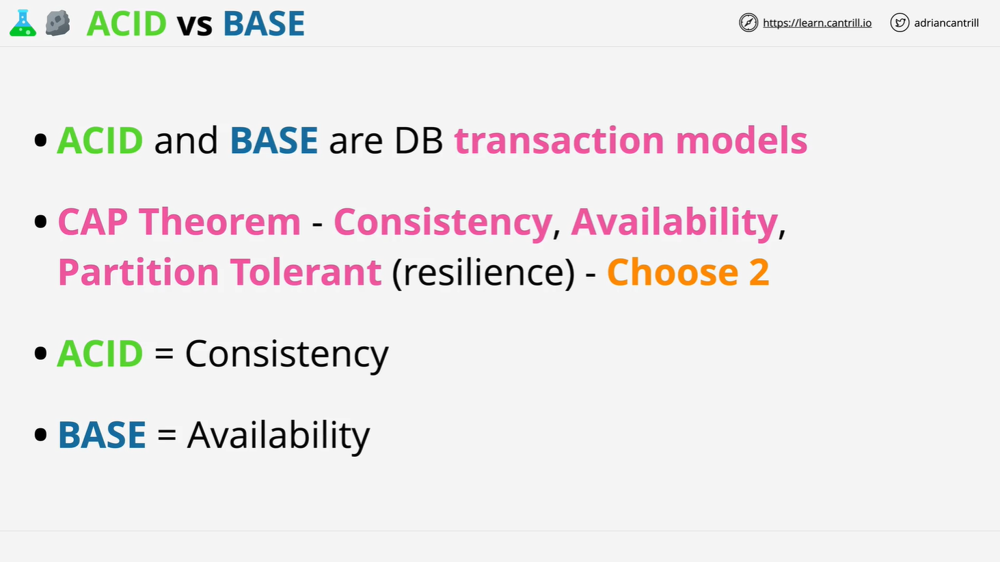
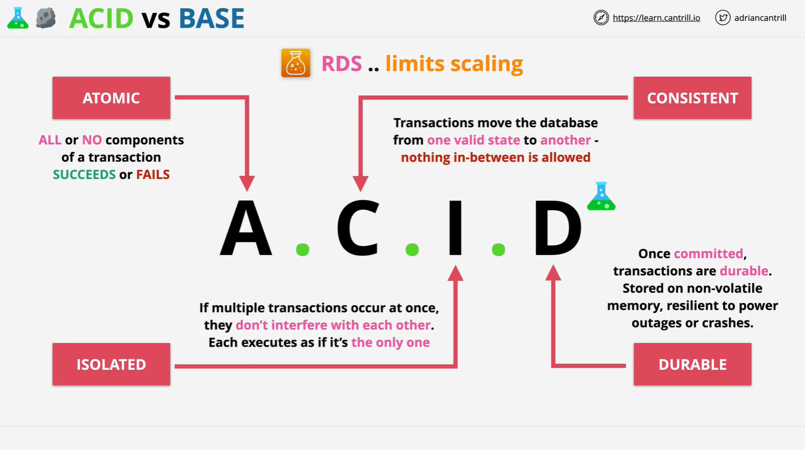
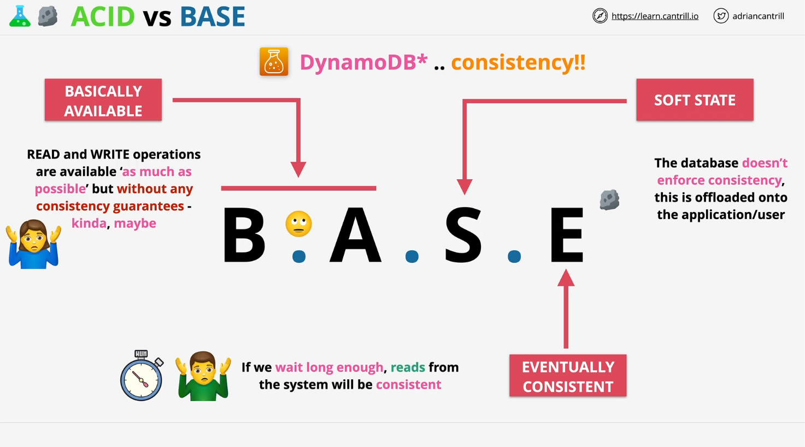

# ACID vs BASE

This document provides a detailed summary of the **ACID vs BASE** database transaction models, as covered in the **Learn Cantrill.io AWS SA C03** course. Understanding these models is essential for both the **AWS certification exam** and real-world database applications.

## **1. Introduction to ACID and BASE**

ACID and BASE are two database transaction models. These models define how transactions interact with a database, affecting its architecture and behavior.

### **CAP Theorem**

The foundation for ACID and BASE is the **CAP Theorem**, which states that a database can only provide two out of the following three guarantees:

- **Consistency:** Every read receives the most recent write or an error.
- **Availability:** Every request receives a non-error response but may not contain the most recent write.
- **Partition Tolerance:** The system continues to function even if some network nodes fail or messages are lost.

Since it's impossible to achieve all three simultaneously, database systems must choose trade-offs, leading to either **ACID** (consistency-focused) or **BASE** (availability-focused) models.

## **2. ACID - Strong Consistency Model**

ACID ensures strict transaction reliability and is commonly used in **relational databases (RDS, SQL-based systems)**. ACID stands for:

### **A - Atomicity**

- A transaction must be **all-or-nothing**.
- If any part of the transaction fails, the entire transaction is rolled back.
- Example: Transferring $10 from Account A to Account B:
  - Step 1: Deduct $10 from Account A.
  - Step 2: Add $10 to Account B.
  - If Step 2 fails, Step 1 is also reverted.

### **C - Consistency**

- The database transitions from one valid state to another.
- No partial or invalid states exist.
- Example: In a relational database, a record in Table A must have a corresponding record in Table B if a constraint requires it.

### **I - Isolation**

- Concurrent transactions do not interfere with each other.
- The final database state remains as if transactions were executed sequentially.
- Example: Two users updating the same account balance should not result in data corruption.

### **D - Durability**

- Once a transaction is committed, it remains permanent even in the case of a system crash.
- The data is securely stored to prevent loss due to failure.

#### **ACID Trade-offs**

- ACID-compliant databases **limit scalability** due to their strict rules.
- Commonly found in **financial and enterprise applications** where consistency is critical.

## **3. BASE - High Availability Model**

BASE provides a more **flexible, scalable** approach and is commonly used in **NoSQL databases (e.g., DynamoDB, Cassandra, MongoDB).** BASE stands for:

### **B - Basically Available**

- The database **remains operational** as much as possible.
- No guarantees of immediate consistency.
- Example: A distributed NoSQL database might allow writes to a node that is temporarily disconnected from the network.

### **S - Soft State**

- The system state may change over time **without external input**.
- Applications must handle possible inconsistencies.
- Example: An application may read old data before updates are fully propagated.

### **E - Eventually Consistent**

- The database will **eventually** reach consistency, but not instantly.
- Reads may return stale data until synchronization completes.
- Example: In a NoSQL database, a write operation on Node A may take time to reflect in Node B.

#### **BASE Trade-offs**

- BASE databases **sacrifice strict consistency** for **scalability and availability**.
- Suitable for **high-performance applications** such as social media, real-time analytics, and e-commerce.

## **4. ACID vs BASE - Key Differences**

| Feature                    | ACID (Relational Databases) | BASE (NoSQL Databases)  |
| -------------------------- | --------------------------- | ----------------------- |
| **Consistency**            | Immediate (Strong)          | Eventual (Weak)         |
| **Availability**           | Lower                       | Higher                  |
| **Scalability**            | Limited                     | High                    |
| **Transaction Guarantees** | Strong (Atomic, Durable)    | Weak (Best Effort)      |
| **Common Use Cases**       | Banking, ERP, Government    | Web apps, Big Data, IoT |

## **5. AWS Services and ACID/BASE**

AWS provides services that follow both models:

### **ACID-Based AWS Services**

- **Amazon RDS (Relational Database Service)**
- **Amazon Aurora**
- **Amazon Redshift**
- **DynamoDB Transactions (when explicitly enabled)**

### **BASE-Based AWS Services**

- **Amazon DynamoDB (default mode)**
- **Amazon S3 (eventual consistency for some operations)**
- **Amazon ElastiCache**
- **Amazon Neptune (Graph Database with eventual consistency options)**

## **6. Exam Tips & Key Takeaways**

- **If "ACID" is mentioned, think SQL and RDS.**
- **If "BASE" is mentioned, think NoSQL and DynamoDB.**
- **DynamoDB supports both BASE and ACID via transactions.**
- **Eventual consistency means data will be updated, but not immediately.**

Understanding these trade-offs is crucial for choosing the right AWS database solution in different use cases.

## **7. Conclusion**

- ACID is ideal for **consistency-critical applications** like banking.
- BASE is ideal for **highly scalable, high-availability applications** like social media and IoT.
- AWS provides both models, and knowing when to use each is **essential for the AWS exam and real-world cloud architecture.**
