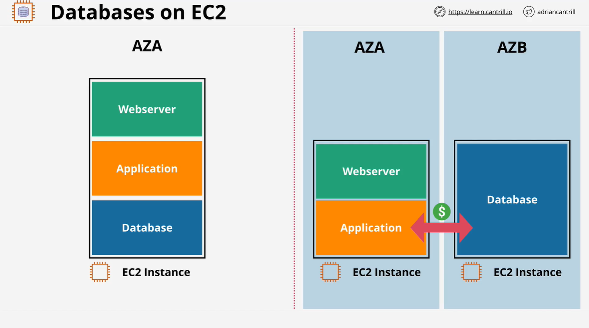

# Running Databases on EC2

## Overview

This lesson discusses the practice of running databases directly on Amazon EC2 instances. While this approach can be justified in certain scenarios, it is generally considered a bad practice due to various limitations and challenges. The lesson explores both the reasons for and against running databases on EC2, along with an architectural breakdown and an upcoming demo to transition from a monolithic application stack to a more scalable architecture.

## Running Databases on EC2: A Good or Bad Idea?

It is always a bad idea to run databases on EC2 unless specific business or technical justifications outweigh the negatives. The argument revolves around whether the benefits to an organization justify the drawbacks.

## Typical Architectures for Databases on EC2

### Single EC2 Instance

- A single EC2 instance running:
  - Database
  - Application (e.g., WordPress)
  - Web server (e.g., Apache)
- Typically deployed in a **single availability zone (AZ)**

### Split Architecture

- Separate instances for the **database** and **application**
- Can be in the **same AZ** or across **multiple AZs**
- Introduces **network dependency** between instances
- **Inter-AZ communication costs** apply if split across AZs

## Justifications for Running a Database on EC2

1. **OS-Level Access**

   - Some organizations or vendors require root access to the database's operating system.
   - However, AWS managed database services often allow parameter tuning without OS access.
   - Question whether this access is truly necessary or just perceived as a requirement.

2. **Unsupported Database Versions or Types**

   - Some databases are not available in AWS managed services.
   - Emerging databases or niche use cases may require installation on EC2.
   - Projects may demand **specific OS and DB versions** that AWS does not support.

3. **Custom Architectures**

   - Organizations may require **custom replication strategies** or **unique configurations** that AWS managed services do not support.

4. **Organizational Decisions**
   - Some companies may insist on running databases on EC2 due to legacy systems, internal policies, or personal preferences of decision-makers.

## Reasons to Avoid Running Databases on EC2

1. **High Administrative Overhead**

   - Maintaining both the EC2 instance and the database requires **significant effort**.
   - **Patching, compatibility management, and fault resolution** add operational complexity.
   - Backups and **disaster recovery (DR)** must be handled manually.

2. **Availability and Failure Risks**

   - EC2 instances are tied to a **single AZ**, making them susceptible to outages.
   - Backups (e.g., EBS snapshots) need to be actively managed.

3. **Lack of Managed Features**

   - AWS managed database services provide automation for:
     - **Backup and recovery**
     - **Performance optimization**
     - **Scaling**
     - **High availability**

4. **Scaling Limitations**

   - EC2 does **not support serverless scaling**.
   - Must provision fixed compute and storage resources.
   - **Cannot scale down dynamically** to reduce costs during low traffic periods.

5. **Replication Complexity**

   - Requires **manual setup and maintenance**.
   - AWS managed services handle replication automatically.

6. **Performance Constraints**
   - AWS invests in optimizing its managed database products for **better performance**.
   - Databases on EC2 miss out on these optimizations.

## Transitioning from a Monolithic Stack

### Current Monolithic Architecture

- **Single EC2 instance** hosting:
  - WordPress application
  - Apache web server
  - Database (e.g., MariaDB)
- Not scalable or best practice for enterprise applications.

### Planned Evolution

- **Splitting into two EC2 instances**:
  - One for the **application and web server**.
  - One for the **database**.
- This separation prepares for **migrating the database to an AWS managed service**.

## Next Steps

In the next lesson, a **demo** will be conducted to split the monolithic WordPress deployment into two separate compute instances:

1. **Application server** (Apache & WordPress)
2. **Database server** (MariaDB)

This restructuring will enable further optimization and migration to a **managed AWS database service** for better performance and scalability.
