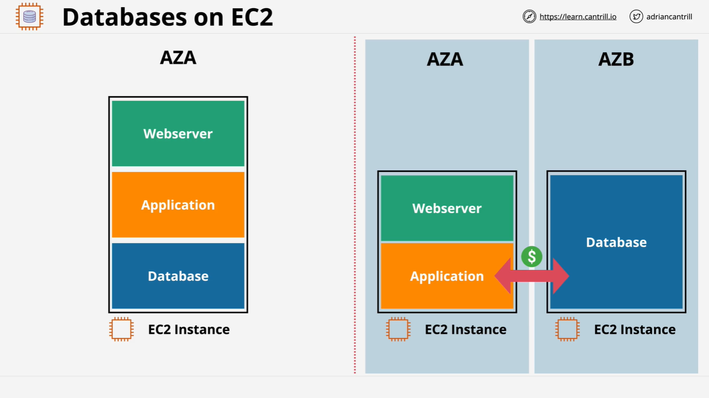

# Migrating WordPress Database to a Separate MariaDB Instance

## Overview



This lesson demonstrates how to migrate a WordPress database from a monolithic architecture (where the database and application are hosted on the same server) to a tiered architecture (where the database is hosted separately on a dedicated MariaDB instance). This is the first step in transitioning towards a fully elastic architecture.

## Prerequisites

- AWS account with access to the **Northern Virginia** (`us-east-1`) region.
- Basic knowledge of EC2 instances and CloudFormation.

## Resources

- **1-Click Deployment:** [CloudFormation Stack](https://console.aws.amazon.com/cloudformation/home?region=us-east-1#/stacks/create/review?templateURL=https://learn-cantrill-labs.s3.amazonaws.com/awscoursedemos/0014-aws-associate-rds-dbonec2/A4L_WORDPRESS_ALLINONE_AND_EC2DB_AL2023.yaml&stackName=MONOLITHTOEC2DB)
- **Lesson Commands:** [lesson_commands.txt](https://learn-cantrill-labs.s3.amazonaws.com/awscoursedemos/0014-aws-associate-rds-dbonec2/lesson_commands.txt)
- **Blog Images:** [blog_images.zip](https://learn-cantrill-labs.s3.amazonaws.com/awscoursedemos/0014-aws-associate-rds-dbonec2/blog_images.zip)

## Step 1: Deploy CloudFormation Stack

1. Click the **1-Click Deployment** link above.
2. The stack name should be pre-set. Scroll to the bottom, check the required box, and click **Create Stack**.
3. Wait for the stack to reach the `CREATE_COMPLETE` state before proceeding.

## Step 2: Identify EC2 Instances

1. Navigate to **AWS EC2 Console**.
2. Locate the two EC2 instances:
   - **A4L-WordPress** (Monolithic WordPress instance)
   - **A4L-DB-WordPress** (Standalone MariaDB instance)

## Step 3: Setup WordPress

1. Copy the public IP of **A4L-WordPress**.
2. Open it in a browser (**use HTTP, not HTTPS**).
3. Follow the WordPress installation process:
   - **Site Title:** `The Best Cats`
   - **Username:** `admin`
   - **Password:** Use the same password as `DB_PASSWORD` in CloudFormation.
   - **Email:** `test@test.com`
4. Click **Install WordPress** and log in.

## Step 4: Create a Test Blog Post

1. Navigate to **Posts** > **Add New**.
2. **Title:** `The Best Cats Ever!`
3. **Add Gallery:** Upload images from the `blog_images.zip` file.
4. Click **Publish**.

## Step 5: Backup and Restore the Database

### Backup the Source Database

```bash
mysqldump -u root -p a4lwordpress > a4lwordpress.sql
```

- `mysqldump` is a utility for exporting MySQL databases.
- `-u root` specifies the user.
- `-p` prompts for a password.
- `a4lwordpress` is the database name.
- `> a4lwordpress.sql` saves the output to a file.

### Restore the Database to the New Server

```bash
mysql -h privateipof_a4l-mariadb -u a4lwordpress -p a4lwordpress < a4lwordpress.sql
```

- `mysql` is used to import a database.
- `-h privateipof_a4l-mariadb` specifies the **private IP** of the new MariaDB server.
- `-u a4lwordpress` connects with a specific user.
- `-p` prompts for the password.
- `< a4lwordpress.sql` restores the backup.

## Step 6: Update WordPress Configuration

1. Connect to the **A4L-WordPress** instance via SSH.
2. Edit the `wp-config.php` file:

```bash
cd /var/www/html
sudo nano wp-config.php
```

3. Replace:

```php
define('DB_HOST', 'localhost');
```

With:

```php
define('DB_HOST', 'REPLACEME_WITH_MARIADB_PRIVATEIP');
```

4. Save the file and exit (`CTRL+O`, `ENTER`, `CTRL+X`).

### Stop the Old Database Service

```bash
sudo service mariadb stop
```

- This ensures WordPress now relies on the new database server.

## Step 7: Verify Migration

1. Refresh the WordPress site.
2. If everything loads properly, it confirms that the site is now using the **separate MariaDB instance**.
3. To verify further, stop the old database and check if the site still functions.

## Summary

- Deployed **AWS infrastructure** via CloudFormation.
- Installed and configured **WordPress**.
- Created a **test blog post**.
- Migrated **WordPress database** to a separate MariaDB instance.
- Updated **wp-config.php** to point to the new database.
- Successfully **tested and verified** the migration.

This migration is a crucial step toward a **scalable and elastic** WordPress architecture. Future enhancements may involve **offloading static assets to S3**, **implementing caching**, and **autoscaling the web layer**.

## Next Steps

- Explore **Amazon RDS** for managed database services.
- Implement **Elastic Load Balancing (ELB)** for high availability.
- Use **Amazon S3** to store WordPress media files instead of the local file system.
