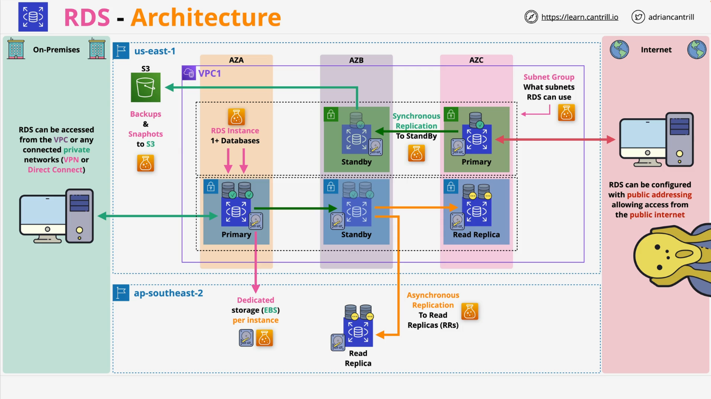
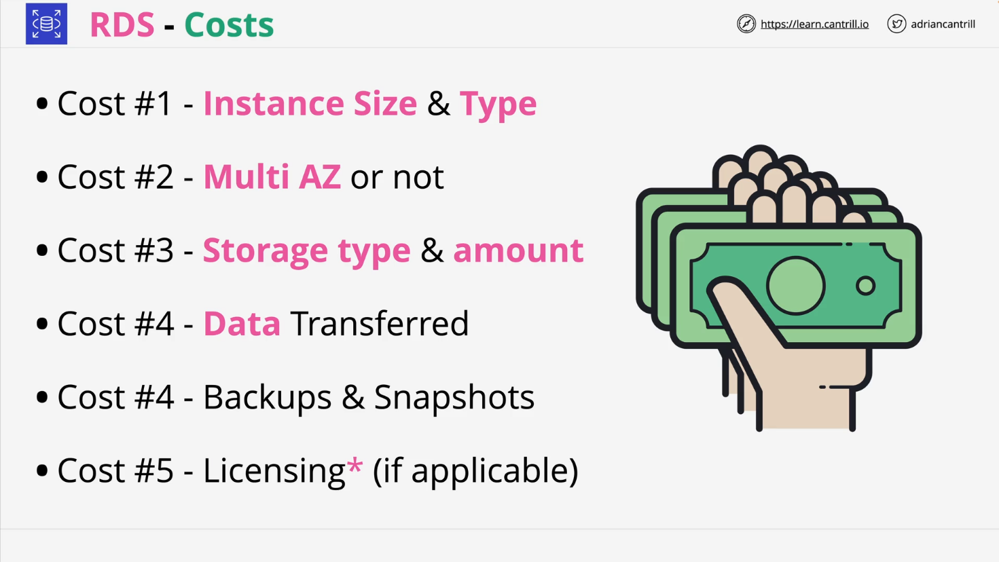

# RDS Architecture Overview

## Introduction

This document summarizes the first lesson in the **Learn Cantrill.io AWS SA-C03** series, covering the architecture of Amazon Relational Database Service (RDS). The lesson provides an overview of RDS as a **database server as a service** rather than a **database as a service (DBaaS)** and explains key components, architecture, and cost considerations.

## What is Amazon RDS?

Amazon RDS is a **managed database server as a service** offering that provides users with a **database server instance** rather than just a database.

### Key Characteristics:

- **Not a DBaaS**: Unlike DBaaS, RDS provides a database server where multiple databases can be hosted.
- **Managed Service**: AWS handles hardware, OS, installation, and maintenance of the database engine.
- **Supported Database Engines**:
  - Open-source: **MySQL, MariaDB, PostgreSQL**
  - Commercial: **Oracle, Microsoft SQL Server** (licensing considerations apply)
- **Not Amazon Aurora**: Aurora is a separate AWS database product with different architecture and features.
- **Limited Access**:
  - No **SSH access**
  - No **OS-level access** (except for **RDS Custom**, which allows limited OS access)

## RDS Architecture

Amazon RDS runs inside a **VPC (Virtual Private Cloud)** and requires **subnets** to operate. It is not a public service like S3 or DynamoDB.

### RDS Components:

1. **DB Subnet Groups**:

   - A list of subnets that RDS can use.
   - You must define a DB Subnet Group when launching an RDS instance.
   - Example:
     - One group uses **public subnets** (less secure, can allow internet access).
     - Another group uses **private subnets** (recommended for security).

2. **Availability Zones (AZs) and Multi-AZ Deployment**:

   - If Multi-AZ is enabled, RDS automatically selects different subnets for **primary** and **standby** instances.
   - **Primary instance** handles read/write operations.
   - **Standby instance** is updated via **synchronous replication** for failover.
   - Recommended for **high availability**.

3. **Connectivity Options**:

   - Private subnets: Accessible only within **VPC** or connected networks (e.g., **VPN, Direct Connect, Peered VPCs**).
   - Public subnets: Can be assigned **public IPs** but is **not recommended** for security reasons.

4. **Storage (EBS-Backed)**:

   - Each RDS instance has **dedicated storage provided by EBS**.
   - In Multi-AZ, each instance (primary and standby) has its own storage.
   - Different from **Aurora**, where storage is shared.

5. **Replication**:

   - **Multi-AZ Replication**: Synchronous replication to standby.
   - **Read Replicas**: Asynchronous replication, useful for scaling read traffic.
   - Read replicas can be in the **same region** or **different AWS regions**.

6. **Backups**:
   - Automated backups are stored in an **AWS-managed S3 bucket** (not visible in your S3 console).
   - **Multi-AZ Mode**: Backups are taken from the **standby instance** to avoid performance impact.

## RDS Cost Architecture

RDS pricing is based on **resource allocation** rather than direct usage. The main cost components include:

1. **Instance Type & Size**:

   - Similar to EC2, larger/more powerful instances cost more.
   - Billed per second, but prices are listed as hourly rates.

2. **Multi-AZ Deployment**:

   - Higher cost due to additional standby instance.

3. **Storage Costs**:

   - Charged per **GB per month**.
   - Provisioned **IOPS storage** is more expensive.

4. **Data Transfer Costs**:

   - Charges apply for data moving **to/from the internet** or **across AWS regions**.

5. **Backups and Snapshots**:

   - Free storage for **snapshots** up to the size of the DB instance storage.
   - Additional backup storage incurs per-GB/month charges.

6. **Licensing Costs**:
   - Additional costs apply for **commercial databases** (Oracle, Microsoft SQL Server).

## Summary

- **Amazon RDS is a managed database server service**, not a simple DBaaS.
- **It requires VPC subnets** and can be deployed in **Multi-AZ mode** for high availability.
- **Storage is provided by EBS**, and each instance has dedicated storage.
- **Read replicas and backups provide scalability and resilience**.
- **Pricing is based on allocated resources, storage, and data transfer**.
- **Amazon Aurora is a separate service** with different architecture and features.

This introduction covered **RDS architecture basics**. Future lessons will explore specific features, including **replication, backups, monitoring, and cost optimizations**.

## Next Steps

- Learn about **RDS Multi-AZ vs. Read Replicas**.
- Understand **backup and restore strategies**.
- Explore **performance tuning and monitoring for RDS**.
- Hands-on **demos and mini-projects** for practical experience.

Stay tuned for more in-depth lessons!
