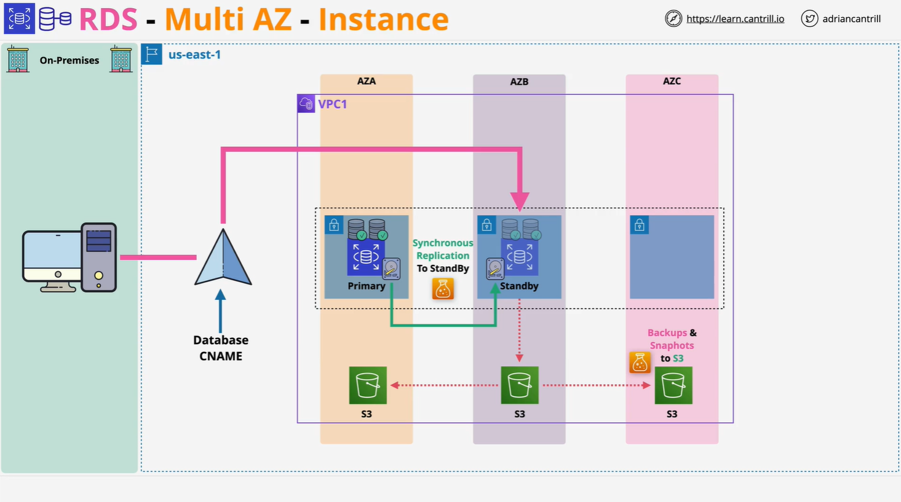
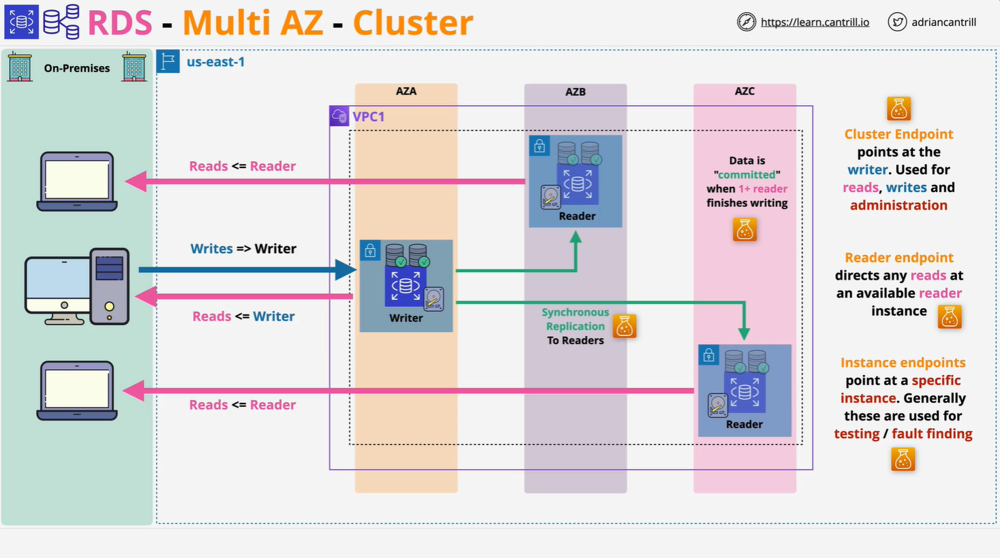

# AWS RDS High Availability - Multi-AZ Deployments

## Introduction

Amazon RDS offers high availability through **Multi-AZ deployments**, which have evolved into two distinct models:

- **Multi-AZ Instance Deployment** (legacy method)
- **Multi-AZ Cluster Deployment** (modern, Aurora-like method)

Each offers different architecture, features, and trade-offs.

## Multi-AZ Instance Deployment

### Architecture

- Consists of:
  - One **primary database instance**
  - One **standby instance** in a **different Availability Zone**
- **Synchronous replication** of data from primary to standby
- All traffic (reads and writes) goes through the **primary instance**
- **Backups** are taken from the standby to reduce load on the primary

### Key Features

- Replication occurs at the **storage level**
- Supported engines:
  - MySQL, MariaDB, PostgreSQL, Oracle: Amazon failover tech
  - Microsoft SQL Server: Database mirroring or Always On
- Users interact with a **database CNAME (DNS)** that points to the **primary**

### Failover Process

- On failure (or manual trigger), the **CNAME switches** to the standby
- Takes approximately **60–120 seconds**
- Apps should **disable DNS caching** to avoid stale CNAME resolution

### Limitations

- **Standby instance is passive**
  - Cannot be used for reads or writes
- Only **one standby allowed**
- **Not part of the free tier**
- **Region-scoped only** (within a single region's AZs)
- Longer failover time compared to newer methods

## Multi-AZ Cluster Deployment

### Cluster Architecture

- One **writer instance**
- Two **reader instances** in different AZs
- All instances are **active**
  - Writer handles reads and writes
  - Readers handle **reads only**

### Reader and Writer Instances

- Replication is **transaction log-based**
- **Readers can be used** to scale read-heavy workloads
- Requires **application-level awareness** to separate reads and writes

### Endpoints

- **Cluster Endpoint**

  - Points to the **writer**
  - Used for reads/writes and admin functions

- **Reader Endpoint**

  - Load balances across **readers** (and sometimes writer)

- **Instance Endpoints**
  - One per instance
  - Used mainly for **testing and troubleshooting**
  - Do not handle failover automatically

### Performance and Replication

- Uses **Graviton-based** instances
- **Local NVMe SSD storage** boosts performance
  - Writes go to fast local storage first, then flushed to EBS
- Replication across AZs is **resilient and fast**

### Failover Improvements

- **Faster failover**: as low as **35 seconds**
- **Efficient transaction log replication**
- Writes are committed once replicated to at least **one reader**

## Comparison Summary

| Feature            | Multi-AZ Instance            | Multi-AZ Cluster                 |
| ------------------ | ---------------------------- | -------------------------------- |
| Replication Type   | Synchronous (storage-level)  | Transaction log-based            |
| Number of Replicas | One standby                  | Two reader replicas              |
| Read Scaling       | Not supported                | Supported (via reader endpoint)  |
| Failover Time      | 60–120 seconds               | ~35 seconds + log application    |
| Use of Replicas    | Passive standby only         | Active for read                  |
| Storage            | EBS only                     | Local NVMe + EBS                 |
| DNS Endpoint       | Single CNAME                 | Cluster, Reader, and Instance    |
| Cost               | Higher (due to idle replica) | Efficient usage, but still extra |
| Application Impact | Minimal (same endpoint)      | Requires read/write separation   |
| Free Tier          | Not included                 | Not included                     |

## Conclusion

**Multi-AZ Cluster Deployment** is a more modern, resilient, and performant solution compared to the legacy **Multi-AZ Instance Deployment**. While both offer high availability, **Cluster mode provides read scalability, faster failover, and improved architecture**, especially useful for production-grade applications with high read demand.

> For even more performance and scalability, explore **Amazon Aurora**, which extends these benefits further.

Let me know if you'd like this exported as a `.md` file, or if you want the Aurora lesson summarized next!
