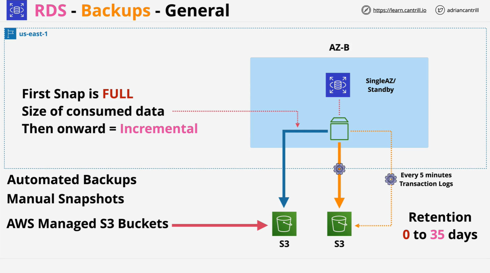
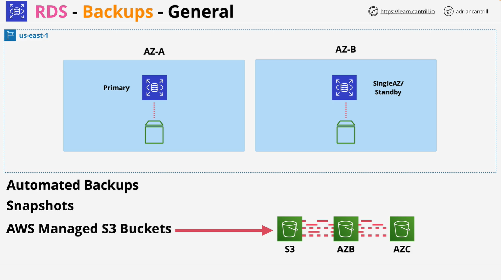

# AWS RDS Backups & Restores

## Overview

This lesson explores the two types of backup mechanisms available in **Amazon RDS**:

- **Automated Backups**
- **Manual Snapshots**

Both types of backups are stored in **Amazon S3**, using AWS-managed storage (not user-visible buckets).

## Backup Types in RDS

### 1. **Automated Backups**



- **Enabled by default**
- Occur **once per day**
- First backup is **full**, subsequent ones are **incremental**
- Include **automated snapshot** and **transaction logs**
- Stored in **AWS-managed S3**, not visible in the S3 console
- Retention period: **0 to 35 days**
  - **0 = disabled**
  - **35 = max retention**
- Used for **Point-in-Time Restore** (PITR) with **5-minute granularity**
- **Transaction logs** are stored every 5 minutes
- **Backups from Multi-AZ deployments** are taken from **standby instance** → no performance impact
- In **Single-AZ**, backups are taken from the only instance → can cause performance pauses
- **Automatically cleaned up** after the retention period
- Can be configured to **replicate backups to another region** (manual setup required)

#### Restore Behavior

- Restoring from automated backup **creates a new RDS instance**
- Application must update its **endpoint** to the new instance
- Enables **precise restoration** to any point using logs
- Useful for **disaster recovery** or **data corruption rollback**
- Restores can take **significant time** depending on DB size

### 2. **Manual Snapshots**



- **User-initiated** (via script, console, or API)
- Also stored in **S3**, not visible to user
- Like EBS snapshots:
  - First snapshot = **full copy**
  - Subsequent = **incremental (only changed blocks)**
- Taken at the **instance level**, not per database
- Stored **indefinitely** unless **manually deleted**
- Can exist **after RDS instance is deleted**
- Useful for **long-term backups**, compliance, or portability

#### Snapshot Characteristics

- Each snapshot introduces a **brief IO interruption**
  - **Multi-AZ**: interruption on standby → no visible impact
  - **Single-AZ**: may affect application performance
- **Frequency is flexible**:
  - Hourly, daily, weekly, etc.
- **More frequent snapshots** = **lower RPO**
- Used for **fixed point** restore (only to time of snapshot)

#### Best Practice

- Create a **final snapshot** before deleting a DB to retain data beyond 35 days

## Code Example (Restoring an RDS Snapshot via AWS CLI)

```bash
aws rds restore-db-instance-from-db-snapshot \
    --db-instance-identifier mydb-restored \
    --db-snapshot-identifier mydb-snapshot
```

### Explanation (Line-by-Line):

- `aws rds restore-db-instance-from-db-snapshot`: AWS CLI command to restore a DB from a snapshot.
- `--db-instance-identifier mydb-restored`: Specifies the name of the new RDS instance to be created.
- `--db-snapshot-identifier mydb-snapshot`: Specifies the identifier of the snapshot to restore from.

### Notes:

- A **new DB instance** is always created.
- Ensure your app connects to the **new endpoint** after restore.

## Recovery Concepts

| Term                               | Description                                                                                    |
| ---------------------------------- | ---------------------------------------------------------------------------------------------- |
| **RPO (Recovery Point Objective)** | Maximum acceptable amount of data loss. Lower RPO = more frequent backups/snapshots.           |
| **RTO (Recovery Time Objective)**  | Maximum acceptable downtime. Restores take time → must be planned into RTO.                    |
| **PITR (Point in Time Recovery)**  | Restoring to any point within the retention window using automated backups + transaction logs. |

## Key Differences: Snapshots vs Automated Backups

| Feature                   | Manual Snapshot              | Automated Backup                      |
| ------------------------- | ---------------------------- | ------------------------------------- |
| Initiation                | Manual                       | Automatic                             |
| Retention                 | Until manually deleted       | Up to 35 days                         |
| Visibility                | AWS Console only             | AWS Console only                      |
| Used for PITR             | No                           | Yes                                   |
| Restore                   | Fixed point in time          | Any point in time (5-min granularity) |
| Backup Source (Multi-AZ)  | Standby                      | Standby                               |
| Backup Source (Single-AZ) | Primary (can cause IO pause) | Primary (can cause IO pause)          |

## Cross-Region Backup Replication

- Both **snapshots** and **transaction logs** can be replicated to **another AWS region**
- Not enabled by default → must be **explicitly configured**
- Useful for **disaster recovery**
- Involves:
  - **Data transfer charges**
  - **Storage costs** in the destination region

## Restoration Summary

- Restores **create a new RDS instance**
- Must **update your app's DB endpoint**
- **Automated backup restores**:
  - Use snapshot + transaction logs for **PITR**
  - Better RPO than snapshots
- **Manual snapshot restores**:
  - Fixed to snapshot time
  - Used when precise timing isn't critical
- **Restore time can be significant**, especially for large DBs
- Always consider this in **disaster recovery/RTO planning**

## Final Tips for the Exam

- Know the differences between **automated backups** and **manual snapshots**
- Understand when and how **IO pauses** occur
- Remember:
  - **Automated backups expire**
  - **Manual snapshots don’t**
- **Final snapshot** is key if you need data past retention window
- Restores always create a **new DB instance** with a **new endpoint**
