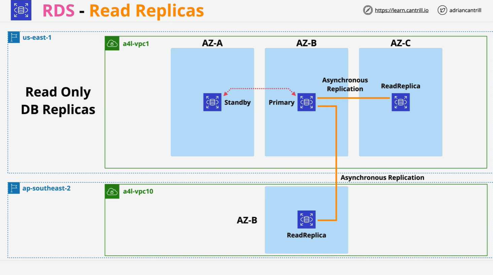

# Amazon RDS Read Replicas

## Overview

RDS Read Replicas are **read-only copies** of an RDS database instance that provide:

- Improved **read performance** and scalability.
- Support for **cross-region failover** and **disaster recovery**.
- Ability to achieve **low Recovery Time Objectives (RTO)** in failure scenarios (excluding data corruption).

## Key Concepts

### 1. **What Are Read Replicas?**

- Unlike Multi-AZ deployments (which are passive standby replicas), **read replicas can be used actively**—but only for **read operations**.
- They are **not part of the main DB instance**:
  - Each has its own endpoint.
  - Applications must explicitly connect to read replicas.

### 2. **Replication Mechanism**

- Read replicas use **asynchronous replication**.
- Contrast:
  - **Multi-AZ**: Synchronous (writes committed to both primary and standby).
  - **Read Replicas**: Asynchronous (data written to primary first, then replicated).
- There can be **replication lag** depending on network and database load.

### 3. **Regional Placement**

- Read replicas can be:
  - In the **same AWS region**.
  - In a **different AWS region** (Cross-Region Read Replicas).
- AWS handles all **networking and encryption** during cross-region replication.

## Benefits of Read Replicas

### 1. **Read Scalability**

- Up to **5 direct read replicas** per database instance.
- Each adds **additional read capacity**.
- Read replicas can also have **their own replicas**, but beware:
  - Increased **replication lag** becomes a performance concern.

### 2. **Global Read Performance**

- Helps offload read traffic in **other AWS regions**.
- Reduces latency and pressure on the primary instance.

### 3. **Disaster Recovery**

- Snapshots/backups help with **RPO (Recovery Point Objective)**, but not RTO due to restore time.
- **Read replicas can be promoted quickly**, offering:
  - **Near-zero RTO** (Recovery Time Objective).
  - **Near-zero RPO** (if not dealing with data corruption).

> ⚠️ **Warning**:  
> Promoting a read replica **won’t help** if the disaster involves **data corruption**—corrupted data is likely replicated as well.

### 4. **Global Resilience**

- Cross-region read replicas allow creation of **failover DB instances in another region**.
- Useful for business continuity in case of **regional AWS outages**.

## Key Considerations

- Applications like WordPress do **not automatically detect** read replicas.
  - Application logic must be modified to take advantage of them.
- **No automatic failover**:
  - Unlike Multi-AZ, read replicas **won’t take over** if the primary fails unless manually promoted.
- Read replicas are **read-only** until promoted.
- Promoted read replicas become **standalone RDS instances**.

## Summary Table

| Feature        | Read Replica                        | Multi-AZ                      |
| -------------- | ----------------------------------- | ----------------------------- |
| Usage          | Read-only until promoted            | Passive standby               |
| Replication    | Asynchronous                        | Synchronous                   |
| Failover       | Manual (promotion required)         | Automatic                     |
| Endpoint       | Separate                            | Shared (failover transparent) |
| Use Case       | Scalability, global performance, DR | High availability             |
| Region Support | Same or cross-region                | Same region only              |

## Exam Tips

- **Read Replicas ≠ Multi-AZ**
- Remember the replication type:
  - **Multi-AZ = Synchronous**
  - **Read Replica = Asynchronous**
- Read replicas **do not help** with **data corruption** scenarios.
- They **must be explicitly used by the application** (no automatic routing).
- **Promotion is manual** but fast—helpful for **low RTO**.
