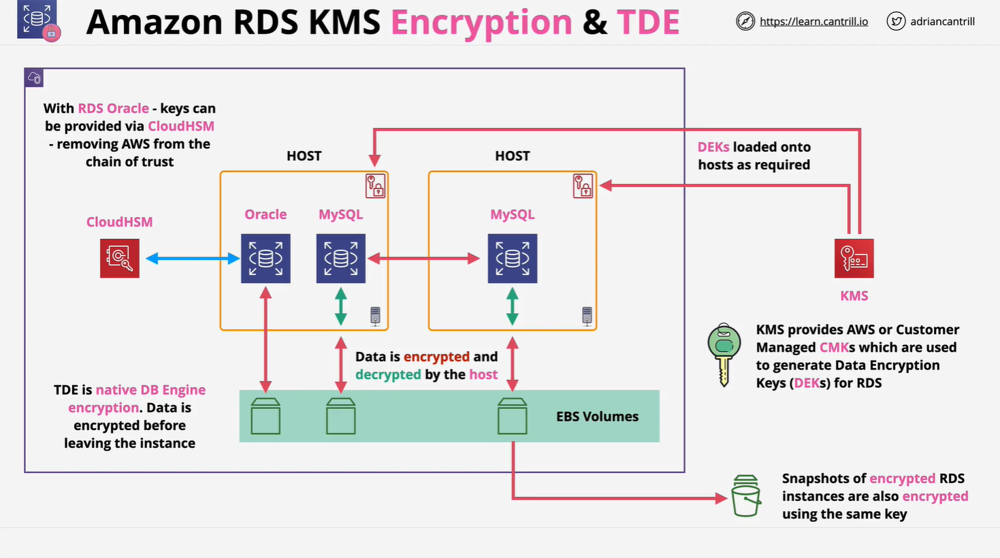
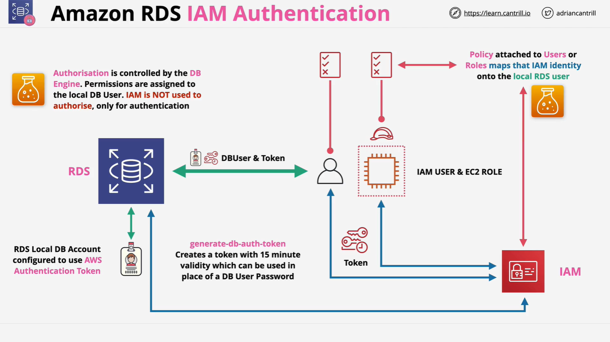

# AWS RDS Data Security

This lesson focuses on **data security** in Amazon RDS, covering four key areas:

1. **Authentication** – How users log into RDS.
2. **Authorization** – How access is managed.
3. **Encryption in Transit** – Securing data between client and RDS.
4. **Encryption at Rest** – Securing stored data.

## 1. Encryption in Transit

All RDS database engines support **encryption in transit** using **SSL/TLS**.

- **Purpose**: Encrypts the data between client and RDS.
- **Configuration**: Can be enforced **per-user** by making SSL mandatory.

## 2. Encryption at Rest

RDS supports **encryption at rest** using different methods based on the engine.

### a. **Default Encryption with KMS and EBS**

- RDS relies on **EBS-based storage encryption**, managed by the RDS **host**, not the DB engine.
- AWS **KMS (Key Management Service)** is used to manage keys.
  - You can use:
    - AWS-managed CMK (Customer Master Key)
    - Customer-managed CMK

#### **How it works:**

1. A **CMK** is used to generate a **Data Encryption Key (DEK)**.
2. The DEK performs the actual encryption/decryption operations.
3. This encryption also applies to:
   - Logs
   - Snapshots
   - Replicas

> ⚠️ **Important**: Once enabled, encryption **cannot be removed** from an RDS instance.

### b. **Transparent Data Encryption (TDE)**

TDE is supported on **Microsoft SQL Server** and **Oracle** RDS engines.

- **TDE** is **native** to the database engine.
- Data is encrypted/decrypted **inside the DB engine**, before hitting the storage.
- Offers **tighter security** because the host does not handle encryption.

### c. **CloudHSM with Oracle RDS**

For **RDS Oracle**, TDE can integrate with **CloudHSM** for even stronger key control:

- Keys are managed by the customer, not AWS.
- No key exposure to AWS.
- Satisfies high-security or regulatory compliance requirements.

## 3. Visual Encryption Architecture

Here’s a conceptual architecture to understand encryption flow:



### **With Oracle + TDE + CloudHSM:**

- CloudHSM handles encryption keys.
- Encryption happens entirely within the DB engine.
- AWS has **no visibility** of keys.

### **With KMS-based Encryption (e.g., MySQL):**

- KMS manages CMKs → generates DEKs.
- DEKs are loaded onto RDS hosts.
- RDS hosts encrypt/decrypt data before writing to EBS.
- The database engine is **unaware** of encryption.

## 4. IAM Authentication for RDS

### Traditional Authentication:

- Uses **local DB users** with usernames and passwords.
- AWS IAM is **not involved**.

### IAM-based Authentication:



You can enable IAM authentication to log in to RDS **without a password**, using a **temporary token**.

#### **How it works:**

1. **IAM user or role** is created.
2. Attach a policy that **maps IAM identity to a DB user**.
3. IAM identity calls `rds:GenerateDBAuthToken`.
4. A token is generated, valid for **15 minutes**.
5. Token is used to log in to RDS in place of a password.

```bash
# Example token generation (CLI)
aws rds generate-db-auth-token \
  --hostname mydb.xyz.us-west-2.rds.amazonaws.com \
  --port 3306 \
  --region us-west-2 \
  --username dbuser
```

#### ⚠️ **Important Notes:**

- **Authentication only**: IAM handles login.
- **Authorization still depends on the DB user**:
  - Permissions (GRANT, etc.) are still managed **inside** the database.
- **IAM Auth must be explicitly enabled** on the RDS instance.

## Summary of Key Concepts

| Feature              | Purpose                                       | Notes                                  |
| -------------------- | --------------------------------------------- | -------------------------------------- |
| SSL/TLS in Transit   | Encrypt client-to-RDS communication           | Can be enforced per user               |
| KMS + EBS Encryption | Encrypts data on disk                         | Managed by host                        |
| TDE                  | Encrypts inside DB engine                     | More secure, used by Oracle/SQL Server |
| CloudHSM             | Secure, customer-managed key storage          | No AWS access to keys                  |
| IAM Auth             | Allows login with AWS IAM instead of password | Token-based, 15-min validity           |
| Authorization        | Still controlled by local DB permissions      | IAM does **not** manage this           |
