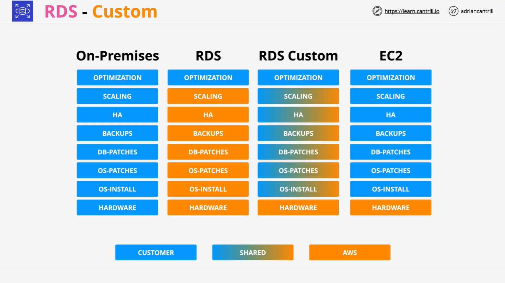

# Amazon RDS Custom

Amazon **RDS Custom** is a niche offering within the RDS family that fills the operational and control gap between:

- **Standard RDS** (fully managed by AWS)
- **EC2-hosted Databases** (fully self-managed by customer)

For the **exam**, a **basic service-level understanding** is typically sufficient.

## What is RDS Custom?

RDS Custom enables greater control over the underlying infrastructure of an RDS database, while still benefiting from some of RDS’s automation features.

### Key Characteristics

| Feature                  | RDS Standard  | RDS Custom                    | EC2-hosted DB |
| ------------------------ | ------------- | ----------------------------- | ------------- |
| Managed by AWS           | Mostly        | Partially                     | No            |
| Custom OS/Engine Access  | No            | Yes (via SSH/RDP/Session Mgr) | Yes           |
| Runs in Customer Account | No            | Yes                           | Yes           |
| Automation Controls      | Fully managed | Pause/Resume customization    | None          |

## RDS Custom vs RDS vs EC2-hosted DB

### 1. **Standard RDS**

- Fully managed by AWS.
- No OS or DB engine-level access.
- ENIs (Elastic Network Interfaces) are injected into your VPC for connectivity.
- You don’t see the underlying EC2 or EBS resources in your AWS account.

### 2. **EC2-hosted Database**

- Fully self-managed: you handle everything from the OS up.
- High operational burden (patching, backups, scaling, HA, etc.).
- Full access and flexibility, but minimal AWS automation.

### 3. **RDS Custom**

- Hybrid approach.
- Provides OS-level access via **SSH**, **RDP**, or **Session Manager**.
- EC2, EBS volumes, and backups are visible in your AWS account.
- Allows **customizations** (e.g., patches, extensions).
- You must **pause RDS automation** during customization to prevent conflicts.

## When to Use RDS Custom

RDS Custom is ideal for **legacy or specialized workloads** where:

- Applications require **custom OS configurations** or **database patches**.
- Standard RDS limitations block required customizations.
- Full EC2 management is too high of an operational burden.

### Supported Engines (As of Now):

- **Oracle**
- **Microsoft SQL Server**

## Managing Customizations in RDS Custom

If you plan to perform customizations:

1. **Pause RDS Automation**

   - Prevents conflicts or unexpected behaviors during your changes.

2. **Perform Customizations**

   - Examples: custom patching, OS-level tuning, DB-level modifications.

3. **Resume Automation**
   - Reinstate RDS management features to ensure production readiness.

## Service Model Comparison

This breakdown shows who manages what across different DB deployment models:

| Responsibility           | On-Premises | EC2-hosted DB | RDS Standard | RDS Custom |
| ------------------------ | ----------- | ------------- | ------------ | ---------- |
| Hardware                 | Customer    | AWS           | AWS          | AWS        |
| OS Install & Patch       | Customer    | Customer      | AWS          | Shared     |
| DB Engine Patching       | Customer    | Customer      | AWS          | Shared     |
| Backups                  | Customer    | Customer      | AWS          | Shared     |
| HA & Scaling             | Customer    | Customer      | AWS          | Shared     |
| Application Optimization | Customer    | Customer      | Customer     | Customer   |

> **Blue** = Customer-managed  
> **Orange** = AWS-managed  
> **Gradient** = Shared responsibility

## RDS Custom Summary for the Exam

- Know that **RDS Custom exists** as a hybrid option between RDS and EC2-based databases.
- Provides **customization and OS/engine access** not available in standard RDS.
- Still benefits from **RDS automation**, but requires more customer responsibility.
- **Only available for Oracle and MS SQL Server.**
- **Rarely used in production**, mostly for **niche use cases**.
