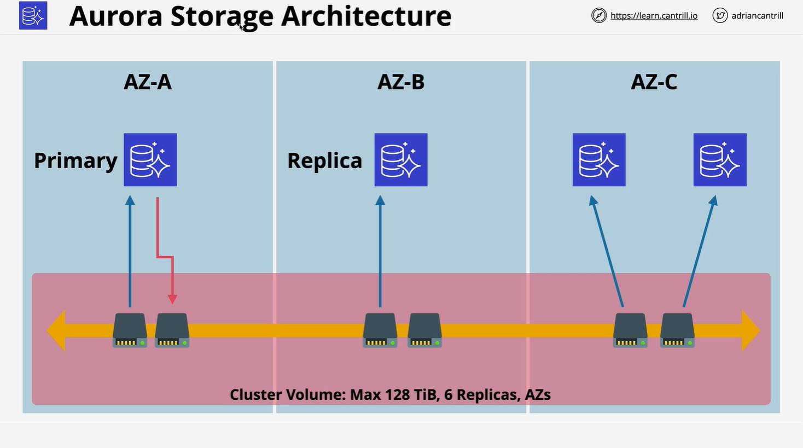
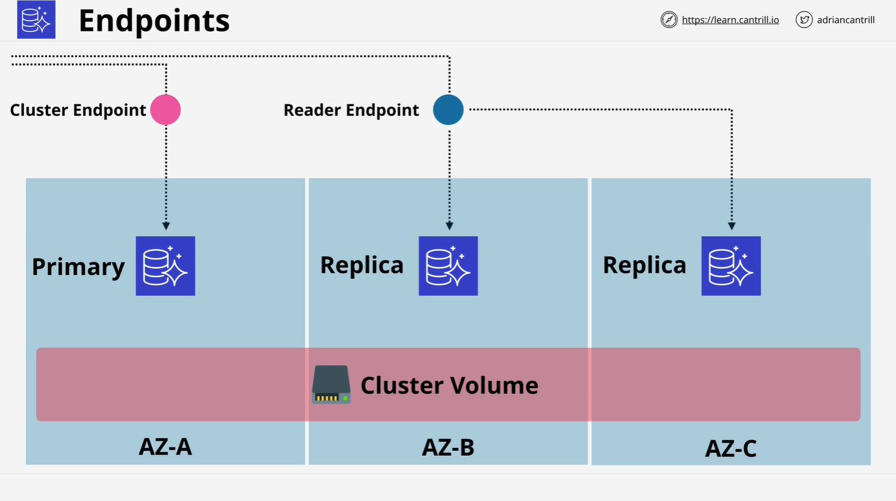

# Aurora Architecture

## Overview

Amazon Aurora is technically part of the **RDS (Relational Database Service)** family, but due to its **distinct architecture and capabilities**, it should be considered a separate product. This lesson covers how Aurora differs from traditional RDS engines in architecture, performance, storage, and cost model.

## 1. **Aurora Architecture Basics**

### Cluster-Based Design

Aurora is **cluster-based**, unlike traditional RDS engines.

- **Cluster Composition**:
  - One **primary instance** (handles both reads and writes).
  - Up to **15 replicas** (read-only; used for high availability and read scaling).

> Unlike RDS where read replicas and Multi-AZ failovers are distinct features, Aurora replicas **serve both purposes simultaneously**.

## 2. **Aurora Storage Architecture**

### Shared Cluster Volume

- Aurora **does not use local instance storage**.
- All compute instances (primary and replicas) **share a distributed, SSD-based cluster volume**.

### Key Characteristics:

- **Max size**: 128 TiB.
- **Replication**: Data is **synchronously replicated to 6 copies across 3 AZs**.
- **No storage overhead on compute**: Storage replication occurs **below the database layer**, so it doesn’t consume compute instance resources.
- **Automatic fault repair**: If a segment fails, Aurora repairs using healthy copies without downtime or corruption.

## 3. **High Availability and Read Scaling**

- Aurora can support **up to 15 replicas** as failover targets.
- **Failover is faster** than traditional RDS because:
  - No storage promotion is needed.
  - All instances already access the same shared storage.

## 4. **Aurora Storage Billing Model**

### Dynamic Storage Allocation

- No need to pre-allocate storage.
- Billing is based on **consumed data**, **not provisioned capacity**.

### High Watermark Behavior (Legacy)

- Aurora used to charge based on **maximum storage ever used** (high watermark).
- Even if you delete data, billing remains based on peak usage until a new cluster is created.
- **Note**: AWS is updating this model; newer versions may not use high watermark.

## 5. **Endpoints & Connection Management**

Aurora provides **multiple types of DNS endpoints** for connecting applications:

| Endpoint Type         | Description                                                     |
| --------------------- | --------------------------------------------------------------- |
| **Cluster Endpoint**  | Always points to the **primary instance** (for reads & writes). |
| **Reader Endpoint**   | **Load balances across all replicas** (read-only).              |
| **Instance Endpoint** | Unique endpoint per instance (for custom connection control).   |
| **Custom Endpoint**   | User-defined, maps to a subset of instances.                    |

This makes **read scaling and connection management more flexible** than standard RDS.

## 6. **Cost Considerations**

- **No free tier support**:
  - Aurora doesn’t support micro instances (used in free tier).
- **Compute Charges**:
  - Per-second billing (10-minute minimum).
- **Storage Charges**:
  - Billed by **GiB-month** based on high watermark (legacy).
- **IO Charges**:

  - Cost per I/O operation to shared storage.

- **Backup Charges**:
  - Free backup space equals the size of the database (e.g., 100 GiB DB = 100 GiB backup).
  - Typical usage often sees **backup costs included** in the main cluster fee.

## 7. **Aurora Backup and Restore Features**

- Works like standard RDS for:
  - **Automatic backups**
  - **Manual snapshots**
  - **Point-in-time restores** (creates new cluster)

### Advanced Features

#### 7.1 Backtrack

- **In-place rollback** to a previous time (like an undo).
- No need to create new instances.
- Useful for recovery from data corruption.

> Must be **enabled per cluster** and supports a configurable time window.

#### 7.2 Fast Clone

- Creates a new Aurora cluster without copying all data.
- **Storage is shared** and only **deltas (differences)** are stored.
- Much faster and more storage-efficient than traditional cloning.

## 8. **Summary of Key Benefits Over Traditional RDS**

| Feature          | Aurora                                                 | Traditional RDS                   |
| ---------------- | ------------------------------------------------------ | --------------------------------- |
| Storage          | Shared, distributed SSD-based                          | Instance-attached EBS             |
| Replication      | 6 copies across 3 AZs                                  | One standby (Multi-AZ) or replica |
| Read Scaling     | Up to 15 replicas                                      | Limited and separate from HA      |
| Failover Speed   | Fast (no storage promotion needed)                     | Slower                            |
| Backup & Restore | Same as RDS + advanced options (backtrack, fast clone) | Standard only                     |
| Endpoints        | Cluster, reader, instance, custom                      | Primary and optional reader       |
| Storage Billing  | Usage-based, legacy high watermark                     | Prov                              |

## 9. **What’s Next**

- Upcoming lessons will **demonstrate how to migrate** a MariaDB-based WordPress application to Aurora.
- You’ll get hands-on experience with:
  - Creating Aurora clusters
  - Interacting with endpoints
  - Performing data migrations
