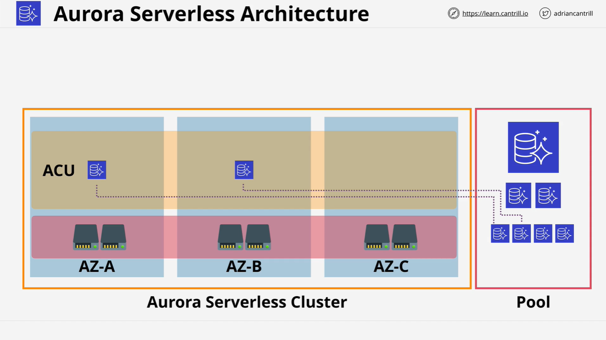
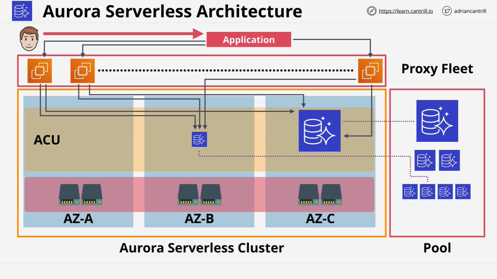

# Aurora Serverless

## Overview

Aurora Serverless is to **Aurora** what **Fargate** is to **ECS**. It provides an **on-demand, auto-scaling** version of Amazon Aurora where you **don’t have to provision or manage database instances manually**.

This moves Aurora closer to a true **Database-as-a-Service (DBaaS)** model by reducing the administrative overhead of traditional database instance management.

## Aurora Provisioned vs. Aurora Serverless

| Feature             | Aurora Provisioned                 | Aurora Serverless                             |
| ------------------- | ---------------------------------- | --------------------------------------------- |
| Capacity Management | Manually provision instances       | Auto-scales using ACUs                        |
| Billing             | Based on instance uptime           | Per-second billing based on usage             |
| Scaling             | Manual scaling, can cause downtime | Seamless, automatic scaling                   |
| Pausing             | Not supported                      | Can pause at zero ACUs (storage-only billing) |

## Key Concept: Aurora Capacity Units (ACUs)



- Aurora Serverless introduces **ACUs** (Aurora Capacity Units).
- Each ACU includes a predefined amount of **CPU and memory**.
- Users set **minimum and maximum ACU values**.
- Aurora automatically **scales between these limits** based on demand.
- Aurora can **scale down to zero**, pausing the database and incurring only storage charges.

### Billing Model

- **Per-second billing** for:
  - Active ACU usage.
  - Cluster storage.

## High-Level Benefits

1. **Simplicity**
   - No need to manage individual DB instances.
2. **Auto Scaling**
   - Seamless scaling of compute/memory.
   - No disruption to client connections.
3. **Cost Efficiency**
   - Pay only for what you use.
   - Suitable for workloads with infrequent or variable demand.

## Aurora Serverless Architecture



### Shared Characteristics with Aurora Provisioned

- **Aurora Cluster Volume**
  - Data is replicated across **6 storage nodes** in **multiple Availability Zones (AZs)**.

### Key Differences

| Element               | Aurora Provisioned        | Aurora Serverless               |
| --------------------- | ------------------------- | ------------------------------- |
| Compute               | Provisioned EC2 instances | Dynamically allocated ACUs      |
| Connection Management | Direct to DB instance     | Via AWS-managed **proxy fleet** |

## Architecture Components Explained

### 1. **Warm Pool of ACUs**

- AWS maintains a shared pool of ACUs across accounts.
- These **stateless compute units** can be quickly allocated as needed.

### 2. **Proxy Fleet**

- Manages connections between applications and ACUs.
- Acts as a **connection broker**:
  - Applications connect to the **proxy**, not the ACU directly.
  - Enables **fluid scaling** without impacting active sessions.

### Diagram (Conceptual)

```
App → Proxy Fleet → ACUs → Shared Cluster Storage
```

## Real-World Use Cases

### 1. **Infrequently Used Apps**

- Example: A blog like _Best Cat Pics_.
- Low connection frequency → pay only during active access.

### 2. **New Applications**

- Unsure about traffic/load levels.
- Avoid upfront sizing mistakes—Aurora auto-scales.

### 3. **Variable Workloads**

- Apps with periodic spikes (e.g., flash sales).
- No need to overprovision for peak usage.

### 4. **Unpredictable Workloads**

- Ideal when usage patterns can’t be forecasted.
- Set wide min/max ACU range to adapt automatically.

### 5. **Development and Testing**

- Scale to zero during inactivity.
- Only pay for storage → cost-efficient for non-production.

### 6. **Multi-Tenant SaaS Apps**

- Costs scale with user load.
- Logical choice when **revenue aligns with usage**.

## Exam Tip

While Aurora Serverless may not be heavily featured in current exam versions, understanding its architecture and use cases offers a **strong foundational advantage** for comparing AWS RDS solutions in future exam updates.

## Summary

Aurora Serverless:

- Offers **true serverless DB scaling**.
- Uses **ACUs** for flexible compute/memory allocation.
- Incorporates an **AWS-managed proxy fleet** for seamless connection handling.
- Best suited for **dynamic, variable, or low-load** environments.
