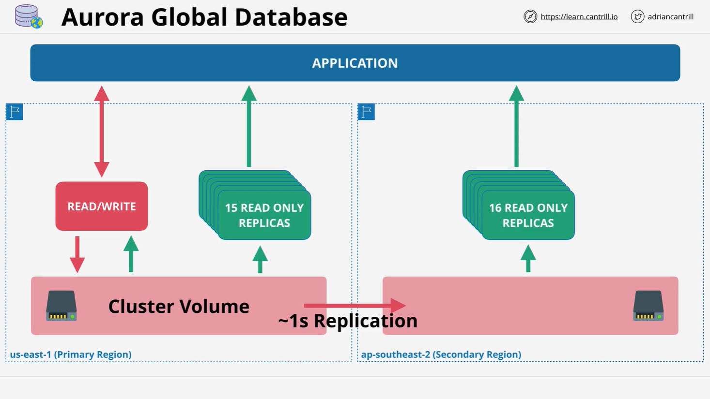

# Aurora Global Database – Summary

## Overview

**Aurora Global Database** is an Amazon Aurora feature designed to support **global-level replication**. It allows replication from a **primary region** to up to **five secondary AWS regions**. While it may not feature heavily in the AWS Certified Solutions Architect – Associate (C03) exam, understanding its architecture and use cases is beneficial for both the exam and real-world implementations.

## Key Features

- **Cross-region replication**: From a master (primary) region to up to **5 secondary regions**.
- **Replication latency**: Typically **< 1 second**.
- **Replication occurs at the storage layer**: Minimizes impact on database performance.
- **One-way replication only**: From primary to secondary (not bidirectional).
- **Secondary regions are read-only**: But can be promoted to read-write during disaster recovery.

## Architecture

### Primary Region

- Example: `us-east-1`
- Functions similarly to a standard Aurora cluster.
- Contains:
  - **1 read/write instance**
  - **Up to 15 read replicas**

### Secondary Region

- Example: `ap-southeast-2` (Sydney)
- Entirely **read-only** during normal operations.
- Contains:
  - **Up to 16 read replicas** (no primary instance)

### Diagram Explanation

## Use Cases

### 1. **Cross-Region Disaster Recovery**

- Provides **business continuity** during regional AWS outages.
- Secondary clusters can be **promoted to primary** for read/write operations.
- Enables **low RPO (Recovery Point Objective)** and **RTO (Recovery Time Objective)**.

### 2. **Global Scalability and Low Latency**

- Improves performance for **international users**.
- Secondary clusters allow local applications to **perform read operations** with **low latency**.
- Especially useful for **read-heavy** global applications.

## Technical Characteristics

| Feature               | Details                                                            |
| --------------------- | ------------------------------------------------------------------ |
| Replication Method    | **Storage layer**, non-intrusive                                   |
| Replication Direction | **One-way only** (Primary → Secondary)                             |
| Replication Latency   | **< 1 second**                                                     |
| Secondary Cluster     | **Read-only**, up to **16 replicas**                               |
| Total Regions         | **1 Primary + up to 5 Secondary Regions**                          |
| Impact on Performance | **None**, due to storage-layer replication                         |
| Promotion             | Secondary clusters can be **promoted to primary** during disasters |

## Notes for Exam Preparation

- Be **aware** of Aurora Global Database, but don’t expect heavy focus.
- Know:
  - It’s used for **disaster recovery** and **performance scaling**.
  - Replication is **fast**, **efficient**, and **non-bidirectional**.
  - Understand **regional limits** and **read/write restrictions**.

## Aurora vs. Aurora Global Database

| Feature          | Aurora        | Aurora Global Database                      |
| ---------------- | ------------- | ------------------------------------------- |
| Region Scope     | Single region | Multi-region                                |
| Replication      | Within region | Cross-region                                |
| Read Replicas    | Up to 15      | Up to 16 per secondary region               |
| Write Capability | One primary   | Only one primary (global), others read-only |
| Promotion        | N/A           | Secondary clusters promotable during DR     |

## Final Thoughts

Aurora Global Database is a **powerful tool** for ensuring global **availability**, **performance**, and **resilience**. While it may not dominate the SA-C03 exam content, understanding the **fundamentals** ensures you're prepared for both exam scenarios and production deployments.
