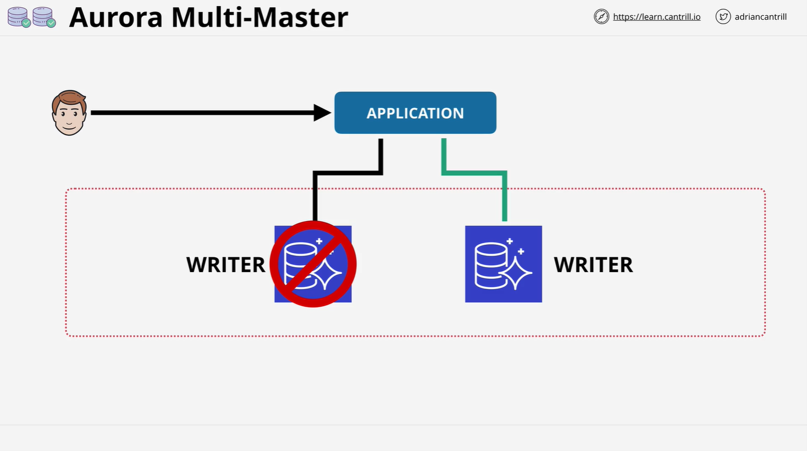

# Amazon Aurora Multi-Master Writes

## Overview


**Aurora Multi-Master** is an advanced Amazon Aurora feature that allows multiple database instances within a cluster to **perform both reads and writes simultaneously**. This differs from the default **single-master Aurora**, where only **one writer** is allowed and the rest are **read-only replicas**.

## Aurora Single-Master Mode (Default)


In the **default mode**, also called **single-master**, the architecture includes:

- **1 Read/Write (Primary) instance**
- **0 or more Read-Only Replicas**

### Endpoints in Single-Master

- `Cluster Endpoint`: Used for **read and write** operations (always points to the primary).
- `Reader Endpoint`: Used for **read-only** queries and load balancing across replicas.

### Failover in Single-Master

- In case of **primary instance failure**:
  - A **replica is promoted** to be the new primary.
  - **Cluster endpoint is updated** to point to the new writer.
  - **Disruption occurs** during this change (although faster than traditional RDS).

## Aurora Multi-Master Mode



### Key Characteristics

| Feature        | Description                                                               |
| -------------- | ------------------------------------------------------------------------- |
| All Instances  | Can **read and write**                                                    |
| Failover       | **Instant** — no need to promote replicas                                 |
| Shared Storage | Same as single-master — **distributed storage layer**                     |
| Load Balancing | Not automatic — **must be handled by the application**                    |
| Endpoints      | **No cluster endpoint** — applications must connect directly to instances |

## Multi-Master Architecture & Operation

In a **multi-master** Aurora cluster:

1. All instances can perform read and write operations.
2. There is **no load-balanced cluster endpoint**.
3. Applications must handle connections and traffic distribution to instances manually.

### Write Request Flow (Explained)

When a write is initiated:

```text
Application → Write Request → Any Aurora RW Instance
                             ↓
             Proposes change to storage nodes
                             ↓
         Quorum of storage nodes must agree
                             ↓
       If accepted → Commit change to shared storage
                   → Replicate to other instances’ memory cache
```

#### Step-by-Step Breakdown

1. **Application sends write** to one of the nodes.
2. **That node proposes** the data be written to shared storage.
3. **Storage nodes vote**:
   - Accept → Commit
   - Reject (e.g. conflict with another write) → Error back to app
4. **If committed**, the data is:
   - Written to shared storage.
   - **Replicated to memory caches** of other writer nodes.
5. This ensures **read consistency** across all nodes.

## Read Consistency in Multi-Master

Each instance maintains an **in-memory cache** for performance. When a write is successfully committed:

- The change is also **replicated to all other nodes’ memory**.
- Ensures **reads from any node reflect the latest state**.

## Comparison: Single-Master vs Multi-Master

| Feature          | Single-Master | Multi-Master                        |
| ---------------- | ------------- | ----------------------------------- |
| Writers          | 1             | Multiple                            |
| Read Replicas    | Yes           | All are RW                          |
| Failover Time    | Seconds       | Instant                             |
| App-Awareness    | Minimal       | Must handle load balancing manually |
| Cluster Endpoint | Yes           | No                                  |
| Cache Sync       | N/A           | Required across all nodes           |

## Multi-Master & High Availability

### Scenario: Single-Master Failover

- Bob’s app connects via `cluster endpoint`.
- Primary fails → Disruption occurs.
- Replica is promoted → Endpoint updated → Service restored.

**Problem**: There’s a failover gap causing disruption.

### Scenario: Multi-Master Fault Tolerance

- App connects to **both nodes**.
- Both perform read/write.
- If one fails, **app continues using the other immediately**.
- **No failover event is needed**, no disruption.

**Result**: **High availability and near fault tolerance** — as long as the application is coded to maintain connections to multiple nodes.

## Design Considerations

- Aurora Multi-Master allows for **immediate failover within the app**.
- **Applications must handle traffic routing and instance management**.
- This enables **higher availability**, **lower latency failovers**, and a foundation for **fault-tolerant systems**.

## Final Thoughts

- Multi-master doesn’t yet play a **major role on the AWS SA-C03 exam**, but **awareness is key**.
- Knowing when and how to use it is essential for **real-world high availability** and **resilient application design**.
