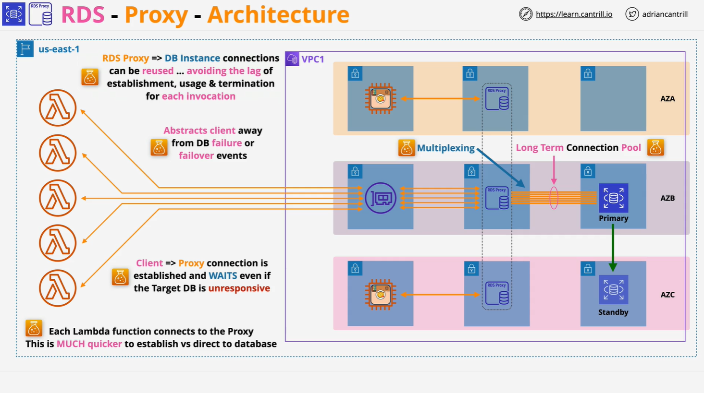

# RDS Proxy

## What is RDS Proxy?

RDS Proxy is a **fully managed database proxy service** provided by AWS. It **sits between your application and your RDS database**, maintaining **long-lived database connections** to optimize performance, availability, and connection management.

## Why Use RDS Proxy?

### 1. **Reduce Connection Overhead**

- Opening/closing DB connections is resource-intensive.
- Small queries often spend more time connecting than querying.
- Serverless environments (e.g. AWS Lambda) suffer due to frequent cold starts and transient connections.

### 2. **Improve Reliability During Failovers**

- Handling DB failover in the application adds complexity.
- Applications need to handle:
  - Retry logic
  - Failover events
  - Connection reestablishment
- RDS Proxy **abstracts** failover handling and **maintains client connections** even during backend transitions.

### 3. **Connection Pooling & Multiplexing**

- Maintains a **pool of DB connections**.
- Applications connect to **proxy**, not directly to DB.
- The proxy **multiplexes client connections** over a smaller set of DB connections.

## How It Works

### Without RDS Proxy

**Architecture:**

- App (EC2 or Lambda) connects directly to RDS DB.
- Each connection is initiated and terminated per request.
- High overhead for small transactions and Lambda invocations.

### With RDS Proxy

**Architecture Overview:**

- RDS Proxy runs **inside a VPC**, across multiple AZs.
- **Long-lived connections** maintained between proxy and DB.
- Application connects to the **proxy endpoint** instead of the DB.
- Fast connection times, low load on DB server.
- **Multiplexing** enables:
  - Fewer DB connections.
  - More client connections.

**Failover Handling:**

- If the DB fails:
  - Proxy reconnects to standby.
  - Client stays connected to the **same proxy endpoint**.
  - Failover is transparent to the application.

## Example Scenario

**Components:**

- 3-AZ VPC.
- RDS primary in AZ-B, standby in AZ-C.
- EC2 app + Lambda functions in subnets.
- Lambda uses VPC networking.

**Without Proxy:**

- App & Lambda connect **directly** to RDS.
- Each Lambda invocation opens a new DB connection (slow, costly).

**With Proxy:**

- EC2 & Lambda connect to **RDS Proxy**.
- Proxy maintains connections to RDS DB.
- **Lambda invocations reuse existing DB connections** via proxy.
- **Lower latency, reduced cost, improved scalability**.

## Use Cases for RDS Proxy

| Use Case                              | Benefit                                                |
| ------------------------------------- | ------------------------------------------------------ |
| **"Too many connections" errors**     | Reduces connection count via pooling/multiplexing.     |
| **Small DB instances (e.g., T2, T3)** | Conserves DB resources.                                |
| **Serverless (AWS Lambda)**           | Reuses connections across invocations.                 |
| **SaaS / Low-latency apps**           | Avoids repeated connection setup per user interaction. |
| **Resilience to DB failure**          | Transparent failover handling.                         |

## Key Technical Facts (Exam-Centric)

- **Fully managed**: No need to run/manage your own proxy.
- **Auto-scaling**: Built-in high availability.
- **Connection pooling**: Reduces DB load.
- **Multiplexing**: Many client connections, fewer DB connections.
- **VPC only**: Must be deployed within a VPC.
- **Uses proxy endpoints**: Application connects as if it's a DB endpoint.
- **Supports IAM Authentication**: Especially useful for Lambda.
- **SSL/TLS Support**: Enforces secure connections.
- **Failover Reduction**: Up to **66% faster** failovers (Aurora).
- **Abstracts Failures**: App doesn't need to manage failover logic.

## Summary

RDS Proxy is an essential service when:

- You need **high connection efficiency**.
- You're using **Lambda** or **small instance classes**.
- You're building **resilient, highly available applications**.
- You want to **simplify failover and DB failover logic**.

It plays a crucial role in modern cloud-native applications and is especially valuable for **serverless**, **multi-AZ**, and **SaaS** architectures.
