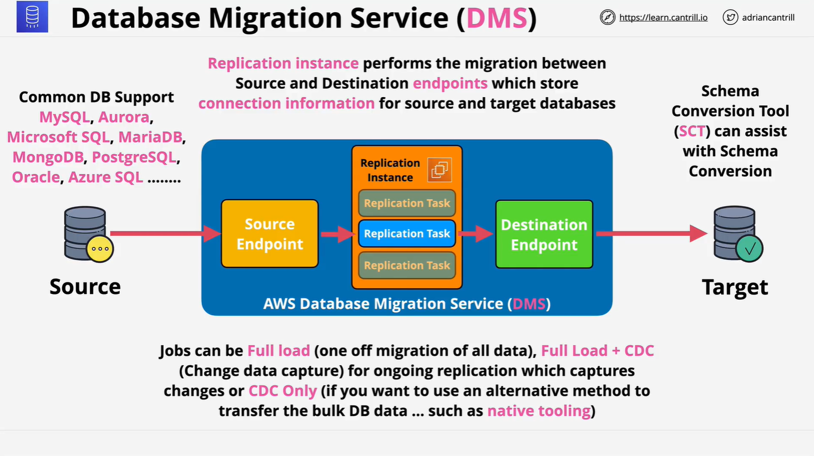

# AWS Database Migration Service (DMS)

This lesson expands upon the AWS DMS (Database Migration Service), a service featured heavily on the AWS SA-C03 exam and frequently used in real-world solutions architecture involving databases.

## Overview of DMS

AWS Database Migration Service (DMS) is a **managed service** that facilitates **migrating databases to AWS**. It simplifies a traditionally complex and manual process of database migration.

### Key Use Cases

- Moving databases to AWS (e.g., from on-premises)
- Migrating between different database engines
- Performing **zero-downtime** or **minimal-downtime** migrations

### Real-world Relevance

Even outside of exam scenarios, DMS is commonly used in AWS projects that involve databases.

## Traditional Database Migration Challenges

Before DMS, database migration typically required:

- Manual replication setup (complex)
- Point-in-time backups and restores (risk of data loss)
- Handling changes made during the migration

## DMS Architecture Overview

### Core Components

1. **Replication Instance**

   - Runs on an EC2 instance
   - Hosts one or more replication tasks

2. **Source and Target Endpoints**

   - Configuration that defines how to connect to the source and destination databases
   - At least one database must be hosted on AWS

3. **Replication Task**
   - Defines how the data is moved from source to target
   - Tasks can include full loads, change data capture (CDC), or both

### Supported Database Engines

DMS supports a wide variety of engines:

- MySQL, PostgreSQL, MariaDB, MongoDB
- Oracle, Microsoft SQL Server, Aurora
- Azure SQL, and others

## Types of Migration Jobs in DMS

| Type                | Description                                                                                                |
| ------------------- | ---------------------------------------------------------------------------------------------------------- |
| **Full Load**       | Migrates all existing data. Good if you can afford some downtime.                                          |
| **Full Load + CDC** | Performs a full load, then captures and replicates ongoing changes. Ideal for minimal-downtime migrations. |
| **CDC Only**        | Only replicates changes. Useful when the initial data transfer is done via other means.                    |

## DMS Limitation

- **No native schema conversion** support.
- **Cannot migrate between two on-premises databases** (one must be in AWS).

## AWS Schema Conversion Tool (SCT)

### Purpose

- Converts schemas between **different database engines**.
- Required when the source and target engines are not compatible.

### Key Facts

- **Not required** when the source and target engines are the same (e.g., MySQL → MySQL).
- Can be used with:
  - OLTP databases: MySQL, Microsoft SQL Server, Oracle
  - OLAP databases: Teradata, Vertica, Greenplum

### Example Use Cases

- Microsoft SQL (on-prem) → RDS MySQL
- Oracle (on-prem) → Aurora PostgreSQL

## Large Scale Migrations: DMS + SCT + Snowball

### Problem:

Migrating multi-terabyte databases can strain network capacity and take too long.

### Solution Workflow

1. **Extract Data**

   - Use SCT to convert schema and extract data into local files.

2. **Transfer Data**

   - Load the data onto an **AWS Snowball** device.
   - Ship the device to AWS.

3. **Import into AWS**

   - AWS loads the data into an S3 bucket.
   - DMS then migrates the data from S3 to the destination database.

4. **CDC Support**
   - Any changes that occurred since the initial extraction can also be sent through S3 and applied using DMS.

### Rule of Thumb:

SCT is **only** used when the **engine is changing** during the migration. The Snowball step doesn’t violate this rule since the data is transformed into a generic format.

## Exam Tips

- If a question involves **database migration**, and **one database is in AWS**, default to **DMS**.
- For **minimal downtime migrations**, always prefer **Full Load + CDC** via DMS.
- Use **SCT** only when the database **engine is changing**.
- For **large datasets**, consider combining **SCT + DMS + Snowball**.

## Summary

- AWS DMS is a powerful, managed service for migrating data between databases.
- It supports multiple database engines and is ideal for on-prem to AWS migrations.
- SCT complements DMS for engine conversion and large-scale migrations.
- Understanding DMS is crucial for both the AWS exam and real-world AWS architecture work.
