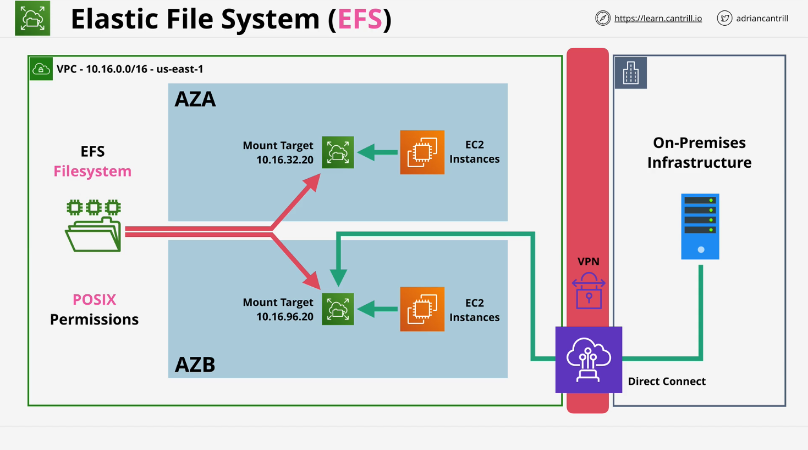

# AWS EFS (Elastic File System)

## Overview of EFS

**Amazon EFS (Elastic File System)** is a scalable, managed, NFS (Network File System)-based storage service that can be mounted by multiple EC2 Linux instances simultaneously. It's especially useful for applications requiring shared access to file-based storage such as content management systems (e.g., WordPress), home directories, and media hosting.

## Benefits of Using EFS

- **Network-based File System**: Accessible by multiple Linux EC2 instances concurrently.
- **Scalability**: Storage grows and shrinks automatically as files are added or removed.
- **High Availability & Durability**: Data persists independently of EC2 instance lifecycle.
- **Supports Stateless Architecture**: Ideal for self-healing and autoscaling setups.
- **Improves Media Handling**: Media stored on EFS won't be lost during EC2 instance replacement.

## Key Concepts

### 1. **EFS as NFS (v4) Implementation**

- EFS is AWS’s managed implementation of the NFSv4 protocol.
- It allows you to **mount file systems** into the **Linux file system hierarchy**, e.g., at `/nfs/media`.

### 2. **Shared Access**

- EFS can be mounted on **multiple EC2 Linux instances** at once.
- Facilitates **shared access to files**, which is useful for clustered applications or replicated environments.

## Architecture of EFS



### High-Level Architecture

- EFS resides **within a VPC**.
- **Mount targets** exist within **subnets** of the VPC.
- EC2 instances use **mount targets** to connect to EFS.
- For **high availability**, place mount targets in **multiple Availability Zones (AZs)**.

### POSIX Permissions

- EFS uses **POSIX permissions**, ensuring compatibility across Linux distributions.
- POSIX defines file ownership and permissions standards.

### Hybrid Access

EFS can be accessed **outside the VPC** using:

- **VPC Peering**
- **VPN Connections**
- **AWS Direct Connect**

These allow on-premises Linux systems to mount the EFS if connectivity is established.

## Performance Modes

### 1. General Purpose (default)

- Best for:
  - Web servers
  - Content management systems (CMS)
  - Home directories
- Optimized for **low latency** workloads.

### 2. Max I/O

- Designed for:
  - High-performance computing (HPC)
  - Media processing
  - Scientific workloads
- Supports **high throughput and parallelism**, but with **increased latency**.

## Throughput Modes

### 1. Bursting (default)

- Functions similarly to **GP2 EBS volumes**.
- Performance scales with the size of stored data.
- Ideal for most general use cases.

### 2. Provisioned

- Functions similarly to **IO1 EBS volumes**.
- You define throughput independently of storage size.
- Suitable for workloads with **predictable performance requirements**.

## Storage Classes

### 1. Standard (default)

- For **frequently accessed** files.
- Higher cost but optimized for speed.

### 2. Infrequent Access (IA)

- For **rarely accessed** files.
- Lower cost, suitable for archival or seldom-used data.
- Can be managed with **lifecycle policies**, similar to S3.

## EFS and EC2 Integration

- EFS mounts are similar to **locally attached drives**, but network-based.
- Data is **retained** even if the EC2 instance is terminated.
- Acts as a central file repository across multiple Linux servers.

## Important Exam Tips

- **EFS only works with Linux instances.**
- **Mount targets must exist in every AZ used by EC2 instances** to ensure availability.
- **Lifecycle management** can be used to move data between **standard** and **IA** classes.
- Understand the **difference between EBS (block storage)** and **EFS (file storage)**.

## Example Use Case: WordPress Architecture

**Problem**: WordPress media stored on EC2 instance's local storage gets lost if the instance is terminated.

**Solution with EFS**:

- Store `/wp-content/uploads` on EFS.
- Mount EFS to all WordPress EC2 instances.
- Enables high availability, better scaling, and media persistence.

## Code & Mounting Example (Explained)

```bash
# Create a directory to mount EFS
sudo mkdir /mnt/efs

# Mount the EFS file system (example file system ID and DNS name)
sudo mount -t nfs4 -o nfsvers=4.1 fs-12345678.efs.us-east-1.amazonaws.com:/ /mnt/efs
```

### Line-by-Line Breakdown:

- `sudo mkdir /mnt/efs`:  
  Creates a mount point directory on the EC2 instance.

- `sudo mount -t nfs4`:  
  Specifies the type of mount (NFS version 4).

- `-o nfsvers=4.1`:  
  Specifies to use **NFS version 4.1**.

- `fs-12345678.efs.us-east-1.amazonaws.com:/`:  
  DNS name of the EFS file system. Replace `fs-12345678` with your actual file system ID.

- `/mnt/efs`:  
  Local directory where EFS will be mounted.

## Summary

| Feature               | Description                           |
| --------------------- | ------------------------------------- |
| **Access Type**       | NFSv4 (Linux only)                    |
| **Mountable by**      | Multiple EC2 instances                |
| **Performance Modes** | General Purpose, Max I/O              |
| **Throughput Modes**  | Bursting, Provisioned                 |
| **Storage Classes**   | Standard, Infrequent Access           |
| **Hybrid Access**     | Supported via VPN/Direct Connect      |
| **High Availability** | Achieved via mount targets in each AZ |

## Next Step: Hands-On Demo

- You’ll:
  - Create an EFS file system.
  - Launch multiple EC2 Linux instances.
  - Mount EFS on both.
  - Share files between instances to validate shared storage.

# Additional Resources - File System Permissions and AWS EFS

## File System Permissions

File system permissions control the ability of users to read, change, navigate, and execute the contents of the file system. Two widely available types of permissions are POSIX file system permissions and access-control lists (ACLs), which offer more specific control.

### File System Variations

Different file systems implement permissions in various ways:

- **FAT**: Simple all-user read-only attribute
- **NTFS**: Complex ACLs for Windows NT and derivatives
- **OpenVMS**: Uses system, owner, group, and world categories with read, write, execute, and delete permissions
- **HFS/HFS+**: Original implementations don't support permissions, but macOS supports POSIX permissions and NFSv4 ACLs
- **Solaris**: UFS supports POSIX.1e ACLs; ZFS supports NFSv4 ACLs
- **Linux**: Supports POSIX.1e ACLs on multiple filesystems (ext2, ext3, ext4, Btrfs)
- **FreeBSD**: Supports POSIX.1e ACLs on UFS and NFSv4 ACLs on UFS and ZFS
- **IBM z/OS**: Implements file security using RACF
- **AmigaOS**: Supports ARWED permissions and additional flags
- **OpenHarmony**: Uses HMDFS with role-based access control

### POSIX Permissions

POSIX.1-2017 standard defines permissions based on three classes or scopes:

### Permission Classes

1. **Owner**: The user who owns the file
2. **Group**: Users who are members of the file's assigned group
3. **Others**: Users who are neither the owner nor members of the group

Effective permissions are determined based on the first class the user falls within (owner, then group, then others).

### Permission Types

POSIX implements three specific permissions for each class:

1. **Read (r)**:

   - For files: Grants ability to read file contents
   - For directories: Grants ability to list filenames, but not to see details

2. **Write (w)**:

   - For files: Grants ability to modify contents
   - For directories: Grants ability to modify entries (create, delete, rename files)

3. **Execute (x)**:
   - For files: Grants ability to execute as a program
   - For directories: Grants search permission (access file contents if name is known)

When a permission is not set, the corresponding rights are denied. Unlike ACL systems, permissions on Unix-like systems are not inherited.

### Special Permission Bits

Unix-like systems also use three special permission modes:

1. **Setuid (SUID)**: When executed, the process assumes the owner's effective user ID
2. **Setgid (SGID)**:
   - For files: When executed, the process assumes the group ID
   - For directories: New files inherit the directory's group
3. **Sticky Bit**: On directories, prevents users from renaming, moving, or deleting files they don't own

### Permission Notation

POSIX permissions can be represented in two ways:

#### Symbolic Notation

- First character indicates file type (not related to permissions)
- Nine subsequent characters represent permissions in three triads
- Each triad represents permissions for owner, group, and others respectively
- For each triad: r (read), w (write), x (execute), - (not permitted)
- Special permission bits modify the notation:
  - s/S: setuid/setgid with/without execute
  - t/T: sticky bit with/without execute

Examples:

- `-rwxr-xr-x`: Regular file, owner has full permissions, group and others have read and execute
- `crw-rw-r--`: Character special file, user and group have read and write, others have read
- `dr-x------`: Directory, user has read and execute, group and others have no permissions

#### Numeric Notation

Octal (base-8) notation represents permissions as digits:

- Read (r) = 4
- Write (w) = 2
- Execute (x) = 1

Common examples:

- `0000`: No permissions
- `0700`: Read, write, execute for owner only
- `0755`: Owner can read/write/execute, group and others can read/execute
- `0777`: Everyone can read/write/execute

## Amazon EFS Performance

### Performance Summary

Amazon EFS performance is measured in latency, throughput, and IOPS (Input/Output operations per second). Performance depends on:

1. **File system type**: Regional or One Zone
2. **Performance mode**: General Purpose or Max I/O
3. **Throughput mode**: Elastic, Provisioned, or Bursting

Performance specifications for General Purpose performance mode vary based on file system type and throughput mode:

- **Regional with Elastic throughput**:

  - Read latency: As low as 250μs
  - Write latency: As low as 2.7ms
  - Read IOPS: 900,000-2,500,000
  - Write IOPS: 500,000
  - Max read throughput: 10-60 GiBps
  - Max write throughput: 1-5 GiBps
  - Per-client throughput: 1,500 MiBps

- **Regional with Provisioned throughput**:

  - Similar latencies
  - Read IOPS: 55,000
  - Write IOPS: 25,000
  - Lower throughput maximums

- **One Zone (any throughput)**:
  - Read latency: As low as 250μs
  - Write latency: As low as 1.6ms
  - Read IOPS: 35,000
  - Write IOPS: 7,000
  - Max read throughput: 3 GiBps
  - Max write throughput: 1 GiBps
  - Per-client throughput: 500 MiBps

### Storage Classes

EFS offers storage classes optimized for different use cases:

1. **EFS Standard**:

   - Uses SSD storage
   - Lowest latency (250μs for reads, 2.7ms for writes)
   - Ideal for frequently accessed files

2. **EFS Infrequent Access (IA) and Archive**:
   - For less frequently accessed data
   - Higher latency (tens of milliseconds)

### Performance Modes

1. **General Purpose**:

   - Default and recommended mode
   - Lowest per-operation latency
   - Available for all file system types

2. **Max I/O**:
   - Previous generation performance type
   - Higher latencies but designed for highly parallelized workloads
   - Not supported for One Zone file systems or Elastic throughput
   - Not recommended due to higher latencies

Applications can scale IOPS up to the limit of the performance mode.

### Throughput Modes

EFS offers three throughput modes that determine available throughput:

1. **Elastic Throughput** (Recommended):

   - Automatically scales based on workload
   - Best for spiky or unpredictable workloads
   - Good for applications with average-to-peak throughput ratio of 5% or less
   - Pay only for what you use

2. **Provisioned Throughput**:

   - Specify a level of throughput independent of file system size
   - Good when performance requirements are known
   - Best for applications with average-to-peak throughput ratio of 5% or more
   - Billed for throughput provisioned in excess of baseline

3. **Bursting Throughput**:
   - Throughput scales with storage size in Standard storage class
   - Base rate: 50 KiBps per GiB of storage
   - Can burst up to 100 MiBps per TiB with credits

Your file system can achieve a combined 100% of read and write throughput.

### Burst Credits

With Bursting throughput, file systems earn credits at baseline rate determined by storage size:

- Baseline: 50 KiBps per GiB
- Read operations metered at one-third the rate of writes
- Credits accumulate when throughput is below baseline
- Maximum credit balance: 2.1 TiB for systems <1 TiB or 2.1 TiB per TiB for larger systems
- Credits allow bursting for up to 12 hours continuously

Examples:

- 100 GiB system: Can burst to 100 MiBps for 72 minutes per day
- 1 TiB system: Can burst to 100 MiBps for 12 hours per day
- 10 TiB system: Can burst to 1 GiBps for 12 hours per day

### Throughput Mode Restrictions

After switching to Provisioned throughput or changing the amount, the following actions are restricted for 24 hours:

- Switching to another throughput mode
- Decreasing the Provisioned throughput amount

## Amazon EFS Overview

Amazon Elastic File System (EFS) provides serverless, fully elastic file storage without requiring provisioning or management of capacity and performance. It scales automatically to petabytes and manages all file storage infrastructure.

Key features:

- Supports NFSv4.1 and NFSv4.0 protocols
- Compatible with most AWS compute instances
- Highly scalable, available, and durable

### File System Types

1. **Regional** (Recommended):

   - Stores data redundantly across multiple Availability Zones
   - Provides continuous availability even when one or more zones are unavailable

2. **One Zone**:
   - Stores data in a single Availability Zone
   - Lower cost but might lose data if the zone fails

### Performance Options

1. **Default Recommended Modes**:

   - General Purpose performance mode
   - Elastic throughput mode

2. **Features**:
   - File-system-access semantics with strong data consistency and file locking
   - POSIX permissions for access control

### Security Features

- Authentication and authorization
- Encryption in transit and at rest
- IAM policies and network security policies
- Not supported for Windows-based EC2 instances

## Storage Lifecycle Management

EFS lifecycle management automatically transitions data between storage classes based on access patterns, optimizing costs throughout the file system's lifecycle.

### Lifecycle Policies

Three policies control the lifecycle management:

1. **Transition into IA**:

   - Moves infrequently accessed files to cost-optimized storage
   - Default: Files not accessed for 30 days in Standard

2. **Transition into Archive**:

   - Moves rarely accessed files to lowest-cost storage
   - Default: Files not accessed for 90 days in Standard

3. **Transition into Standard**:
   - Controls whether files move back to Standard when accessed
   - Default: Files remain in IA or Archive when accessed
   - Performance-sensitive use cases should select "On first access"

### File System Operations

- Lifecycle management operations have lower priority than file system workloads
- Transition time depends on file size and workload
- Small files may take longer to transition than larger files
- Metadata always remains in Standard storage class
- Metadata operations don't count as file access
- All write operations to files in IA or Archive first go to Standard
- Files written to Standard are eligible for transition after 24 hours
