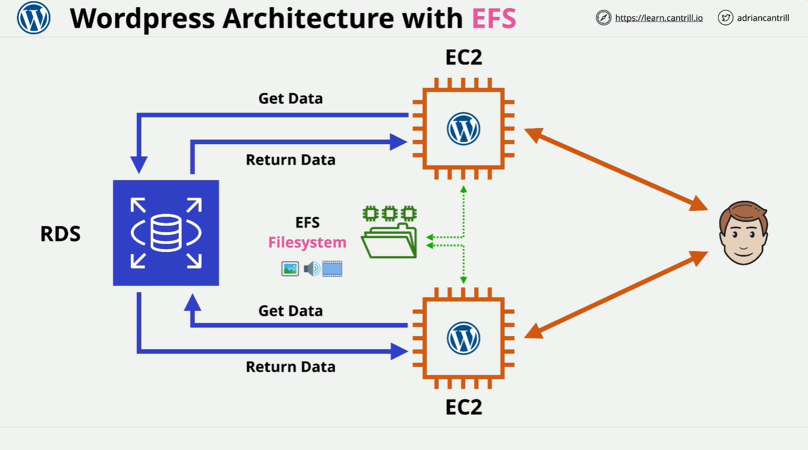

# WordPress with EFS (Elastic File System)

This lab demonstrates how to enhance WordPress scalability using AWS services, specifically EFS to decouple media storage from EC2 instances. The demo walks through the setup of infrastructure and multiple WordPress instances that all connect to a common shared file system.

## 📦 1-Click Deployments

Before you begin, ensure:

- You're logged into your **management account** in AWS.
- You're in the **N. Virginia (us-east-1)** region.

### 1. Base Infrastructure (VPC, RDS, EFS)

Deploy the foundational resources:

```text
Stack Name: EFSDEMO-VPC-RDS-EFS
URL: https://console.aws.amazon.com/cloudformation/home?region=us-east-1#/stacks/create/review?templateURL=https://learn-cantrill-labs.s3.amazonaws.com/awscoursedemos/0020-aws-associate-storage-scaling-wordpress-with-efs/A4L_VPC_EFS_RDS.yaml&stackName=EFSDEMO-VPC-RDS-EFS
```

This deploys:

- **VPC**
- **EFS File System** with mount targets in 3 Availability Zones
- **Aurora RDS Cluster**
- **Security Groups**
- **IAM Role and Instance Profile** for WordPress EC2
- **CloudWatch Agent Configuration**

### 2. WordPress Instance #1

```text
Stack Name: EFSDEMO-WORDPRESS1
URL: https://console.aws.amazon.com/cloudformation/home?region=us-east-1#/stacks/create/review?templateURL=https://learn-cantrill-labs.s3.amazonaws.com/awscoursedemos/0020-aws-associate-storage-scaling-wordpress-with-efs/A4L_WORDPRESS_AL2023.yaml&stackName=EFSDEMO-WORDPRESS1
```

Creates a WordPress EC2 instance that:

- References the shared VPC, RDS, and EFS
- Mounts EFS at `/var/www/html/wp-content`
- Uses user data to install and configure WordPress
- Auto-configures CloudWatch

### 3. WordPress Instance #2 (Later Step)

```text
Stack Name: EFSDEMO-WORDPRESS2
URL: https://console.aws.amazon.com/cloudformation/home?region=us-east-1#/stacks/create/review?templateURL=https://learn-cantrill-labs.s3.amazonaws.com/awscoursedemos/0020-aws-associate-storage-scaling-wordpress-with-efs/A4L_WORDPRESS_AL2023.yaml&stackName=EFSDEMO-WORDPRESS2
```

Same as Instance #1, just a different deployment to test shared storage.

## 🛠️ Understanding the Architecture



### VPC and Network Setup

- Custom **VPC** with subnets in 3 Availability Zones.
- Subnets for Application and Database tiers.
- **Security groups** control access between EC2, RDS, and EFS.
- **IAM Role & Instance Profile** allows EC2 to access EFS and CloudWatch.

### EFS Setup

- **Elastic File System** created and mounted to:
  - `us-east-1a`
  - `us-east-1b`
  - `us-east-1c`
- Mount targets exist in each AZ's application subnet.

### Aurora RDS

- **Aurora Cluster** as WordPress DB backend.
- RDS instance in private subnet.

## 🧑‍💻 WordPress Deployment Logic

The WordPress EC2 instance is deployed using a CloudFormation template. Key highlights:

```bash
# Mount EFS to WordPress media directory
mount -t efs ${FileSystemId}:/ /var/www/html/wp-content
```

**Explanation:**

- `mount -t efs`: Uses EFS mount helper.
- `${FileSystemId}`: Injected from the CloudFormation template.
- `/var/www/html/wp-content`: Where WordPress stores uploads.

WordPress user data script also:

- Installs WordPress
- Sets DB credentials
- Mounts EFS
- Signals CloudFormation when done

## 🖼️ Media Persistence via EFS

Download the cat images used in the demo:

```text
Download: https://learn-cantrill-labs.s3.amazonaws.com/awscoursedemos/0020-aws-associate-storage-scaling-wordpress-with-efs/blogimages.zip
```

Steps:

1. Upload images via WordPress post.
2. Images saved to `/var/www/html/wp-content/uploads/`.
3. Due to EFS, files are persisted independently of the EC2 instance.

## ✅ Verifying Shared Storage

### SSH into Instance:

```bash
cd /var/www/html/wp-content/uploads
ls -la
```

You should see:

- Media files organized by year/month.
- `df -k` shows EFS as mounted FS.

Delete the first WordPress instance and deploy WordPress #2. Visit blog post again — **images persist**, proving they are stored in EFS and not tied to a specific EC2.

## 🌀 Re-Deploy and Scale

1. Re-deploy WordPress1.
2. You now have **two EC2 instances** running WordPress:
   - Both use the **same RDS database**.
   - Both use the **same EFS file system**.
3. Any change on one instance reflects on the other.

## 🧹 Cleanup Steps

1. Delete both WordPress stacks:
   - `EFSDEMO-WORDPRESS1`
   - `EFSDEMO-WORDPRESS2`
2. Then delete base stack:
   - `EFSDEMO-VPC-RDS-EFS`

## 📈 Architectural Progression

At this stage:

- WordPress is no longer tied to one EC2 instance.
- Shared state (media + DB) is centralized using:
  - **Amazon RDS** for database
  - **Amazon EFS** for WordPress media

### Next Steps in the Course:

- Use **Launch Templates**
- Add **Auto Scaling Groups**
- Integrate with **Application Load Balancer**
- Fully elastic and resilient WordPress architecture
