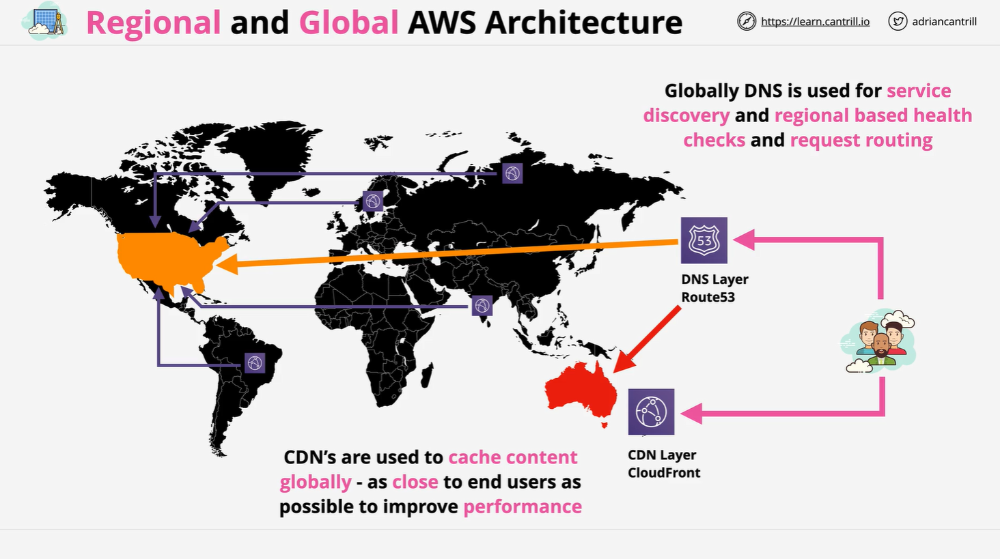
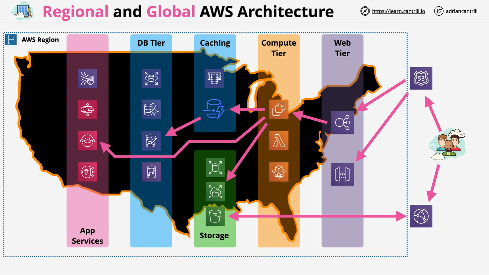

# AWS Global and Regional Architecture

This document provides a structured summary of the **"Regional and Global AWS Architecture"** lesson from the Cantrill.io AWS Solutions Architect Associate course. It introduces the concepts of global and regional system design using AWS services, illustrated with the Netflix platform as an example.

## Overview

The lesson uses **Netflix** as a model global application to explain how large-scale, distributed systems are architected on AWS. Netflix is a globally available service but is actually a collection of smaller, independently operating regional applications.

## Types of Architectures

Three core types of architectures were discussed:

1. **Small-scale Architectures**

   - Operate in a single region/country only.

2. **Regional + Disaster Recovery (DR)**

   - Primary region with a secondary failover region.

3. **Multi-Region Active Architectures**
   - Operate across multiple regions simultaneously and support failover across them.

## AWS Global Architecture Components



These global components work together to make services accessible, resilient, and performant across geographies.

### 1. Global Service Location & Discovery

- Uses **DNS** (Domain Name System) to resolve service endpoints.
- **AWS Service Used**: [Amazon Route 53](https://aws.amazon.com/route53/)
- Example: Typing `netflix.com` triggers DNS to resolve which region to direct the user to (e.g., US-East-1).

**Failover Example:**

```
Primary Region → US-East-1
Secondary Region → ap-southeast-2 (Australia)
```

**Route 53** provides **health checks**, allowing DNS to reroute based on service health.

### 2. Content Delivery

- Global content delivery via **CDN** (Content Delivery Network).
- **AWS Service Used**: [Amazon CloudFront](https://aws.amazon.com/cloudfront/)
- Media is cached in edge locations near users for performance.

### 3. Health Checks and Failover

- Ensures high availability.
- Route 53 monitors health and reroutes traffic as needed.

## AWS Regional Architecture Components



Once DNS resolves the region, traffic enters specific **AWS Regions** where regional services are deployed.

### 1. Regional Entry Point

- Incoming traffic first hits the **web tier**.
- Services include:
  - **Application Load Balancer (ALB)**
  - **API Gateway**

**Purpose:**  
Abstracts back-end infrastructure and allows flexible scaling and management.

### 2. Compute Tier

- Handles processing and logic.
- Services used:
  - **EC2 (Elastic Compute Cloud)**
  - **Lambda (Serverless)**
  - **ECS (Elastic Container Service)**

### 3. Storage Tier

- Used by the compute layer for persistent or shared storage:
  - **EBS (Elastic Block Store)**
  - **EFS (Elastic File System)**
  - **S3 (Simple Storage Service)**

### 4. Caching Tier

- Reduces database load and increases performance.
- Services:
  - **ElastiCache** (Redis/Memcached)
  - **DynamoDB Accelerator (DAX)**

**Flow:**

```
Application → Cache → Database (only if cache miss)
```

Caching is in-memory, making it fast and cost-effective.

### 5. Database Tier

- Persistent structured data storage:
  - **RDS (Relational Database Service)**
  - **Aurora**
  - **DynamoDB**
  - **Redshift** (Data warehousing)

### 6. Application Services Tier

- Supporting services for decoupling, communication, and orchestration:
  - **SQS (Simple Queue Service)** – Message queues
  - **SNS (Simple Notification Service)** – Pub/Sub notifications
  - **Step Functions** – Workflow orchestration
  - **Kinesis** – Real-time data streaming

## Key Architectural Principles

- **Global-Regional Thinking:**  
  Always architect with both global and regional perspectives.

- **Loose Coupling via Tiers:**  
  Separate concerns into distinct tiers: Web, Compute, Storage, Cache, Database, and Application Services.

- **Resilience and Performance:**  
  Use health checks, failover mechanisms, caching, and edge delivery to enhance reliability and user experience.

- **Abstraction and Modularity:**  
  Tiers help in abstracting infrastructure and allow scalable, manageable, and fault-tolerant systems.

## Conceptual Example: DNS Failover Using Route 53

Here is a conceptual JSON example of how DNS failover might be configured using Route 53.

```json
{
  "Type": "A",
  "Name": "netflix.com",
  "SetIdentifier": "Primary-US-East-1",
  "Region": "us-east-1",
  "Failover": "PRIMARY",
  "HealthCheckId": "abc123"
}
```

### Line-by-Line Explanation

- `"Type": "A"`  
  Specifies this is an A record (maps domain name to IPv4 address).

- `"Name": "netflix.com"`  
  The DNS name being resolved.

- `"SetIdentifier": "Primary-US-East-1"`  
  Identifies this record uniquely in the hosted zone.

- `"Region": "us-east-1"`  
  AWS region where this record is active.

- `"Failover": "PRIMARY"`  
  Marks this as the primary endpoint. Route 53 will use the secondary if this fails.

- `"HealthCheckId": "abc123"`  
  Associated health check to monitor this endpoint’s health status.

## Final Thoughts

- Most AWS services are **regional**, not global.
- Architectures should be **modular** and **tiered**.
- Think in terms of **global entry** and **regional execution**.
- Optimize for **performance, resilience, and scalability**.

This was just the **introduction**. Future lessons will dive deeper into each tier and AWS service.
