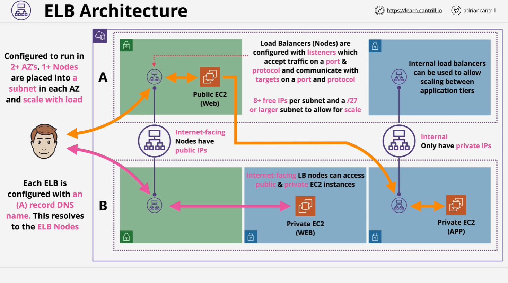

# Elastic Load Balancer (ELB) Architecture – Summary (Part 1)

This lesson serves as a foundational overview of the **Elastic Load Balancer (ELB)** architecture in AWS. It provides a high-level understanding of ELB's **logical and physical components**, its deployment within a **VPC across Availability Zones**, and configuration options like **IP versioning**, **public vs internal exposure**, and **subnet planning**.

## Purpose of a Load Balancer

- **Primary Function**: Accepts customer connections and distributes them to backend compute resources.
- **Abstracts Infrastructure**: Users interact with a single endpoint, unaware of underlying changes like scaling or failures.
- **Benefits**:
  - Supports horizontal scaling.
  - Handles backend failures without affecting end users.
  - Enables flexible and resilient application architecture.

## Basic Architecture Overview

### Visual Setup:

- **VPC** with **two Availability Zones (AZs)**: AZ-A and AZ-B.
- Each AZ has **public and private subnets**.
- **User (Bob)** interacts with **load balancers** deployed in the VPC.

## Load Balancer Configuration Options

### 1. **IP Versioning**

- Choose between:
  - **IPv4 only**
  - **Dual-stack** (IPv4 + IPv6)

### 2. **Availability Zones & Subnets**

- You must **choose one subnet per AZ** to deploy the load balancer.
- Load Balancer nodes are provisioned **inside the selected subnets**.

## Load Balancer Nodes

- What appears to be a **single Load Balancer** is actually **multiple nodes** deployed across subnets.
- These nodes:
  - Reside in **selected AZs**.
  - **Scale automatically** depending on incoming traffic.
  - Are **replaced if they fail**.

## DNS Architecture

- Each load balancer is created with a **single DNS (A record)**.
- This **DNS resolves to all load balancer nodes**.
- Incoming traffic is **distributed equally** across all nodes.

## Internet-Facing vs Internal Load Balancers

| Type            | Public IP | Private IP | Use Case                                 |
| --------------- | --------- | ---------- | ---------------------------------------- |
| Internet-Facing | Yes       | Yes        | Public-facing applications               |
| Internal        | No        | Yes        | Backend services (e.g., app or DB tiers) |

- **Same architecture**, only difference is **public IP assignment**.
- Nodes must be able to **communicate with backend instances**, whether **public or private EC2**.

## Listener Configuration (Intro)

- A **listener** defines:
  - Protocols (e.g., HTTP, HTTPS)
  - Ports to accept incoming traffic.
- Listener config determines how the **load balancer listens** for requests.

## Backend Instance Communication

- **Internet-facing load balancer** can connect to:
  - **Public EC2 instances**
  - **Private EC2 instances** (no public IP)
- Key requirement: **Network connectivity** between load balancer nodes and backend instances.

> Note: Backend instance **does not need a public IP**, even if the load balancer is internet-facing.

## Subnet Size Requirements

### AWS Requirements:

- Load balancers need **at least 8 free IPs** in each subnet.
- **Subnet Size Guidance**:
  - **/28**: Provides 16 IPs total, 11 usable after AWS reserves 5.
  - **/27**: Recommended for better scalability (more free IPs).

> **Exam Tip**: If both **/27** and **/28** are listed, prefer **/27** unless the question specifically requires the minimum viable subnet.

## Internal Load Balancer Usage

- Used for **internal communication** between app tiers.
- Example:
  - Bob connects to **Web Tier via Internet-facing ELB**.
  - Web Tier connects to **App Tier via Internal ELB**.

> This setup enables **tiered architecture** with **scalable and secure isolation** between layers.

## Recap & Next Steps

This concludes **Part 1** of the ELB architecture lesson. It covered:

- ELB fundamentals
- Deployment architecture
- Node behavior and DNS routing
- Internet-facing vs internal design
- Subnet sizing

> Continue to **Part 2** to dive deeper into routing, listener rules, and advanced configuration topics.
