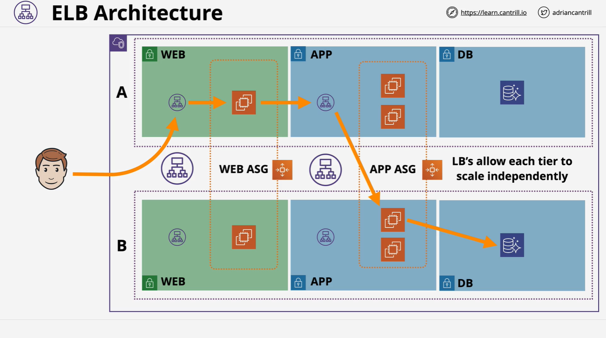
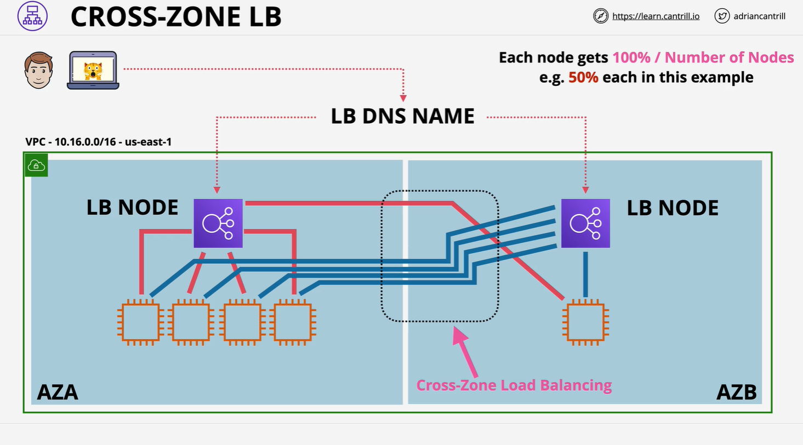

# Elastic Load Balancing (ELB) & Multi-Tier Architecture

## Overview of the Multi-Tier Architecture

The architecture described includes the following components:

1. **VPC** (Virtual Private Cloud) across **2 Availability Zones (AZs)**.
2. **Internet-Facing Load Balancer (ELB)** – handles incoming internet traffic.
3. **Web Tier** – Auto Scaling Group (ASG) of EC2 instances serving frontend requests.
4. **Internal Load Balancer (ELB)** – facilitates communication between web and app tiers.
5. **Application Tier** – ASG of EC2 instances handling backend logic.
6. **Database Tier** – Aurora (or other RDS) database instances for persistent storage.

### Three-Tier Structure

- **Web Tier**
- **Application Tier**
- **Database Tier**

Each tier is abstracted and decoupled using load balancers.

## Purpose of Load Balancers in Architecture

### Without Load Balancers:

- Tiers are tightly coupled.
- A client (e.g., Bob) connects to a specific web server.
- If an instance fails or scales, the user experience is disrupted.
- Web servers must know specific app server instances.
- App servers must know specific DB instances.

### With Load Balancers:

- Tiers become loosely coupled.
- Clients communicate only with the ELB.
- Instances can be added/removed dynamically.
- Each tier communicates with others via ELBs.
- Promotes **independent scaling** and **fault tolerance**.

### Communication Flow:

1. **User → Internet-facing ELB → Web Server**
2. **Web Server → Internal ELB → Application Server**
3. **Application Server → Database**

Each tier is abstracted from the physical deployment of the next.

## Cross-Zone Load Balancing

### Problem Before Cross-Zone Load Balancing:

- ELB nodes could only route to EC2 instances **within the same AZ**.
- If AZ-A has 4 instances and AZ-B has 1 instance:
  - AZ-A node splits its 50% load across 4 instances → 12.5% per instance.
  - AZ-B node sends all 50% to the single instance → 50% to one server.

This creates a significant **load imbalance**.

### Cross-Zone Load Balancing – The Solution:

- Allows **ELB nodes in one AZ to send traffic to instances in other AZs**.
- All registered instances across all AZs receive **equal load distribution**.
- In the previous case, all 5 instances would now receive 20% of the total load.

### Key Notes:

- **Enabled by default** for **Application Load Balancers (ALB)**.
- Historically **disabled by default**, important for exam questions.
- Commonly used to **fix uneven traffic distribution**.

## Key Architectural Insights about ELBs

### 1. ELBs Have Multiple Nodes

- One node is provisioned **per AZ** (per subnet).
- You’re creating **one ELB node per subnet** used in configuration.

### 2. ELBs Use a DNS Name

- DNS entry for the ELB spreads traffic across all its active nodes.

### 3. ELBs Scale Automatically

- As load increases, ELB nodes **scale automatically**.

### 4. ELB Types

| Type            | IP Address Type      | Description                             |
| --------------- | -------------------- | --------------------------------------- |
| Internet-Facing | Public IP addresses  | Accepts traffic from the internet       |
| Internal        | Private IP addresses | Used within private networks (VPC only) |

**Note**:  
An **Internet-Facing ELB** can route traffic to **both public and private EC2 instances**.  
Instances **do not require public IPs** to be registered with an Internet-Facing ELB.

### 5. Listener Configuration

- **Listeners** define how ELBs accept connections (e.g., HTTP port 80).
- Each listener uses a **protocol + port** and forwards traffic to a **target group**.

### 6. Subnet Sizing Requirements

- ELBs require **at least 8 free IP addresses per subnet** they’re deployed into.
- While a **/28** subnet might be technically sufficient,
  AWS recommends using **/27** subnets to allow for scaling.

## Summary of Important Points

| Concept                                     | Importance |
| ------------------------------------------- | ---------- |
| Load Balancers decouple architecture        | High       |
| Cross-Zone Load Balancing                   | High       |
| ELB auto-scales across AZs                  | Medium     |
| Internet-facing ELB works with private EC2s | High       |
| Subnet must have spare IPs                  | Medium     |
| Listener configurations are essential       | Medium     |

## Final Notes for the Exam

- Know the **impact of cross-zone load balancing**.
- Remember **ELBs support both public and private instances**.
- Understand **differences between Internet-Facing and Internal ELBs**.
- Be aware that **ELB nodes must reside in subnets with sufficient IP space**.
- Listener setup is **critical** for ELB behavior.
