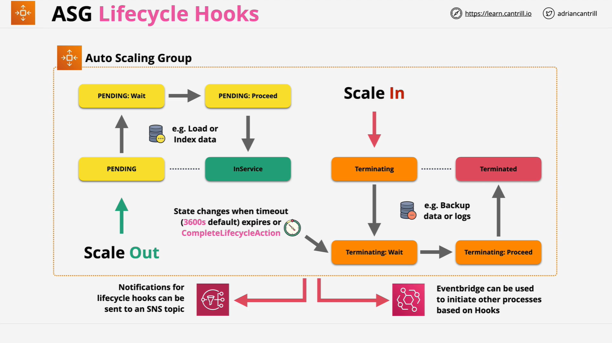

# AWS Auto Scaling Group Lifecycle Hooks

## Overview

Lifecycle Hooks are an advanced feature of Auto Scaling Groups (ASGs) that allow custom actions to be performed during the **launch** and **termination** of EC2 instances within an ASG. Normally, these processes are automated and cannot be interrupted, but Lifecycle Hooks give developers the ability to **pause the workflow** and execute custom logic.

## What are Lifecycle Hooks?

Lifecycle Hooks give you the ability to:

- **Pause** instance transitions during launch or termination
- Perform **custom actions** during these transitions
- Resume or abandon the transition **programmatically**
- Integrate with **SNS** or **Amazon EventBridge** for event-driven automation

## Supported Lifecycle Transitions

Lifecycle Hooks can be applied to two types of instance transitions:

1. **Launch Transitions**  
   Triggered when an instance is being launched during a scale-out event.
2. **Terminate Transitions**  
   Triggered when an instance is being terminated during a scale-in event.

## Launch Process with Lifecycle Hooks

Without Lifecycle Hooks:

```
pending → in-service
```

With Lifecycle Hooks:

```
pending → pending:wait → pending:proceed → in-service
```

### Example Use Case:

- A hook is placed on **instance launch**
- Instance enters `pending:wait`
- Custom logic is executed (e.g., data indexing, configuration)
- Once complete, `complete-lifecycle-action` is called
- Instance moves to `pending:proceed`, then to `in-service`

## Termination Process with Lifecycle Hooks

Without Lifecycle Hooks:

```
terminating → terminated
```

With Lifecycle Hooks:

```
terminating → terminating:wait → terminating:proceed → terminated
```

### Example Use Case:

- A hook is placed on **instance termination**
- Instance enters `terminating:wait`
- You use this time to:
  - Backup logs
  - Deregister from a system
  - Send notifications
- After completion, `complete-lifecycle-action` is triggered
- Instance transitions to `terminating:proceed`, then `terminated`

## Timeout Behavior

- **Default Timeout**: 3600 seconds (1 hour)
- If the timeout expires before `complete-lifecycle-action` is called, the instance **continues** or **abandons** the lifecycle action depending on configuration.

## Integration with AWS Services

### SNS (Simple Notification Service)

- Used to send notifications when lifecycle events occur.
- Helps trigger custom logic via Lambda, SQS, or external services.

### Amazon EventBridge

- Allows event-driven automation.
- You can trigger workflows like:
  - Lambda functions
  - Step Functions
  - External systems listening for EventBridge notifications

## Lifecycle Hook Execution Flow (Launch Example)



```plaintext
Auto Scaling Group decides to scale out
         ↓
Instance enters "pending" state
         ↓
Lifecycle Hook intercepts → "pending:wait"
         ↓
Custom logic runs (e.g. load config, register)
         ↓
Call `complete-lifecycle-action`
         ↓
Moves to "pending:proceed" → "in-service"
```

## Lifecycle Hook Execution Flow (Terminate Example)

```plaintext
Auto Scaling Group decides to scale in
         ↓
Instance enters "terminating" state
         ↓
Lifecycle Hook intercepts → "terminating:wait"
         ↓
Custom logic runs (e.g. backup logs, notify)
         ↓
Call `complete-lifecycle-action`
         ↓
Moves to "terminating:proceed" → "terminated"
```

## Summary

Lifecycle Hooks provide a powerful mechanism for:

- Customizing EC2 instance lifecycle behavior within Auto Scaling Groups
- Creating automation based on launch/termination
- Integrating with AWS services for advanced workflows

They are ideal for situations where you need to perform tasks **before** an instance is fully operational or **before** it is terminated and removed from your infrastructure.
