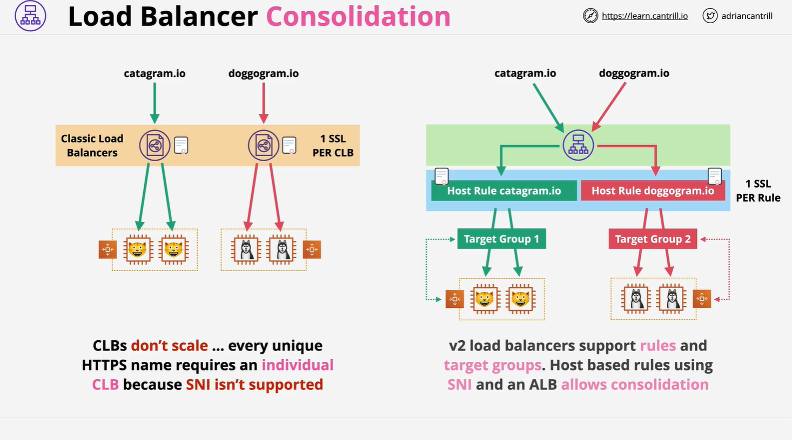
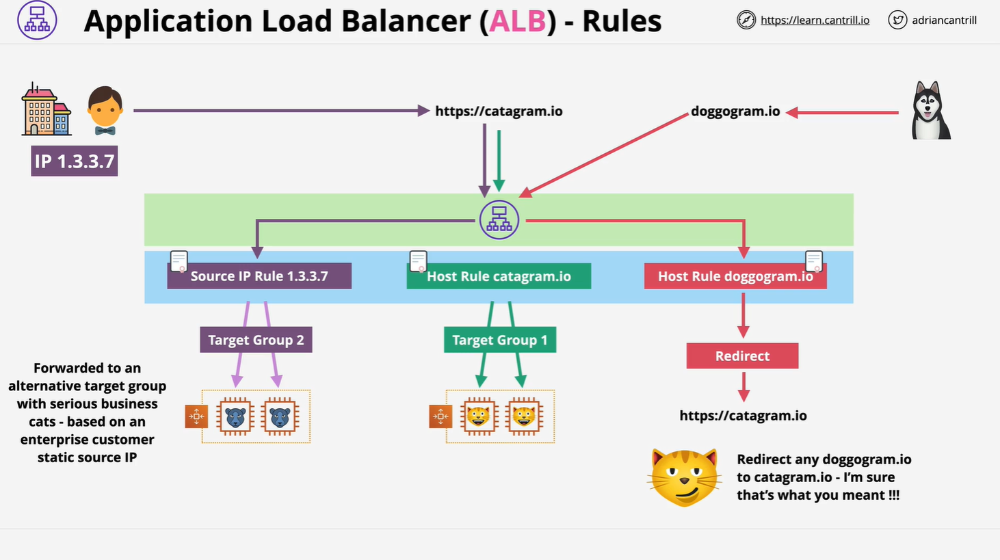

# AWS Load Balancers (ALB vs NLB)

## Overview

This lesson focuses on understanding the **differences, advantages, and ideal use cases** of Application Load Balancers (ALBs) and Network Load Balancers (NLBs) in AWS. A key objective for the AWS Solutions Architect Associate (SAA-C03) exam is to know **when to choose ALB vs NLB**.

## Legacy Load Balancing: The Classic Load Balancer (CLB)

### Problem with Classic Load Balancers

- **No SNI (Server Name Indication) support**
- **Only one SSL certificate per load balancer**
- Required one CLB per HTTPS application

### Example Architecture:



**Limitation**: Cannot serve multiple HTTPS applications (e.g., catagram.io and dogagram.io) without deploying multiple CLBs.

## Modern Approach: Application Load Balancer (ALB)

### ALB Consolidation Example

You can serve multiple apps (e.g., catagram and dogagram) using a single ALB by:

- Attaching multiple **SSL certificates** (via SNI support)
- Using **host-based rules**
- Using **target groups** for each app

**Advantage**: Drastically reduces the number of required load balancers (e.g., from 100 CLBs to 1 ALB in legacy migrations).

## Key Features of Application Load Balancers (ALB)

### 1. **Layer 7 Load Balancer**

- Operates at **Layer 7** of the OSI model (application layer).
- Understands HTTP and HTTPS protocols.
- Cannot support non-HTTP protocols like SMTP, SSH, etc.

### 2. **Termination of SSL/TLS**

- ALB **terminates SSL** connections.
- No support for **end-to-end encryption** from client to EC2 instance.
- Requires **SSL certificates installed** on the ALB.

> This may be unacceptable for organizations needing full SSL passthrough.

### 3. **Supports HTTP/HTTPS Only**

- Cannot use **TCP**, **UDP**, or **TLS** listeners.
- Must use **HTTP or HTTPS** listeners only.

### 4. **Application-Level Routing**

- Makes decisions based on:
  - Host headers (e.g., `catagram.io`)
  - Paths (e.g., `/images`, `/api`)
  - Query strings
  - Source IP
  - HTTP methods (GET, POST)
  - Custom headers

### 5. **ALB Rules and Actions**

**Rules:**

- Processed in **priority order**
- End with a **default catch-all rule**

**Conditions for rules**:

```text
- Host header
- Path pattern
- Query string
- Source IP
- HTTP headers
- HTTP methods
```

**Actions available:**

```text
- Forward to target group
- Redirect to another domain/path
- Fixed HTTP response (e.g., error or maintenance message)
- Authenticate via Cognito/OpenID
```

### Visual Architecture Example:



### Example Use Case: Redirect

- `dogogram.io` requests → **redirected** to `catagram.io`

## Limitations of ALB

- SSL termination **breaks full encryption**
- Slower than NLB due to deeper packet inspection (Layer 7)
- Cannot support protocols outside HTTP/HTTPS

## Health Checks with ALB

- **Application-aware**
- Can make HTTP(S) requests to check app logic
- More detailed than NLB health checks

## Network Load Balancers (NLB)

### 1. **Layer 4 Load Balancer**

- Works at **Layer 4** of the OSI model
- Supports **TCP**, **UDP**, and **TLS**
- No understanding of HTTP/HTTPS headers, cookies, or session stickiness

### 2. **High Performance**

- Handles **millions of requests/sec**
- ~25% latency of ALB
- Ideal for **non-web protocols**:
  - SMTP
  - SSH
  - Gaming
  - Financial apps

### 3. **Static IP Support**

- You can assign **Elastic IPs**
- Useful for **corporate whitelisting**

### 4. **End-to-End Encryption Support**

- TCP connections can be **forwarded unmodified**
- Allows **unbroken encryption** between client and EC2 instance

### 5. **Health Checks**

- Basic **network-level checks**
  - TCP handshake
  - ICMP (ping)
- **Not application-aware**

## PrivateLink Integration

- NLBs are used for **PrivateLink** services
- Exposes services securely to **other VPCs or AWS accounts**

## When to Use Which?

### Choose **Network Load Balancer (NLB)** if:

- You need **unbroken end-to-end encryption**
- You require **static IPs** for firewall whitelisting
- Your application requires **non-HTTP protocols**
- You need **maximum performance**
- You're using **AWS PrivateLink**

### Choose **Application Load Balancer (ALB)** if:

- Your application is **HTTP/HTTPS-based**
- You need **layer 7 routing** (paths, host headers, cookies, etc.)
- You need to **authenticate users**
- You require **content-based routing**
- You want **application-aware health checks**

## Summary Table

| Feature / Need                  | ALB               | NLB           |
| ------------------------------- | ----------------- | ------------- |
| Protocol Support                | HTTP, HTTPS       | TCP, UDP, TLS |
| Layer                           | 7 (Application)   | 4 (Transport) |
| SSL Termination                 | Yes               | Optional      |
| End-to-End Encryption           | No                | Yes           |
| Static IP Support               | No                | Yes           |
| Performance (Latency)           | Moderate          | Very High     |
| Health Check Depth              | Application-level | TCP handshake |
| Routing Features                | Path, Host, IP    | Basic         |
| Supports PrivateLink            | No                | Yes           |
| Cookie-Based Stickiness         | Yes               | No            |
| Authentication (Cognito/OpenID) | Yes               | No            |
