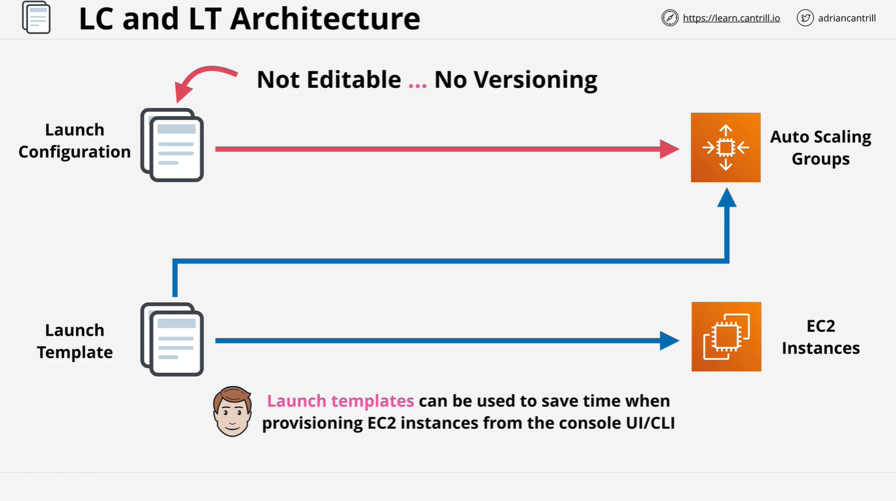

#EC2 Launch Configurations vs Launch Templates

This summary is based on the Cantrill.io AWS SAA-C03 lesson covering **Launch Configurations** and **Launch Templates** in Amazon EC2. Both are mechanisms to define EC2 instance configurations for reuse, especially in **Auto Scaling Groups** (ASGs).

## Overview

**Launch Configurations** and **Launch Templates** allow you to define how EC2 instances should be configured when they are launched. This includes defining:

- AMI (Amazon Machine Image)
- Instance type and size
- EBS volumes and storage settings
- Key pair for SSH access
- Network and subnet settings
- Security groups
- User data scripts (for bootstrapping)
- IAM role (for permissions)

## Launch Configurations

- Legacy method to predefine EC2 instance configurations.
- Once created, they are **not editable**.
- **No versioning** support.
- Only used within **Auto Scaling Groups**.
- If configuration needs to be changed, a **new launch configuration** must be created.

### Limitations

Launch configurations do **not** support modern EC2 features such as:

- T2/T3 Unlimited CPU credits
- Placement groups
- Capacity reservations
- Elastic GPUs

## Launch Templates

- The **modern and recommended** method for defining EC2 instance configurations.
- Include **all features** of launch configurations, and more.
- Support **versioning**, allowing multiple revisions.
- Can be used both in:
  - **Auto Scaling Groups**
  - **Direct EC2 launches** from Console or CLI

### Additional Features Supported

- T2/T3 Unlimited mode
- Placement groups
- Capacity reservations
- Elastic GPUs
- Tagging at instance and volume level
- Advanced networking features

## Key Differences

| Feature                      | Launch Configuration | Launch Template            |
| ---------------------------- | -------------------- | -------------------------- |
| Editable                     | No                   | No (but supports versions) |
| Versioning                   | No                   | Yes                        |
| Auto Scaling Group Support   | Yes                  | Yes                        |
| Direct EC2 Launch Support    | No                   | Yes                        |
| Supports Latest EC2 Features | No                   | Yes                        |
| AWS Recommendation           | No                   | Yes                        |

## AWS Recommendation

**Use Launch Templates**. They offer greater flexibility, more features, and better integration with the broader AWS ecosystem. Launch Configurations are still supported but are considered outdated.

## Architectural Considerations

- **Launch Configurations**: Designed solely for use within Auto Scaling Groups.
- **Launch Templates**: Can be used in Auto Scaling Groups and also for manual EC2 launches. This makes them more versatile in operational and automated environments.

## Real-World Use Case

For example, an administrator can create a **Launch Template** with all the necessary instance parameters. Later, this template can be used:

- To launch instances directly through the AWS Management Console
- Programmatically through the AWS CLI or SDKs
- Within Auto Scaling Groups for dynamic scaling

This reduces errors, increases consistency, and speeds up deployment processes.

## Next in the Course

The following lesson will dive into **Auto Scaling Groups (ASGs)**, which use either Launch Configurations or Launch Templates to automatically scale EC2 instances based on traffic and load conditions.

## Summary Table

| Feature                        | Launch Configuration | Launch Template   |
| ------------------------------ | -------------------- | ----------------- |
| Reusable for ASG               | Yes                  | Yes               |
| Usable for Manual EC2 Launches | No                   | Yes               |
| Editable After Creation        | No                   | No (use versions) |
| Version Support                | No                   | Yes               |
| Supports Modern EC2 Features   | No                   | Yes               |
| Recommended by AWS             | No                   | Yes               |
