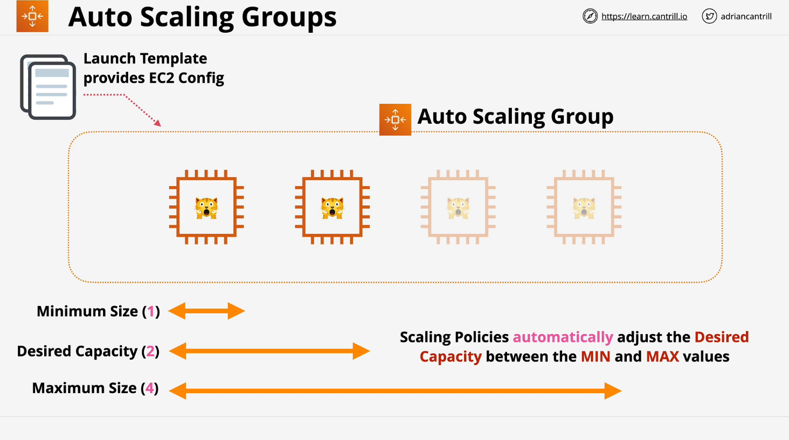
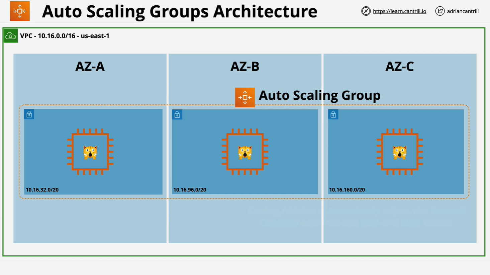
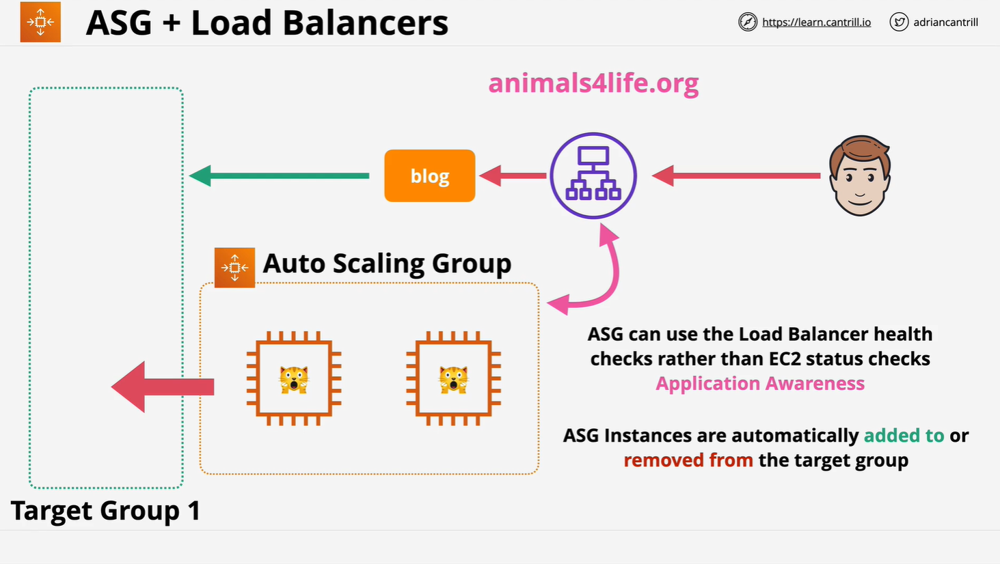

# EC2 Auto Scaling Groups (ASGs)

## Overview

**EC2 Auto Scaling Groups (ASGs)** are used to automatically manage the number of Amazon EC2 instances based on demand. They provide elasticity, availability, and resilience for cloud applications, commonly used alongside **Elastic Load Balancers (ELBs)** and **Launch Templates**.

## Key Components of Auto Scaling Groups

### 1. Launch Configuration / Launch Template

ASGs require a **Launch Configuration** or a specific version of a **Launch Template** to know what type of EC2 instance to provision.

- **Launch Configuration**: Older method.
- **Launch Template**: Newer and more flexible (preferred).

### 2. Capacity Settings

Each ASG includes three critical values:



| Parameter | Description                          |
| --------- | ------------------------------------ |
| `min`     | Minimum number of instances (e.g. 1) |
| `desired` | Target number of instances (e.g. 2)  |
| `max`     | Maximum number of instances (e.g. 4) |

> Example: `(min=1, desired=2, max=4)`

The ASG automatically provisions or terminates instances to maintain the **desired** number of instances between the `min` and `max`.

## Scaling Modes



### 1. **Manual Scaling**

You manually change the desired capacity; the ASG handles instance creation/termination.

### 2. **Scheduled Scaling**

Useful for known high/low usage periods (e.g. sales, off-hours).

### 3. **Dynamic Scaling**

Triggered by monitoring metrics.

#### a. **Simple Scaling**

Basic up/down rules based on a metric.

```plaintext
If CPU > 50% → add 1 instance
If CPU < 50% → remove 1 instance
```

#### b. **Step Scaling**

More granular; reacts proportionally to metric deviations.

```plaintext
CPU > 50% → add 1 instance
CPU > 80% → add 3 instances
```

#### c. **Target Tracking**

Maintains a target metric value (e.g. 40% CPU utilization) by auto-scaling in/out.

> Supported metrics: average CPU, average network in/out, request count per target.

## Cooldown Period

ASGs use a **cooldown period** (in seconds) to wait after a scaling event before another is triggered. Helps avoid **thrashing** and unwanted costs (due to the EC2 minimum billing time).

## Self-Healing & Health Checks

ASGs monitor instance health using:

- **EC2 status checks** (default)
- **ELB health checks** (optional, more advanced)

> If an instance is unhealthy or terminated, the ASG replaces it automatically.

### High Availability Tip

You can create a **"self-healing, HA instance"** setup:

- Launch Template
- ASG using multiple subnets in different AZs
- Set: `min=1, desired=1, max=1`

This ensures the instance is replaced and can recover in another AZ.

## Integration with Load Balancers



When integrated with a **Load Balancer**:

- Provisioned instances are **automatically added** to the **Target Group**.
- Terminated instances are **automatically removed**.

This enables true **elasticity** and **load-based scaling**.

> Use ALB health checks for richer, application-aware monitoring. Be careful with the content of the health check endpoint to avoid misrepresenting instance health.

## Scaling Processes in ASGs

ASG behaviors can be **suspended/resumed**:

| Process             | Functionality                       |
| ------------------- | ----------------------------------- |
| `Launch`            | Controls launching new instances    |
| `Terminate`         | Controls termination of instances   |
| `AddToLoadBalancer` | Adds instances to load balancer     |
| `AlarmNotification` | Reacts to CloudWatch alarms         |
| `AZRebalance`       | Distributes instances across AZs    |
| `HealthCheck`       | Performs health checks              |
| `ReplaceUnhealthy`  | Replaces failed/unhealthy instances |
| `ScheduledActions`  | Runs scheduled scaling actions      |

Additionally, instances can be placed in **Standby** to isolate them from ASG actions (e.g., for maintenance).

## Cost Optimization Tips

- ASGs themselves are **free**—you only pay for the instances.
- Use **smaller EC2 instances** for **granular scaling** and **cost control**.
- Use **cooldown periods** to avoid unnecessary provisioning/termination.

## Summary of ASG Roles

| Component          | Controls                                       |
| ------------------ | ---------------------------------------------- |
| Auto Scaling Group | **When** and **where** to launch instances     |
| Launch Template    | **What** to launch (AMI, instance type, etc.)  |
| Load Balancer      | Abstracts and balances traffic among instances |

## Conclusion

Auto Scaling Groups are a critical component of elastic, fault-tolerant, and cost-efficient AWS architectures. Understanding the different scaling mechanisms, health check integrations, and configuration strategies is essential for both the **AWS Solutions Architect Associate (SAA-C03)** exam and real-world architecture.
