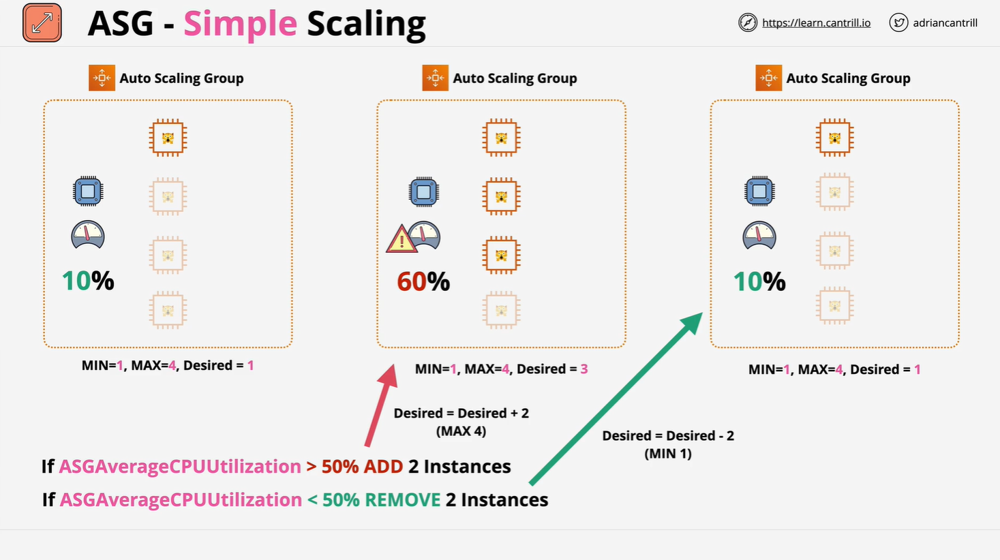
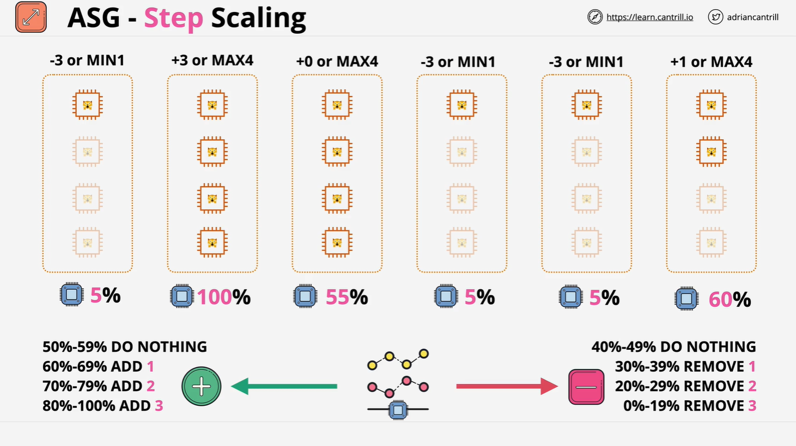

# Auto Scaling Group (ASG) Scaling Policies

This lesson expands on AWS Auto Scaling Group (ASG) policies, especially focusing on how ASGs scale dynamically or manually based on defined rules.

## Manual Scaling vs. Dynamic Scaling

### Manual Scaling

- ASGs can function **without** any scaling policies.
- When this is the case, the ASG uses static values for:
  - `MinSize`
  - `MaxSize`
  - `DesiredCapacity`
- Adjusting these manually is referred to as **manual scaling**.
- Use cases:
  - Testing environments
  - Emergency scaling
  - Cost control measures

## Types of Dynamic Scaling

Dynamic scaling allows ASGs to automatically adjust capacity based on real-time metrics.

### 1. **Simple Scaling**



- Triggered when a CloudWatch alarm enters an alarm state.
- Scaling action is **fixed**:
  - E.g., Add 1 instance if `CPUUtilization > 40%`
  - Remove 1 instance if `CPUUtilization < 40%`
- **Drawback**: It's rigid and does not adapt to the degree of demand.

#### Example:

```plaintext
If CPU > 50% → Add 2 instances
If CPU < 50% → Remove 2 instances
```

- No distinction between a small or large deviation — same action occurs regardless.

### 2. **Step Scaling**



- Allows **graduated scaling** based on how far the metric deviates from the threshold.
- Uses **step adjustments** to determine how many instances to add/remove.

#### Example Rules:

```plaintext
If CPU is:
- 50-59% → Do nothing
- 60-69% → Add 1 instance
- 70-79% → Add 2 instances
- 80-100% → Add 3 instances

If CPU is:
- 40-49% → Do nothing
- 30-39% → Remove 1 instance
- 20-29% → Remove 2 instances
- 0-19% → Remove 3 instances
```

- **Advantage**: More responsive and efficient than simple scaling.
- AWS **recommends step scaling** over simple scaling due to its flexibility.

### 3. **Target Tracking Scaling**

- Uses predefined CloudWatch metrics like:

  - `CPUUtilization`
  - `NetworkIn`
  - `NetworkOut`
  - `ALBRequestCountPerTarget`

- You set a **target value**, e.g., keep `CPUUtilization` at **50%**.
- ASG calculates required adjustments **automatically** to meet that target.

#### Behavior:

- If actual usage > target → Add instances
- If actual usage < target → Remove instances
- Larger the gap from target, more aggressive the scaling

### 4. **Scaling Based on SQS Queue Length**

- Common in **decoupled architectures** (e.g., worker-based systems).
- ASG scales based on **visible messages** in an Amazon SQS queue.

#### Behavior:

- More messages in the queue → Add compute capacity
- Queue empties → Remove instances to save cost

## Simple vs. Step Scaling (Detailed Comparison)

### Scenario:

- ASG Config:
  - `MinSize: 1`
  - `MaxSize: 4`
  - `DesiredCapacity: 1`
- Assume average `CPUUtilization: 10%`

### Simple Scaling Logic:

```plaintext
Rule 1: If CPU > 50% → Add 2 instances
Rule 2: If CPU < 50% → Remove 2 instances
```

#### Example Flow:

1. CPU spikes to 60%:

   - Rule 1 triggers
   - DesiredCapacity becomes 3 (adds 2 instances)

2. CPU drops to 10%:
   - Rule 2 triggers
   - DesiredCapacity becomes 1 (removes 2 instances)

> Simple Scaling always applies the **same** adjustment, regardless of severity of the metric.

### Step Scaling Logic:

```plaintext
CPU %       | Action
|--
50-59       | Do nothing
60-69       | Add 1 instance
70-79       | Add 2 instances
80-100      | Add 3 instances

40-49       | Do nothing
30-39       | Remove 1 instance
20-29       | Remove 2 instances
0-19        | Remove 3 instances
```

#### Example Flow:

- Starting with `DesiredCapacity: 1`
- CPU jumps to 100% → Add 3 instances → DesiredCapacity becomes 4
- CPU settles at 55% → No change (falls in do-nothing zone)
- CPU drops to 5% → Remove 3 instances → DesiredCapacity becomes 1

> Step scaling enables **fine-grained** control based on **severity** of demand.

## Summary: Why Step Scaling is Preferred

- **Simple Scaling**: Adds/removes a fixed number of instances regardless of load severity.
- **Step Scaling**: Adjusts capacity **proportionally** to the deviation from the desired metric.
- Ideal for **variable workloads** and **efficient resource usage**.

## Conclusion

Auto Scaling policies are crucial for cost-efficiency and application performance. Step Scaling provides the best balance of control and automation, and AWS generally recommends it over simple scaling. Target tracking and SQS-based scaling also offer dynamic responsiveness in specific use cases.

> Tip: Always consider the **nature of your workload** before choosing a scaling strategy.
