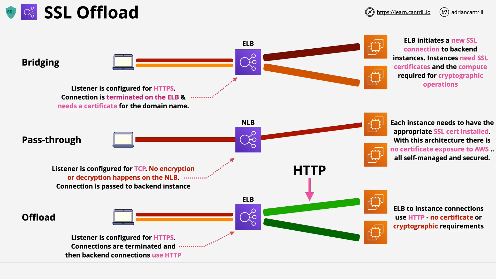
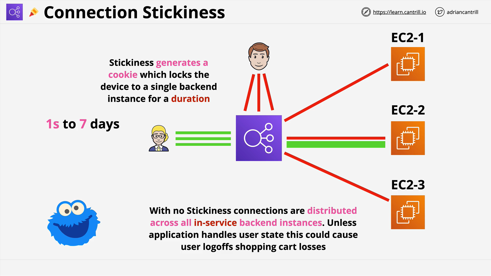

# Elastic Load Balancer (ELB): SSL Offload & Session Stickiness

This lesson from Cantrill.io covers two critical architectural concepts related to Elastic Load Balancers (ELB) in AWS:

- **SSL Offload**
- **Session Stickiness**

While detailed implementation is not required for the exam, understanding the **architecture**, **behavior**, and **trade-offs** is essential.

## SSL Handling Modes

There are three architectural methods a Load Balancer can use to handle secure (HTTPS) connections:

### 1. **SSL Bridging (Default for Application Load Balancer)**

- **How it works:**
  - The client establishes an **HTTPS** connection to the load balancer.
  - The ELB **terminates (decrypts)** the SSL at the load balancer.
  - The ELB then creates a new HTTPS connection to backend instances (EC2).
- **Requirements:**
  - SSL certificates must be installed **on the load balancer** and **on each EC2 instance**.
- **Benefits:**
  - The ELB can **inspect** the HTTP layer (since SSL is terminated).
  - Enables routing based on **application-layer content** (e.g., HTTP headers, paths).
- **Drawbacks:**

  - Certificates must be securely managed and **stored on multiple components**.
  - EC2 instances must perform **encryption/decryption**, adding CPU overhead.

- **Summary:**
  - Good for **application-aware routing**.
  - Increases operational complexity due to certificate and compute needs.

### 2. **SSL Pass Through (Used by Network Load Balancer)**

- **How it works:**

  - The encrypted connection from the client is passed **unchanged** to the backend.
  - The ELB does **not decrypt** or inspect traffic.

- **Requirements:**

  - SSL certificates are **only required on backend EC2 instances**.
  - The ELB listens using **TCP**, not HTTP/HTTPS.

- **Benefits:**

  - Full **encryption end-to-end**; AWS never sees the decrypted data.
  - Improved **security compliance** (e.g., for PCI or HSM-controlled environments).

- **Drawbacks:**

  - No application-layer inspection or routing.
  - Backend instances still bear the compute cost of SSL.

- **Summary:**
  - Great for **security-first** architectures.
  - Limits flexibility due to lack of HTTP-level routing.

### 3. **SSL Offload**

- **How it works:**

  - SSL is **terminated** at the load balancer.
  - Backend EC2 instances receive **plain HTTP** traffic.

- **Requirements:**

  - SSL certificate needed **only at the ELB**.
  - EC2 instances need to handle only **HTTP** traffic.

- **Benefits:**

  - **No SSL overhead** on backend EC2 instances.
  - Enables use of **smaller, cost-effective** instances.

- **Drawbacks:**

  - HTTP between ELB and backend is **unencrypted**.
  - May not meet certain **compliance or security** requirements.

- **Summary:**
  - Ideal for **performance-optimized** architectures when encryption inside AWS is not a concern.

## Session Stickiness

### Overview

- Also known as **"session affinity"**, this feature ensures that a user is consistently routed to the **same backend instance**.
- Essential when **user session state is stored locally** on the instance.

### Without Stickiness

- Each request from the client can land on **any healthy backend instance**.
- Load balancing is **even and stateless**.
- Requires **external session management** (e.g., DynamoDB, ElastiCache).

### With Stickiness (Application Load Balancer)

- **Enabled at the Target Group level**.
- Uses a special **cookie** (`AWSALB`) to track users.
- All subsequent requests from a user are routed to the **same instance** until:
  1. The instance becomes **unhealthy**.
  2. The **cookie expires**.

#### Stickiness Cookie Details

| Attribute        | Description        |
| ---------------- | ------------------ |
| Cookie Name      | `AWSALB`           |
| Expiration Range | 1 second to 7 days |
| Defined On       | Target Group       |

### Pros of Stickiness

- Ensures consistent user sessions.
- Useful for **legacy applications** with in-memory sessions.

### Cons of Stickiness

- Can result in **uneven load** on backend instances.
- Scalability and fault tolerance can be impacted.
- Better architecture is to design **stateless applications**.

### Recommended Architecture

- Store session data **outside** of EC2 (e.g., in **DynamoDB**, **ElastiCache**).
- Allows for true **stateless compute** and better elasticity.

## Summary Table

| Mode             | ELB Can Decrypt? | Cert on ELB | Cert on EC2 | HTTP Routing? | Data Encrypted to EC2? | Compute Load on EC2 |
| ---------------- | ---------------- | ----------- | ----------- | ------------- | ---------------------- | ------------------- |
| SSL Bridging     | Yes              | Yes         | Yes         | Yes           | Yes                    | High                |
| SSL Pass Through | No               | No          | Yes         | No            | Yes                    | High                |
| SSL Offload      | Yes              | Yes         | No          | Yes           | No                     | Low                 |

## Final Thoughts

- Understand the **use cases** and **trade-offs** for each SSL handling method.
- Choose **stickiness** only when absolutely necessary.
- Favor **stateless applications** and **external session management** for scalable, cloud-native design.
