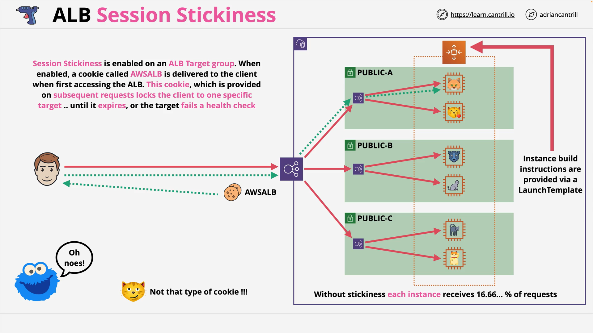

# Session Stickiness with AWS Application Load Balancer (ALB)

This lab from the **Learn Cantrill AWS SA-C03 Course** provides hands-on experience with configuring **session stickiness** on an **Application Load Balancer (ALB)** using a CloudFormation template. You will observe the behavior with and without stickiness enabled and understand its impact on backend EC2 routing.

## Resources

- **1-Click CloudFormation Deployment**  
  [Launch Stack (us-east-1)](https://console.aws.amazon.com/cloudformation/home?region=us-east-1#/stacks/quickcreate?templateURL=https://learn-cantrill-labs.s3.amazonaws.com/aws-simple-demos/aws-alb-session-stickiness/ALBSTICKINESS.yaml&stackName=ALB)

- **Lab Instructions**  
  [GitHub Instructions](https://github.com/acantril/learn-cantrill-io-labs/blob/master/00-aws-simple-demos/aws-alb-session-stickiness/02_LABINSTRUCTIONS/Session%20Stickiness%20Instructions.md)

## Overview

The focus of this lab is on how **session stickiness** works with an **Application Load Balancer (ALB)**. You’ll interact with a load-balanced group of EC2 instances and see how enabling stickiness alters routing behavior.

## Step 1: Deploy Infrastructure Using CloudFormation

### Prerequisites

- Log in to your AWS account with an **admin-level IAM user**.
- **Region**: Use **us-east-1 (N. Virginia)**.

### Deploy the Stack

1. Click the **1-click deploy link** above.
2. Scroll down, check the **capabilities** box.
3. Click **Create Stack**.

The CloudFormation template creates the following architecture:

### Architecture Diagram

- **VPC** with 3 **public subnets** (1 per Availability Zone).
- **Auto Scaling Group** using a **Launch Template**.
- **6 EC2 Instances** (2 per AZ).
- **Application Load Balancer** across the public subnets.

## Step 2: View EC2 Instances and Load Balancer Behavior (Stickiness Disabled)

1. Go to **EC2 > Instances** and get the **Public DNS/IP** of each of the 6 instances.
2. Open each one in a new tab. Each page displays:
   - Unique **Instance ID**
   - Unique **background color**
   - Random **animated cat gif**

This confirms that each EC2 instance has unique identifiers.

3. Go to **EC2 > Load Balancers**.
4. Copy the **DNS name** of the ALB.
5. Open it in a browser tab.

### Behavior Observed (Without Stickiness)

- Each page refresh cycles through different EC2 instances.
- This is due to the **round-robin routing** of ALB by default.
- No persistence between client and instance.

## Step 3: Enable Session Stickiness

1. Go to **Target Groups**.
2. Select the **target group** linked to the ALB.
3. Go to **Attributes > Edit**.
4. Enable **Stickiness**:
   - Choose **Load balancer generated cookie**.
   - Set validity to **1 minute**.
5. Save changes.

### Behavior Observed (With Stickiness)

- On first access, a cookie named `AWSALB` is issued to the browser.
- While the cookie is valid:
  - All requests are routed to the **same EC2 instance**.
  - Even with refreshes, the page does not change instances.
- If the instance **fails health checks** or the **cookie expires**, the ALB will:
  - Route the request to a new healthy instance.
  - Set a new session cookie.

## Testing Failover Behavior

1. Note the **instance ID** of the EC2 you're currently connected to via the ALB.
2. In the EC2 console, stop that specific instance.
3. Refresh the ALB endpoint:
   - You will be switched to a **new instance** automatically.
   - A new `AWSALB` cookie is set to maintain stickiness to the new instance.

> **Note**: If the instance is terminated by the Auto Scaling Group, it’s a sign of **health check-based termination** and replacement — expected behavior.

## Step 4: Disable Session Stickiness (Cleanup)

1. Return to the **Target Group > Attributes > Edit**.
2. Uncheck **stickiness** and save.

### Result

- ALB returns to **round-robin** behavior.
- Page refreshes now route to **any instance** randomly.

## Cookie Behavior Explained

- **Cookie Name**: `AWSALB`
- **Purpose**: Informs the ALB which backend EC2 to route to.
- **Lifecycle**: Remains active until it **expires** or **instance fails health check**.

### View Cookie in Browser

In Firefox:

1. Open **Developer Tools > Storage > Cookies**.
2. Look for `AWSALB` cookie.
3. The presence of this cookie means the client will stay connected to a specific instance.

## Pros & Cons of Session Stickiness

### Pros

- Useful for applications that **store session state locally**.
- Maintains consistency in user experience.

### Cons

- Reduces the load balancer’s ability to **evenly distribute traffic**.
- Risk of overloading a single EC2 if client load is uneven.
- **Auto Scaling** benefits are limited if instances hold unique state.

> **Best Practice**: Design applications to **store state externally** (e.g., ElastiCache, DynamoDB, RDS) to avoid reliance on session stickiness.

## Cleanup

1. Go to **CloudFormation > Stacks**.
2. Select the **ALB stack**.
3. Click **Delete Stack**.

This will remove all resources created in this demo.

## Summary

This demo showed how to:

- Deploy a load-balanced EC2 architecture with CloudFormation.
- Understand **round-robin** vs **sticky session** behavior.
- Enable and disable **session stickiness**.
- Test failover and cookie-based routing in ALB.
- Grasp architectural considerations for **stateful vs stateless apps**.

Understanding ALB session stickiness is crucial for designing scalable and resilient architectures, especially for the **AWS Certified Solutions Architect – Associate (C03)** exam.
