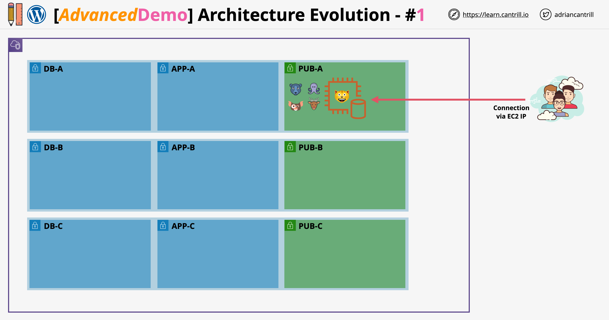

# Elastic WordPress Evolution – Stage 1 Summary

## Overview



This hands-on project guides learners through evolving an AWS architecture for WordPress from a **single manual EC2 instance** to a **scalable, resilient, production-grade deployment**. This is part of the **AWS SA-C03 Certification training by Adrian Cantrill**.

> The goal of this lesson is to simulate a **real-world architecture evolution scenario**, ideal for preparing for **job interviews** and understanding core AWS services.

## Stage 1: Initial Setup and Manual WordPress Build

### One-Click Deployment

Use the following link to provision the base AWS infrastructure with CloudFormation:

**[One-Click CloudFormation Stack (A4LVPC)](https://console.aws.amazon.com/cloudformation/home?region=us-east-1#/stacks/quickcreate?templateURL=https://learn-cantrill-labs.s3.amazonaws.com/aws-elastic-wordpress-evolution/A4LVPC.yaml&stackName=A4LVPC)**

- Creates:
  - Custom **VPC**
  - **Three-tier architecture** (Public, Application, Database subnets)
  - **Security Groups**
  - IAM Roles

## Architecture Overview – Stage 1

View the detailed architecture diagram here:

**[Stage 1 Architecture (PDF)](https://github.com/acantril/learn-cantrill-io-labs/blob/master/aws-elastic-wordpress-evolution/02_LABINSTRUCTIONS/STAGE1%20-%20SINGLE%20SERVER%20MANUAL.pdf)**

- One **Amazon EC2 instance**
- Contains:
  - WordPress
  - MySQL Database
  - Static files
- Hosted in **Public Subnet A**
- Limited scalability and fault tolerance

## Phase 1: Launch EC2 Instance Manually

### EC2 Instance Configuration

| Field                 | Value                                  |
| --------------------- | -------------------------------------- |
| Name                  | `wordpress-manual`                     |
| AMI                   | Amazon Linux 2023 (64-bit x86)         |
| Instance Type         | `t2.micro` or equivalent (Free Tier)   |
| Key Pair              | Proceed without key pair               |
| VPC                   | `A4L-VPC`                              |
| Subnet                | `SN-PUB-A`                             |
| Auto-assign Public IP | Enabled                                |
| Security Group        | `A4L-VPC-SG-Wordpress`                 |
| IAM Role              | `A4L-VPC-WordpressInstanceProfile`     |
| Credit Specification  | `standard` (or `unlimited` if allowed) |

No custom storage is needed; keep the default 8GB GP3.

> **Note**: SSH is not used. Use **Session Manager** from Systems Manager.

## Phase 2: Configure Systems Manager Parameter Store

Set up configuration parameters for later automation. These parameters are used in future stages and reduce hard-coded values.

### Parameter Table

| Name                            | Type         | Description                   | Value              |
| ------------------------------- | ------------ | ----------------------------- | ------------------ |
| `/A4L/Wordpress/DBUser`         | String       | WordPress DB Username         | `a4lwordpressuser` |
| `/A4L/Wordpress/DBName`         | String       | WordPress DB Name             | `a4lwordpressdb`   |
| `/A4L/Wordpress/DBEndpoint`     | String       | WordPress DB Endpoint         | `localhost`        |
| `/A4L/Wordpress/DBPassword`     | SecureString | WordPress DB Password         | `4n1m4l54L1f3`     |
| `/A4L/Wordpress/DBRootPassword` | SecureString | Root password for MySQL admin | `4n1m4l54L1f3`     |

### Parameter Creation Steps

#### DB User

```plaintext
Name: /A4L/Wordpress/DBUser
Description: WordPress Database User
Tier: Standard
Type: String
Data Type: text
Value: a4lwordpressuser
```

#### DB Name

```plaintext
Name: /A4L/Wordpress/DBName
Description: WordPress Database Name
Tier: Standard
Type: String
Data Type: text
Value: a4lwordpressdb
```

#### DB Endpoint

```plaintext
Name: /A4L/Wordpress/DBEndpoint
Description: WordPress Endpoint Name
Tier: Standard
Type: String
Data Type: text
Value: localhost
```

#### DB Password (Secure)

```plaintext
Name: /A4L/Wordpress/DBPassword
Description: WordPress DB Password
Tier: Standard
Type: SecureString
KMS Key Source: My Current Account
KMS Key ID: alias/aws/ssm
Value: 4n1m4l54L1f3
```

#### DB Root Password (Secure)

```plaintext
Name: /A4L/Wordpress/DBRootPassword
Description: WordPress DB Root Password
Tier: Standard
Type: SecureString
KMS Key Source: My Current Account
KMS Key ID: alias/aws/ssm
Value: 4n1m4l54L1f3
```

## What’s Next?

After this stage:

1. Install WordPress manually on the EC2 instance.
2. Use parameter values during configuration.
3. Later stages include:
   - Launch Template-based EC2 provisioning
   - Migrating database to RDS
   - Moving file storage to EFS
   - Adding Load Balancer and Auto Scaling Group

## Purpose of Manual Build

- Understand WordPress infrastructure requirements
- Recognize **limitations of single-instance setups**
- Set foundation for **scalable design**
- Prepare to transition to **automation and elasticity**

## Summary

In this stage, you:

- Deployed a custom VPC using CloudFormation
- Manually launched a WordPress EC2 instance
- Set up reusable configuration values via Parameter Store
- Prepared for further architecture evolution
