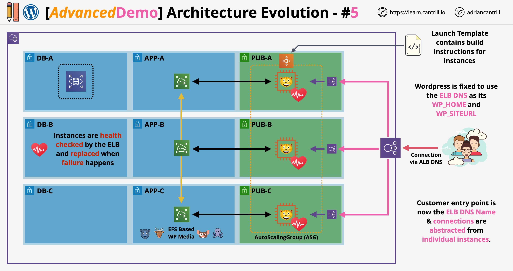

# Stage 5: Adding an Elastic Load Balancer (ELB) and Auto Scaling Group (ASG)

This stage in the Cantrill.io AWS Solutions Architect course focuses on building a **scalable**, **resilient**, and **self-healing architecture** for a WordPress application by integrating:



- An **Application Load Balancer (ALB)**
- An **Auto Scaling Group (ASG)**
- CloudWatch alarms for intelligent, dynamic scaling
- A shared storage and database already configured in prior stages

Reference links:

- [Stage 5 Instructions](https://github.com/acantril/learn-cantrill-io-labs/blob/master/aws-elastic-wordpress-evolution/02_LABINSTRUCTIONS/STAGE5%20-%20Add%20an%20ELB%20and%20ASG.md)
- [Stage 5 Architecture PDF](https://github.com/acantril/learn-cantrill-io-labs/blob/master/aws-elastic-wordpress-evolution/02_LABINSTRUCTIONS/STAGE5%20-%20ASG%20%26%20ALB.pdf)

## 1. Create an Auto Scaling Group (ASG)

### Step-by-Step:

1. Navigate to **Auto Scaling Groups** in the EC2 console.
2. Click **Create Auto Scaling Group**.
3. **Name** it: `A4L-WordPress-ASG`.
4. Select **Launch Template**:
   - Use the pre-existing `WordPress Launch Template`
   - Choose **Latest version** (e.g., version 4).
5. **Networking**:
   - Use the `A4L VPC`.
   - Select the **three public subnets**:
     - `SN-Pub-A`
     - `SN-Pub-B`
     - `SN-Pub-C`
6. **Load Balancer Integration**:
   - Attach to the existing **Target Group**: `A4L-WordPress-ALB-TG`.
   - Enable **ELB Health Checks**.
7. **CloudWatch Metrics**: Enable group metrics collection.
8. **Capacity Settings**:
   - Desired Capacity: `1`
   - Minimum Capacity: `1`
   - Maximum Capacity: `1` (temporarily)
   - Leave scaling policies **disabled** initially.
9. **Tags**:  
   Add a tag:
   ```txt
   Key: Name
   Value: WordPress-ASG
   Propagate to instances: Yes
   ```
10. Create the Auto Scaling Group.

## 2. Validate ASG Behavior

After creating the ASG:

- **Terminate the manually created EC2 instance** (based on the Launch Template).
- **ASG will detect this** and automatically provision a new instance using the template.
- The new instance is auto-registered with the ALB's target group.

## 3. Implement Dynamic Scaling Policies

### Objective:

- **Scale Out** when average CPU > 40%
- **Scale In** when average CPU < 40%

### 3.1. Scaling Policy: High CPU

1. Go to the ASG, then **Automatic Scaling**.
2. Click **Create Dynamic Scaling Policy** → Simple scaling.
3. Name: `High-CPU`
4. **Create a CloudWatch Alarm**:
   - **Metric**: `CPU Utilization` for `A4L-WordPress-ASG`
   - **Threshold**:
     - Condition: `Greater than 40%`
     - Static Threshold: `40`
   - Name: `WordPress-High-CPU`
5. Back in Scaling Policy:
   - **Action**: Add `1` capacity unit.
   - Save the policy.

### 3.2. Scaling Policy: Low CPU

1. Create another Dynamic Scaling Policy.
2. Name: `Low-CPU`
3. **Create a CloudWatch Alarm**:
   - Same metric: `CPU Utilization`
   - **Threshold**:
     - Condition: `Lower than 40%`
     - Static Threshold: `40`
   - Name: `WordPress-Low-CPU`
4. Back in Scaling Policy:
   - **Action**: Remove `1` capacity unit.
   - Save the policy.

## 4. Modify ASG Capacity Limits

- **Increase Maximum Capacity** from `1` to `3`:
  - Desired: `1`
  - Min: `1`
  - Max: `3`

This enables the group to actually scale beyond a single instance when CPU increases.

## 5. Simulate CPU Load

### Connect to Instance via Session Manager:

1. Go to EC2 → select the new instance.
2. Use **Session Manager** to connect.

### Run Stress Test

Run the following command to simulate high CPU usage:

```bash
sudo bash
stress --cpu 2 --timeout 3000
```

#### Explanation:

- `sudo bash`: Elevate to root shell
- `stress`: A utility to stress test CPU
- `--cpu 2`: Uses 2 CPU cores
- `--timeout 3000`: Runs the test for 3000 seconds

### Result:

- CloudWatch detects the CPU spike
- High CPU alarm triggers
- ASG **scales out** by launching a new EC2 instance
- New instance is automatically added to ALB’s target group

## 6. Observe Self-Healing Behavior

- **Terminate one EC2 instance**.
- ASG will **detect** the drop in instance count.
- It **provisions a replacement** automatically.

Also, if any instance **fails health checks**, ALB removes it and ASG replaces it.

## 7. Access the Load Balanced Application

1. Go to **EC2 → Load Balancers**.
2. Copy the **DNS name** of the ALB.
3. Paste it in the browser.

### Benefit:

- All traffic goes through ALB
- Scaling events do **not disrupt** existing sessions

## Completion Summary

By the end of Stage 5, you've achieved:

- A **fully elastic, scalable, and self-healing** WordPress architecture
- Separation of compute and storage:
  - **WordPress Content** → EFS
  - **Database** → RDS
- **Load Balancer** to distribute traffic
- **Auto Scaling Group** for intelligent scaling
- **CloudWatch**-based scaling rules

This architecture is robust and designed for high availability and scalability with minimal manual intervention.
