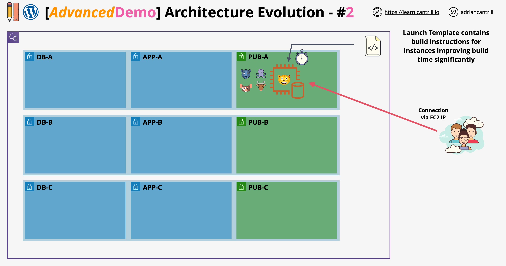

# Stage 2: Automate WordPress Instance Deployment with Launch Templates

## Overview



In this stage, the manual installation of WordPress is replaced by an **automated EC2 instance launch** using **Launch Templates**. The instance will host both the **WordPress application** and the **MariaDB database** on a **single EC2 instance**. This setup mimics Stage 1's architecture but improves build speed and repeatability.

## Objectives

- Terminate the previously manually created WordPress instance.
- Create a **Launch Template** that automatically:
  - Installs required software
  - Configures WordPress
  - Sets up the database
- Use **user data scripts** to automate the above processes.
- Launch an EC2 instance from the template.
- Validate that WordPress is working.

## Step-by-Step Guide

### 1. Terminate Manual Instance

- Locate the previous instance (e.g., `WordPress-iPhone-Manual`).
- Right-click and **terminate** it to avoid conflicts and costs.

### 2. Create Launch Template

Go to **EC2 Console > Launch Templates > Create Launch Template**:

#### Template Configuration

| Field       | Value                                 |
| ----------- | ------------------------------------- |
| Name        | `WordPress`                           |
| Description | `Single Server DB and App`            |
| Check       | Provide guidance for EC2 Auto Scaling |

#### AMI & Instance Type

- **AMI**: Amazon Linux 2023 (Free Tier Eligible)
- **Instance Type**: `t2.micro` (Free Tier)

#### Security

- **Key Pair**: Do not include in launch template.
- **Security Group**: `A4LVPC-SG-WordPress`

#### Advanced Settings

- **IAM Instance Profile**: `A4LVPC-WordPress-InstanceProfile`
- **Credit Specification**: Unlimited (Standard if new account)
- **User Data**: Add user data script (See next section)

## User Data Script (Bootstrap)

Paste the following script into the **User Data** box during Launch Template creation.

<details>
<summary><code>Click to expand User Data script</code></summary>

```bash
#!/bin/bash -xe

# Fetch sensitive values from AWS Systems Manager Parameter Store
DBPassword=$(aws ssm get-parameters --region us-east-1 --names /A4L/Wordpress/DBPassword --with-decryption --query Parameters[0].Value)
DBPassword=`echo $DBPassword | sed -e 's/^"//' -e 's/"$//'`

DBRootPassword=$(aws ssm get-parameters --region us-east-1 --names /A4L/Wordpress/DBRootPassword --with-decryption --query Parameters[0].Value)
DBRootPassword=`echo $DBRootPassword | sed -e 's/^"//' -e 's/"$//'`

DBUser=$(aws ssm get-parameters --region us-east-1 --names /A4L/Wordpress/DBUser --query Parameters[0].Value)
DBUser=`echo $DBUser | sed -e 's/^"//' -e 's/"$//'`

DBName=$(aws ssm get-parameters --region us-east-1 --names /A4L/Wordpress/DBName --query Parameters[0].Value)
DBName=`echo $DBName | sed -e 's/^"//' -e 's/"$//'`

DBEndpoint=$(aws ssm get-parameters --region us-east-1 --names /A4L/Wordpress/DBEndpoint --query Parameters[0].Value)
DBEndpoint=`echo $DBEndpoint | sed -e 's/^"//' -e 's/"$//'`

# Install dependencies
dnf -y update
dnf install wget php-mysqlnd httpd php-fpm php-mysqli mariadb105-server php-json php php-devel stress -y

# Enable and start services
systemctl enable httpd
systemctl enable mariadb
systemctl start httpd
systemctl start mariadb

# Set MySQL root password
mysqladmin -u root password $DBRootPassword

# Download and extract WordPress
wget http://wordpress.org/latest.tar.gz -P /var/www/html
cd /var/www/html
tar -zxvf latest.tar.gz
cp -rvf wordpress/* .
rm -R wordpress
rm latest.tar.gz

# Configure WordPress
cp ./wp-config-sample.php ./wp-config.php
sed -i "s/'database_name_here'/'$DBName'/g" wp-config.php
sed -i "s/'username_here'/'$DBUser'/g" wp-config.php
sed -i "s/'password_here'/'$DBPassword'/g" wp-config.php
sed -i "s/'localhost'/'$DBEndpoint'/g" wp-config.php

# Adjust permissions
usermod -a -G apache ec2-user
chown -R ec2-user:apache /var/www
chmod 2775 /var/www
find /var/www -type d -exec chmod 2775 {} \;
find /var/www -type f -exec chmod 0664 {} \;

# Setup database schema and user
echo "CREATE DATABASE $DBName;" >> /tmp/db.setup
echo "CREATE USER '$DBUser'@'localhost' IDENTIFIED BY '$DBPassword';" >> /tmp/db.setup
echo "GRANT ALL ON $DBName.* TO '$DBUser'@'localhost';" >> /tmp/db.setup
echo "FLUSH PRIVILEGES;" >> /tmp/db.setup
mysql -u root --password=$DBRootPassword < /tmp/db.setup
rm /tmp/db.setup
```

</details>

## 3. Launch Instance from Template

1. Navigate back to **Launch Templates**.
2. Select the created template and click **Actions > Launch Instance from Template**.
3. In the launch wizard:
   - **Key Pair**: Proceed without a key pair (default).
   - **Subnet**: Select `SN-Pub-A` (public subnet in AZ A).
   - **Tag**: Add `Name = WordPress-LT`.
4. Click **Launch Instance**.

## 4. Validate WordPress Installation

1. Go to the **EC2 dashboard**.
2. Copy the **public IPv4** of the new instance.
3. Open it in a browser. Wait a few minutes.
4. You should see the **WordPress installation screen**.
5. Complete the setup:
   - Site Title: `Categoram`
   - Username: `admin`
   - Password: (same as before)
   - Email: `test@test.com`
6. Log in and verify the dashboard loads.
7. Add a sample post with gallery images.

## 5. Review and Limitations

### Accomplished

- Instance setup fully automated.
- Both DB and App reside on the same EC2 instance.
- Automation reduces human error and build time.

### Limitations (Same as Stage 1)

- **Single Point of Failure**: DB and App on same instance.
- **No Auto-healing** or Load Balancing.
- **No scalability**: Can't scale app or DB independently.
- **Local storage risks**: Media and DB at risk during scaling.
- **IP address hardcoded**: Needs fixing in future stages.

## What's Next?

In **Stage 3**, you'll:

- Migrate the database to **Amazon RDS**.
- Update the launch template to connect to RDS.
- Begin decoupling the architecture for better scalability and resilience.
