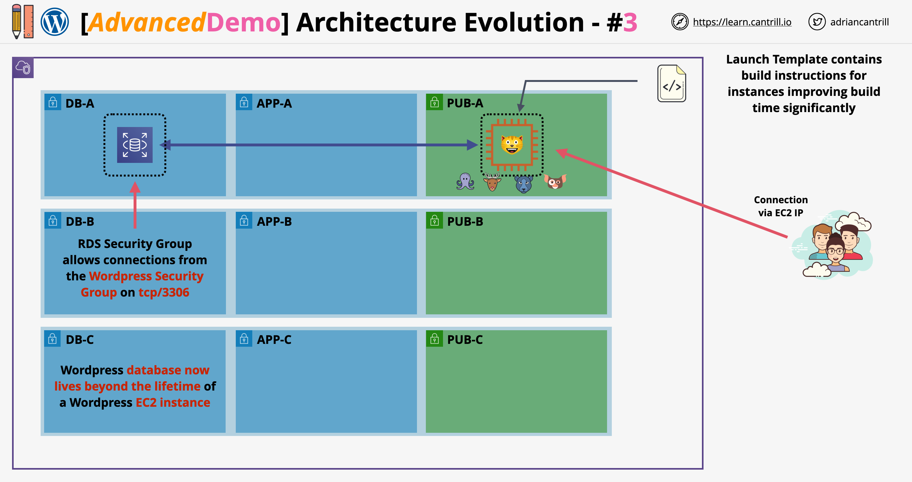

# AWS Elastic WordPress Evolution - Stage 4: Adding EFS

## Overview

Stage 4 involves migrating the WordPress content folder (`wp-content`) from the EC2 instance to Amazon Elastic File System (EFS). This is the final step before achieving a truly elastic and scalable design, as it moves the media content to a resilient shared network file system that exists independently of EC2 instance lifecycles.

## Architecture



This stage evolves the architecture by:

- Maintaining the WordPress database in RDS (from previous stages)
- Moving `wp-content` folder to EFS for shared, resilient storage
- Setting up proper configurations for auto-scaling preparation

## Implementation Steps

### 1. Create EFS File System

1. Open the EFS console
2. Click "Create file system" and select "Customize"
3. Configure file system:

   - Name: `A4L-WordPress-content`
   - Storage class: Standard
   - Keep automatic backups enabled
   - Throughput mode: Bursting
   - Performance mode: General purpose
   - Disable encryption for this demo (would be enabled in production)

4. Configure mount targets:

   - Select VPC: `A4LVPC`
   - Remove default security groups
   - Configure one mount target per availability zone:
     - AZ 1A: Subnet `SN-app-A` (10.16.32.0/20)
     - AZ 1B: Subnet `SN-app-B` (10.16.96.0/20)
     - AZ 1C: Subnet `SN-app-C` (10.16.16.0/20)
   - Set security group for all mount targets: `A4LVPC-SG-EFS`

5. Wait for all mount targets to reach "available" state

### 2. Store EFS File System ID in Parameter Store

1. Note the EFS File System ID
2. Open Systems Manager and go to Parameter Store
3. Create parameter:
   - Name: `/A4L/WordPress/EFSFSID`
   - Description: "File system ID for WordPress content (wp-content)"
   - Type: String
   - Value: _the copied file system ID_

### 3. Configure EC2 Instance to Use EFS

1. Connect to the WordPress EC2 instance using Session Manager
2. Install EFS utilities package:

   ```bash
   sudo dnf -y install amazon-efs-utils
   ```

3. Move the existing content to a temporary location:

   ```bash
   cd /var/www/html
   sudo mv wp-content/ /tmp
   sudo mkdir wp-content
   ```

4. Create environment variable with EFS file system ID from parameter store:

   ```bash
   EFSFSID=$(aws ssm get-parameters --region us-east-1 --names /A4L/Wordpress/EFSFSID --query Parameters[0].Value)
   EFSFSID=`echo $EFSFSID | sed -e 's/^"//' -e 's/"$//'`
   ```

5. Configure automatic mounting by adding entry to `/etc/fstab`:

   ```bash
   echo -e "$EFSFSID:/ /var/www/html/wp-content efs _netdev,tls,iam 0 0" >> /etc/fstab
   ```

6. Mount the EFS file system:

   ```bash
   mount -a -t efs defaults
   ```

7. Verify the mount with:

   ```bash
   df -k
   ```

8. Move the WordPress content back from temporary location:

   ```bash
   mv /tmp/wp-content/* /var/www/html/wp-content/
   ```

9. Fix permissions:

   ```bash
   chown -R ec2-user:apache /var/www/
   ```

10. Reboot the instance:

    ```bash
    reboot
    ```

11. After reboot, verify the EFS is still mounted using `df -k`
12. Test that WordPress loads properly and can display all media content

### 4. Update Launch Template

1. Go to EC2 console → Launch Templates
2. Select the WordPress launch template
3. Create new version:

   - Description: "App only, uses EFS filesystem defined in /A4L/Wordpress/EFSFSID"
   - Update the user data to include:

     **Add after the shebang line:**

     ```bash
     EFSFSID=$(aws ssm get-parameters --region us-east-1 --names /A4L/Wordpress/EFSFSID --query Parameters[0].Value)
     EFSFSID=`echo $EFSFSID | sed -e 's/^"//' -e 's/"$//'`
     ```

     **Modify the package installation line to include EFS utils:**

     ```bash
     dnf install wget php-mysqlnd httpd php-fpm php-mysqli mariadb105-server php-json php php-devel stress amazon-efs-utils -y
     ```

     **Add after `systemctl start httpd`:**

     ```bash
     mkdir -p /var/www/html/wp-content
     chown -R ec2-user:apache /var/www/
     echo -e "$EFSFSID:/ /var/www/html/wp-content efs _netdev,tls,iam 0 0" >> /etc/fstab
     mount -a -t efs defaults
     ```

4. Set the new template version (version 3) as the default

## Architecture Benefits and Remaining Limitations

### Benefits Achieved

- WordPress database now stored in RDS (from previous stages)
- WordPress media content now stored in EFS
- Both database and media can scale independently of application
- EC2 instances can scale freely without risking media or database data loss

### Remaining Limitations to Address in Next Stage

1. Customers still connect to instances directly (no health checks or auto-healing)
2. Instance IP address is hard-coded in the database, preventing proper scaling

## Next Steps

Stage 5 will address the remaining limitations to create a fully elastic architecture with load balancing and auto-scaling capabilities.
