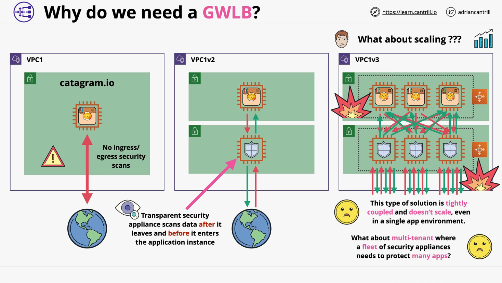
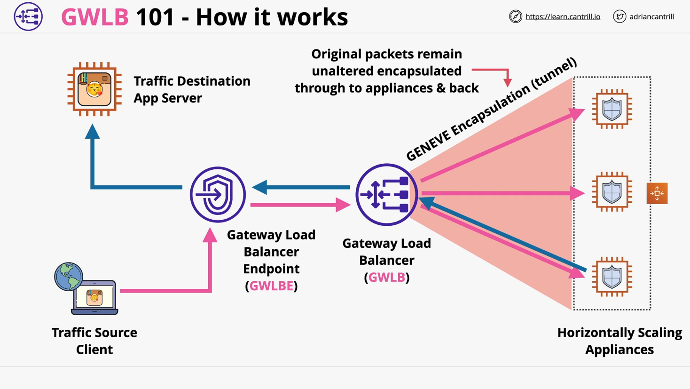
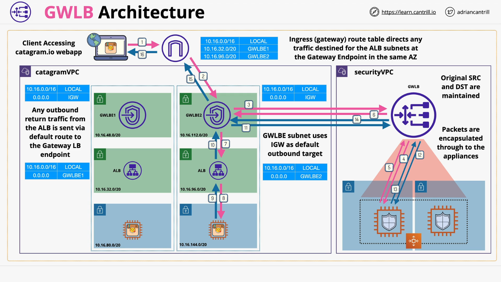

# AWS Gateway Load Balancers (GWLB)

## Overview

Gateway Load Balancers (GWLB) are a relatively new addition to AWS's suite of Load Balancers. They are purpose-built for **inline, scalable network security** using **third-party appliances** like firewalls, IDS/IPS, or traffic analysis tools. This lesson explains **why and when** to use GWLB, their **components**, **network flow**, and how they enable **resilient security architectures** at scale.

## Why Use Gateway Load Balancers?

### The Problem

- A public-facing application server (e.g., _Categram_) needs **traffic inspection** to protect against exploits and data leakage.
- Traditional architectures use **transparent security appliances** inline for inspection.
- However, **scaling** becomes complex:
  - AWS applications are elastic (grow/shrink).
  - Tightly coupled security appliances do not scale efficiently.
  - Failure in one part can affect another.

### The Solution

Use a **Gateway Load Balancer** to:

- Decouple application logic from security logic.
- Enable **horizontal scaling** of third-party appliances.
- Preserve **network packet integrity**.
- Support **multi-tenant** and **multi-VPC** architectures.

## Key Components of GWLB

### 1. Gateway Load Balancer Endpoints (GLBEs)

- Similar to **VPC Interface Endpoints**, but:
  - Can be used as **route table targets**.
  - Allow routing of traffic **through** the security appliances.

### 2. Gateway Load Balancer (GWLB)

- Balances traffic across **security appliances**.
- Targets are **EC2 instances** running third-party security software.
- Uses **Geneve Protocol** to encapsulate and forward traffic **unaltered**.

## How GWLB Works (Traffic Flow Summary)

### Basic Flow:

1. **Client** initiates request to the application (e.g., Categram).
2. Request flows via:
   - **Internet Gateway** →
   - **GWLB Endpoint** →
   - **GWLB** →
   - **Security Appliance (via Geneve Tunnel)**.
3. Security appliance inspects traffic.
4. Packet is returned to GWLB and then to its original **destination (app instance)**.
5. **Response** traffic follows the same path **in reverse**.

## Benefits of Using GWLB

- **Scalability**: Easily add/remove security appliances.
- **Stickiness**: Ensures consistent flow to the same appliance.
- **Transparency**: No need to modify packets.
- **Resilience**: Failing appliances are automatically bypassed.
- **Abstraction**: Infrastructure separates from appliance-specific logic.

## Example Architecture

### Components:

- **App Load Balancer (ALB)** in **public subnet**.
- **Categram Application Instances** in **private subnets**.
- **Security VPC** with third-party appliances in **Auto Scaling Group**.
- **GWLB + GWLB Endpoints** connect both VPCs.

### Traffic Walkthrough:

1. Request hits **Internet Gateway**, which:
   - Translates public IP of ALB to its private IP.
   - Applies ingress route rules directing to **GWLB Endpoint**.
2. Packet goes to **GWLB**, which:
   - Encapsulates packet using **Geneve**.
   - Sends to appropriate **Security Appliance**.
3. Appliance analyzes and returns packet via GWLB.
4. GWLB **decapsulates** and sends to ALB.
5. ALB routes to an **application instance**.
6. **Response** follows similar path:
   - App → ALB → GWLB Endpoint → GWLB → Security Appliance → Internet Gateway → Client.

## Geneve Protocol Explanation

> GWLB uses **Geneve**, a tunneling protocol, to send packets unaltered to security appliances.

### Why Geneve?

- Maintains:
  - Original **source/destination IP**.
  - **Source/destination ports**.
  - **Payload content**.
- Prevents issues with **IP conflicts** or **routing mismatches** between VPCs.

## Visual Analogy (Described)

**Client → GWLB Endpoint → GWLB → Appliance → GWLB → GWLB Endpoint → ALB → App Instance**

Reverse applies for response traffic.

## Code Explanation: Not Applicable

> No code in this lesson, but networking concepts and protocols (Geneve, routing) are discussed in depth.

## Summary

| Feature        | Description                                                   |
| -------------- | ------------------------------------------------------------- |
| **Purpose**    | Inline transparent traffic inspection using third-party tools |
| **Components** | GWLB + GWLB Endpoints + Security Appliances                   |
| **Protocol**   | Geneve for encapsulation and integrity                        |
| **Use Cases**  | Firewalling, IDS/IPS, DLP, traffic analysis                   |
| **Benefits**   | Scalability, resilience, decoupling, transparency             |

## Conclusion

Gateway Load Balancers are essential for **scalable, flexible, third-party security** in AWS. They abstract complexity, maintain packet integrity, and support dynamic workloads without compromising performance or security.
