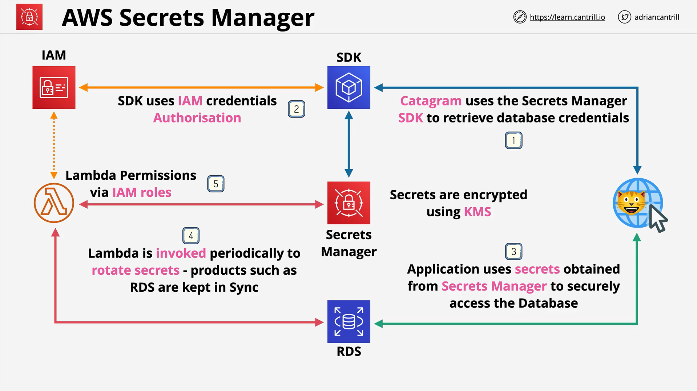

# AWS Secrets Manager vs SSM Parameter Store

## Introduction to AWS Secrets Manager

- **AWS Secrets Manager** is often confused with the **SSM Parameter Store**.
- Both services can store secure information, like passwords.
- The exam focus is **understanding when to use Secrets Manager vs Parameter Store**.

## Key Points: Secrets Manager vs Parameter Store

| Feature                 | Secrets Manager                                                                | SSM Parameter Store                                     |
| ----------------------- | ------------------------------------------------------------------------------ | ------------------------------------------------------- |
| Purpose                 | Designed specifically for **Secrets** like passwords and API keys              | General configuration storage, including secure strings |
| Keyword Triggers (Exam) | If you see **passwords**, **API keys**, or **rotation**                        | Configuration storage scenarios                         |
| Integration             | Built for integration with applications via SDK, CLI, Console, API             | Also supports access through SDK, CLI                   |
| Rotation Support        | Supports **automatic rotation** of secrets via Lambda                          | No automatic rotation capability                        |
| Product Integration     | Direct integration with products like **RDS** for automatic credential updates | No deep product integration                             |
| Encryption              | Encrypted at rest using **KMS**                                                | Also supports KMS encryption                            |
| IAM Integration         | Access to secrets is controlled through **IAM policies**                       | IAM control as well                                     |

## Detailed Functionality of AWS Secrets Manager

- **Stores Secrets** like passwords, API keys, and database credentials.
- **Supports automatic rotation** using a Lambda function.
- **Integrated** with some AWS services like **RDS** for synchronized credential updates.
- **Access**:
  - Through **SDKs**, **CLI**, **API**, and **Console**.
  - Applications authenticate using **IAM roles** or less ideally, access keys.
- **Security**:
  - Secrets are encrypted with **AWS KMS**.
  - Requires both Secrets Manager permissions and KMS permissions to access and decrypt secrets.

## Example Architecture: Categram Application



- **Categram** (fictional application) retrieves **database credentials** using Secrets Manager.
- Steps:
  1. Application uses **Secrets Manager SDK**.
  2. Authenticates using **IAM Role** or **access keys**.
  3. Retrieves database **credentials stored as secrets**.
  4. Accesses database securely using retrieved credentials.
- **Lambda Function** periodically:
  - **Rotates secrets** stored in Secrets Manager.
  - **Updates** credentials in integrated products like **RDS**.
- **Execution Role**:
  - Lambda needs permissions to update both **Secrets Manager** and **RDS** credentials.

## Visual Flow

1. Application ➔ Authenticates with IAM Role ➔ Fetches secret from Secrets Manager.
2. Secrets Manager ➔ Retrieves encrypted credentials ➔ Decrypts via KMS.
3. Application ➔ Uses credentials to access RDS database.
4. Lambda ➔ Periodically rotates credentials ➔ Updates Secrets Manager and RDS.

## Important Exam Tips

- **Keyword analysis** is critical:
  - Look for "**Secrets**", "**Rotation**", or "**Integration with products like RDS**".
- **If** the question **mentions secrets or rotation**, **choose Secrets Manager**.
- **If** the question **mentions general config storage**, **choose Parameter Store**.
- **Rare** that exam asks to choose between the two; usually only one option is provided.

## Code Explanation (Hypothetical Example)

If a Lambda function is used for rotation:

```python
import boto3
import json

def lambda_handler(event, context):
    secret_name = event['SecretId']
    client = boto3.client('secretsmanager')

    # Retrieve current secret value
    response = client.get_secret_value(SecretId=secret_name)
    secret = json.loads(response['SecretString'])

    # Generate a new password or secret (not shown here)
    new_secret = generate_new_password()

    # Update the secret value
    client.update_secret(SecretId=secret_name, SecretString=json.dumps(new_secret))

    return {
        'statusCode': 200,
        'body': json.dumps('Secret rotated successfully')
    }
```

### Line-by-Line Explanation:

- `import boto3, json`: Import the AWS SDK for Python and JSON library.
- `lambda_handler(event, context)`: Main function invoked by Lambda.
- `secret_name = event['SecretId']`: Extracts the secret name passed to Lambda.
- `client = boto3.client('secretsmanager')`: Creates a Secrets Manager client.
- `client.get_secret_value()`: Retrieves the current value of the secret.
- `generate_new_password()`: (Placeholder) You would generate a new password here.
- `client.update_secret()`: Updates the stored secret with the new value.
- Returns success message upon completion.

## Summary

- **Use Secrets Manager** when:
  - Managing sensitive data like passwords and API keys.
  - Automatic secret **rotation** is required.
  - Integration with AWS services like **RDS** is needed.
- **Use Parameter Store** for:
  - General hierarchical configuration management.
  - Storing non-sensitive configuration data.
