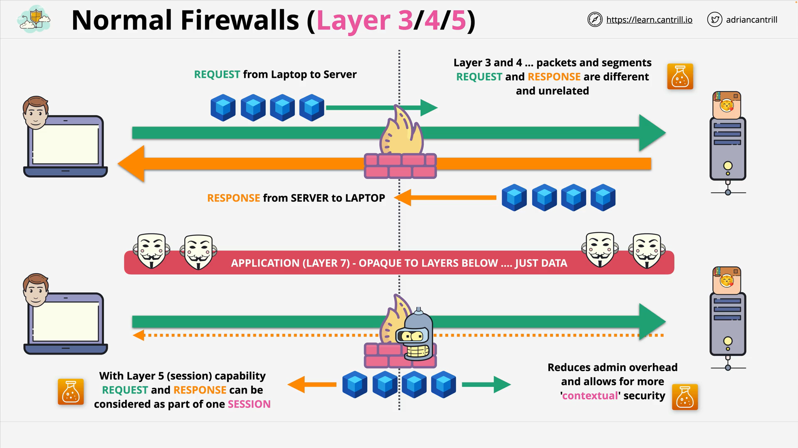
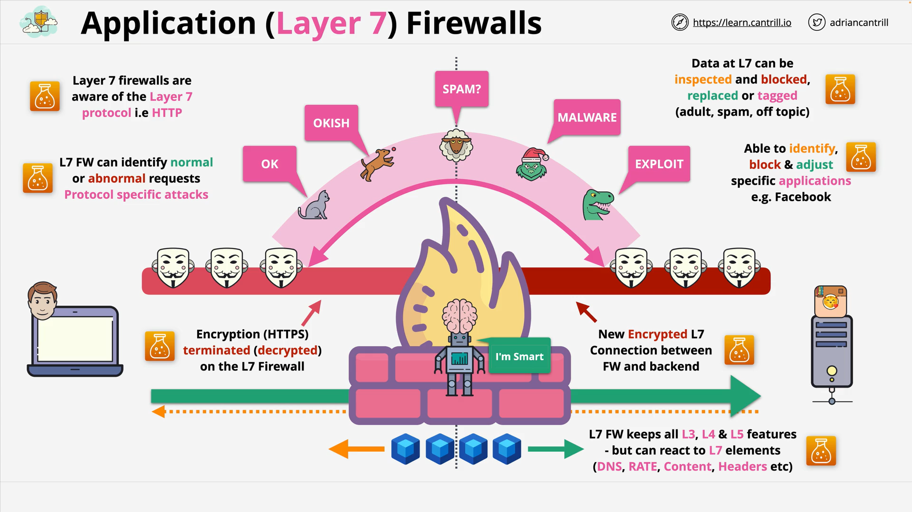

# Application Layer Firewalls (Layer 7 Firewalls)

## Introduction

This lesson discusses **application layer firewalls**, also called **Layer 7 firewalls** (named after the OSI model's 7th layer).  
The video aims to provide a **generic, high-level** understanding without diving into AWS-specific services yet.

## Quick Recap: Layer 3, 4, and 5 Firewalls

### Layer 3 and 4 Firewalls

- Operate at the **network** and **transport** layers.
- Can **see packets and segments**, **IP addresses**, and **ports**.
- Treat **requests and responses** as **separate, unrelated streams**.
- Example:
  - A request from a laptop and a response from a server are **two different flows** from the firewall's perspective.

### Layer 5 Firewall (Session-Aware)

- Adds **session capability** on top of Layer 3/4.
- Understands that **requests and responses** are part of **one communication session**.
- Benefits:
  - **Reduced administrative overhead** (one rule instead of two).
  - **Contextual security** — can differentiate between unsolicited traffic and responses.

### Limitations of L3/L4/L5 Firewalls

- They cannot understand anything above their operational layers.
- Cannot inspect **application-level data** (Layer 7).
- Layer 7 data (like HTTP traffic) is opaque:
  - A **cat image**, a **dog image**, and **malware** all look the same to these firewalls.

## Introduction to Layer 7 Firewalls

### Basic Characteristics

- Understand **all lower layers (L1 to L7)**.
- Have visibility into **application-level protocols**, such as **HTTP**, **SMTP**, etc.
- Can inspect and control **application data**.
- Can differentiate between legitimate content (e.g., a cat image) and malicious or unwanted content (e.g., malware, spam).

### Example Architecture

- **Client** connects to a **server** through a **Layer 7 firewall** (depicted as a "smart robot").
- **HTTPS (encrypted HTTP)** traffic flows from the client to the server.
- The Layer 7 firewall **terminates** the HTTPS session:
  - **Decrypts** the traffic into plain **HTTP**.
  - **Analyzes** the HTTP traffic for headers, data, and hostnames.
  - **Inspects**, **blocks**, **modifies**, or **tags** the data based on configured rules.
- After inspection:
  - A **new HTTPS connection** is established between the firewall and the server.
  - This is **transparent** to both client and server.

## Capabilities of a Layer 7 Firewall

- **Granular content filtering** based on:
  - Headers
  - Content
  - Hostnames
  - Application-specific behaviors
- **Allow/block specific content**:
  - Example: Allow cat pictures, block dog pictures or spam content.
  - Replace adult content with safe images (e.g., kittens).
- **Application control**:
  - Block entire applications like **Facebook**.
  - Prevent sensitive data leaks to services like **Dropbox**.
- **Flow control**:
  - React based on **rate of traffic** (e.g., connections per second).
- **Support for multiple protocols**:
  - Some firewalls understand only **HTTP**.
  - Others support **SMTP**, etc.
- **Retains lower-layer (L3, L4, L5) capabilities** while adding Layer 7 functionality.

## Important Concepts to Remember

- Layer 7 firewalls **decrypt, inspect, and re-encrypt** traffic.
- They **deeply understand** application layer protocols.
- Their capabilities are **limited only by their software support** for various protocols.

## Upcoming Topics

- The next videos will cover how **AWS implements Layer 7 firewall capabilities** within its services.

# Summary Table

|                  Feature                   | Layer 3/4 Firewall | Session-Aware Firewall (Layer 5) | Layer 7 Firewall |
| :----------------------------------------: | :----------------: | :------------------------------: | :--------------: |
|       Sees IP, Port, Protocol Flags        |        Yes         |               Yes                |       Yes        |
|            Understands Sessions            |         No         |               Yes                |       Yes        |
| Sees Application Data (e.g., HTTP Headers) |         No         |                No                |       Yes        |
| Protects Against Application Layer Attacks |         No         |                No                |       Yes        |
| Ability to Block Specific Apps or Content  |         No         |                No                |       Yes        |
