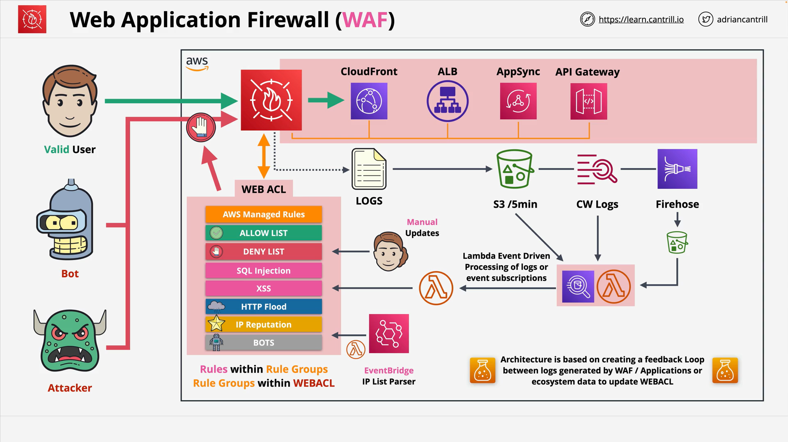

# AWS WAF (Web Application Firewall)

## Introduction to AWS WAF

- **AWS WAF** is an **application layer (Layer 7) firewall**.
- It understands protocols like **HTTP** and **HTTPS**.
- It protects web resources including:
  - **CloudFront** (global)
  - **Application Load Balancers (ALB)** (regional)
  - **AppSync** (regional)
  - **API Gateway** (regional)

## WAF Architecture Overview

- **WAF** operates through a configuration unit called a **Web Access Control List (Web ACL)**.
- A **Web ACL** is associated with supported AWS services.
- **WAF protection** applies globally for CloudFront but regionally for ALB, AppSync, and API Gateway.
- Web ACLs contain **rules** and **rule groups** that determine allowed or blocked traffic.

## Components of WAF

### Web Access Control List (Web ACL)

- **Controls** traffic: either **allow** or **block** unmatched requests.
- Created for:
  - **Global** services like CloudFront.
  - **Regional** services (specify the AWS region).
- Must have **rules** or **rule groups**; processed **in order** (order can be changed).
- **Capacity** is measured using **Web ACL Capacity Units (WCU)**:
  - Default limit: **1500 WCU**.
  - Can request higher limits via AWS Support.

> **Important**:
>
> - A resource (e.g., CloudFront distribution) can only be associated with **one Web ACL**.
> - One Web ACL can be associated with **multiple resources**.
> - **CloudFront** Web ACLs **cannot** be mixed with **regional** Web ACLs.
> - **AWS Outposts** currently do **not** support WAF.

### Rule Groups

- **Groups** of rules for easier management.
- Types:
  - **AWS Managed Rule Groups** (mostly free, some paid like Bot Control/Fraud Control).
  - **Marketplace Vendor Rule Groups** (subscription-based).
  - **Customer Managed Rule Groups**.
  - **Service Owned Rule Groups** (e.g., Shield, Firewall Manager).
- Rule groups:
  - No default action (Web ACL handles default action).
  - Reusable across multiple Web ACLs.
  - WCU allocation determined at creation.

### Rules

- **Rules** have three parts:
  - **Type**: `Regular` or `Rate-Based`.
  - **Statement**: Conditions to match traffic.
  - **Action**: What WAF should do if matched.

#### Rule Types

- **Regular Rules**: Trigger based on matching conditions.
- **Rate-Based Rules**: Trigger when a threshold of requests is met.

Example:
| Type | Example Use Case |
| ------------ | ----------------------------------------- |
| Regular Rule | Allow SSH connections from specific IP. |
| Rate-Based | Block an IP that tries 5000 SSH attempts in 5 minutes. |

#### Rule Statement (Criteria)

- Traffic match based on:
  - Origin Country
  - IP Address
  - HTTP Headers, Cookies
  - Query Parameters
  - URI Path
  - Query String
  - HTTP Method
  - Request Body (only **first 8192 bytes**)

**Match Types**:

- Exact matches
- Starts with / Ends with / Contains
- Regex (regular expressions)

**Multiple Statements**:

- Combine using `AND`, `OR`, `NOT` logic.

#### Rule Actions

| Action  | Description                                       |
| ------- | ------------------------------------------------- |
| Allow   | Let traffic through (regular rules only).         |
| Block   | Deny traffic.                                     |
| Count   | Just record matched traffic without blocking.     |
| Captcha | Challenge traffic to verify if it's from a human. |

> **Note**:  
> Rate-based rules **cannot** use **Allow** action.

#### Custom Responses and Headers

- **Custom Response**:
  - Only possible for `Block` actions.
- **Custom Headers**:
  - Possible for `Allow`, `Block`, `Count`, and `Captcha`.
  - Header format: `x-amzn-waf-<header-name>`.

#### Labels

- Internal to WAF.
- Allow **multi-stage rule evaluation**.
- Used with **Count** and **Captcha** actions (where processing continues).
- Labels cannot persist outside WAF.

## Logging and Event-driven Response

- WAF logs can be sent to:
  - **S3**
  - **CloudWatch Logs**
  - **Kinesis Firehose**
- **Best Practice**:
  - Avoid reacting to S3 directly due to 5-minute delivery lag.
- **Architecture** for automated updates:
  - **S3 Events** → **Lambda** → **Athena** → **EventBridge** → **Update Web ACL**.

## WAF Pricing

| Item               | Cost (Current)                |
| ------------------ | ----------------------------- |
| Web ACL            | \$5 per month                 |
| Rule               | \$1 per month                 |
| Managed Rule Group | Varies (some free, some paid) |
| Request Processing | \$0.60 per 1 million requests |

### Additional Costs

- **Bot Control**:
  - Monthly fee + per million requests.
- **Captcha**:
  - Per 1000 challenge attempts.
- **Fraud Control/Account Takeover**:
  - Monthly fee + per 1000 login attempts analyzed.
- **Marketplace Rule Groups**:
  - Subscription fees apply.

> **Pricing is subject to change. Always verify using the AWS Pricing Calculator.**

# Key Points to Remember for Exam

- Web ACLs use **WCU** (Web ACL Capacity Units).
- WAF matches only the **first 8192 bytes** of request bodies.
- WAF labels are **internal only**.
- **CloudFront WAFs are global**, **ALB/API Gateway/AppSync WAFs are regional**.
- Understand **Rate-Based Rules** vs **Regular Rules**.
- **Only Block, Count, Captcha** are valid actions for Rate-Based Rules (no Allow).
