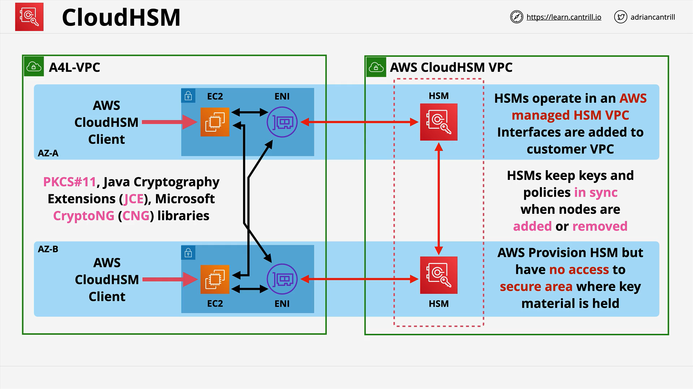

# AWS CloudHSM vs KMS

## Overview

This lesson explains **AWS CloudHSM** and its differences compared to **AWS KMS**. It highlights when to use one over the other, especially for **exam purposes** and **real-world architectural decisions**.

## AWS KMS Overview

- **AWS KMS (Key Management Service)** is a **shared service** for managing and encrypting data.
- It integrates seamlessly with other AWS services.
- AWS manages the **hardware and software** underlying KMS.
- **Security concern**: AWS has some level of access due to the shared service model.
- **Internally uses HSMs** (Hardware Security Modules).

## CloudHSM Overview

- **CloudHSM** provides a **single-tenant**, **tamper-resistant** HSM appliance hosted by AWS.
- AWS is responsible for **hardware maintenance** but has **zero access** to cryptographic material.
- If access is lost to CloudHSM, it cannot be easily recovered — **game over**.

## Compliance Standards

- **FIPS 140-2**: Federal Information Processing Standard Publication 140-2 compliance levels.
  - **CloudHSM**: Compliant with **FIPS 140-2 Level 3**.
  - **KMS**: Overall compliant with **FIPS 140-2 Level 2**, some parts with Level 3.

**Key Point:**  
If a system requires **FIPS 140-2 Level 3 compliance**, you must use **CloudHSM** or an **on-premise HSM**.

## Access Methods

- **KMS**: Accessed using AWS-native APIs and controlled via **IAM policies**.
- **CloudHSM**: Accessed using **industry-standard APIs** such as:
  - **PKCS #11**
  - **JCE** (Java Cryptography Extension)
  - **CryptoNG**

## Custom Key Store (Overlap)

- KMS can now integrate with **CloudHSM** via a **custom key store**.
- Enables the benefits of CloudHSM combined with KMS's AWS integration.

## Important Keywords to Recognize (for Exams)

- **CloudHSM**: PKCS #11, JCE, CryptoNG, FIPS 140-2 Level 3.
- **KMS**: IAM, AWS-native integration, FIPS 140-2 Level 2.

## CloudHSM Architecture

### High-Level View

- **CloudHSM appliances** are placed inside a **AWS-managed VPC**.
- Customer-managed VPCs connect to CloudHSM VPC via **Elastic Network Interfaces (ENIs)**.

### Detailed Steps

1. **Two Private Subnets** are created across **two Availability Zones** (for HA).
2. **Multiple HSMs** are deployed and configured as a **cluster** to ensure **high availability**.
3. **ENIs** inject CloudHSM appliances into the customer VPC.
4. EC2 instances require the **CloudHSM client** installed to communicate with the HSM cluster.
5. Access and encryption happen via **industry-standard APIs**.

### Important Points

- **HSM Clusters replicate** keys, policies, and configurations automatically.
- AWS manages hardware/software updates **outside** the secure cryptographic partition.

## CloudHSM Use Cases and Limitations

### Limitations

- **No direct native integration** with AWS services (e.g., S3 server-side encryption).
- Cannot use **AWS-native APIs** directly.

### Use Cases

- **Client-side encryption** (e.g., encrypting objects before uploading to S3).
- **SSL/TLS offloading**: Offloading cryptographic operations from web servers.
- **Oracle Databases**: Used for Transparent Data Encryption (TDE).
- **Running a Private Certificate Authority (CA)**: Managing CA private keys securely.

## Quick Decision Guide (CloudHSM vs KMS)

| Scenario                                               | Use          |
| :----------------------------------------------------- | :----------- |
| Needs AWS integration (e.g., encrypting RDS, S3)       | **KMS**      |
| Needs industry-standard APIs (PKCS #11, JCE, CryptoNG) | **CloudHSM** |
| Requires FIPS 140-2 Level 3 compliance                 | **CloudHSM** |
| Client-side encryption required                        | **CloudHSM** |
| Web server SSL/TLS acceleration needed                 | **CloudHSM** |
| Secure Oracle TDE encryption                           | **CloudHSM** |
| Need AWS to manage keys                                | **KMS**      |

# Architecture Explanation



```text
Customer Managed VPC
    ├── Private Subnet (AZ-A)
    └── Private Subnet (AZ-B)

AWS Managed CloudHSM VPC
    ├── HSM Appliance (AZ-A)
    └── HSM Appliance (AZ-B)

Elastic Network Interfaces (ENI)
    ├── Injected into customer subnets
    └── Enable EC2 to communicate with HSM cluster

Client Requirements
    └── CloudHSM Client installed on EC2 instances
```

### Explanation:

- **Customer VPC** has **private subnets** across AZs for fault tolerance.
- **CloudHSM** devices are in an **AWS-managed VPC**.
- **ENIs** bridge CloudHSMs into the customer VPC.
- **CloudHSM Client** must run on EC2s to access HSMs using standard encryption libraries.

# Final Thoughts

- If **AWS service integration** is critical, prefer **KMS**.
- If **highest security and regulatory compliance** is needed, go for **CloudHSM**.
- Memorize keywords and compliance levels carefully for **exam success**.
