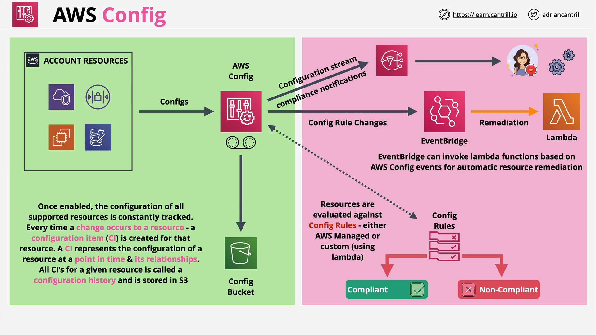

# AWS Config

## Introduction to AWS Config

- **AWS Config** is a service often misunderstood, especially important during the AWS certification exam where quick architectural decisions must be made without external help like Google.
- It has **two primary functions**:
  1. **Recording** changes to AWS resources over time.
  2. **Evaluating** compliance of AWS resources against defined standards.

## Core Functionality of AWS Config

### Resource Change Tracking

- Once enabled, AWS Config **monitors** the configuration of **all resources** in the account.
- When a configuration change happens:
  - A **configuration item** is created.
  - It captures:
    - Current configuration details.
    - Relationships with other resources.
    - The identity of the user/service who made the change.

> **Example:**  
> If a new inbound rule is added to a security group attached to an EC2 instance, AWS Config records:
>
> - Pre-change state.
> - Post-change state.
> - Who made the change.
> - The relationship (attachment to the EC2 instance).

### Key Points

- **Auditability:** Excellent for **auditing** and understanding resource changes.
- **Compliance Checking:** Ensures resources are in compliance with internal standards.
- **No Enforcement:**
  - AWS Config **does not prevent** changes.
  - It **identifies non-compliance** but **does not block** non-compliant configurations.

## Compliance Example

- Example standard: Only certain ports are allowed in security groups.
- You **can** add an insecure port.
- AWS Config will **flag** it as **non-compliant** but **will not block** it.

## Scope and Aggregation

- AWS Config is **regional**:
  - Monitors changes **within a region** and **within an account**.
- **Cross-Region** and **Cross-Account Aggregation** are available.

## Notifications and Integration

- **SNS (Simple Notification Service)**:
  - AWS Config can send notifications about changes or compliance status.
- **EventBridge Integration**:
  - Events like compliance state changes can trigger actions (e.g., invoke Lambda functions).
- **Automatic Remediation**:
  - AWS Config itself does not fix resources.
  - It works with services like **Lambda**, **EventBridge**, and **Systems Manager (SSM)** for remediation.

## Storage of Config Data

- All configuration history is stored:
  - In a designated **S3 bucket** (called a **Config Bucket**).
  - Available for access through:
    - Direct S3 access.
    - AWS Config APIs.

## Standard vs. Optional Features

| Standard (Always On)                | Optional (Additional Functionality)       |
| :---------------------------------- | :---------------------------------------- |
| Enabling AWS Config                 | Defining Config Rules (managed or custom) |
| Recording resource changes          | Automatic remediation actions             |
| Storing configuration history in S3 | Integration with EventBridge and SNS      |

## Config Rules



### AWS Managed Rules

- Predefined rules provided by AWS.

### Custom Config Rules

- Built using **AWS Lambda** functions.
- Logic for compliance evaluation is **coded** inside the Lambda function.

**Workflow of Custom Rules:**

1. Lambda function evaluates the resource.
2. Returns compliant or non-compliant status to AWS Config.
3. AWS Config can:
   - Send notifications via SNS.
   - Trigger remediation actions via EventBridge or SSM.

## Automatic Remediation

- **EventBridge + Lambda**:

  - When a resource becomes non-compliant, EventBridge triggers a Lambda function to fix the issue automatically.

- **Systems Manager (SSM)**:
  - Suitable for remediation actions, especially related to EC2 instances.
  - AWS Config can trigger SSM Automation documents to fix configurations.

## Code Explanation Example (Hypothetical Lambda for Custom Rule)

```python
import json

def lambda_handler(event, context):
    # Parse the event from AWS Config
    configuration_item = event['configurationItem']

    # Extract the security group configuration
    security_group = configuration_item['configuration']

    # Check if SSH (port 22) is open to the world
    for permission in security_group['ipPermissions']:
        for ip_range in permission.get('ipRanges', []):
            if ip_range['cidrIp'] == '0.0.0.0/0' and permission['fromPort'] == 22:
                # Return NON_COMPLIANT if port 22 is open to the world
                return {
                    'compliance_type': 'NON_COMPLIANT',
                    'annotation': 'SSH is open to the world.'
                }

    # If no insecure rule found, return COMPLIANT
    return {
        'compliance_type': 'COMPLIANT',
        'annotation': 'SSH is not open to the world.'
    }
```

### Line-by-Line Code Explanation:

- `import json`: Imports the `json` library (standard in AWS Lambda).
- `lambda_handler(event, context)`: Main entry point for the Lambda function.
- `configuration_item = event['configurationItem']`: Retrieves the configuration item details.
- `security_group = configuration_item['configuration']`: Extracts security group configuration.
- Loops through all IP permissions:
  - Checks if port 22 (SSH) is open to `0.0.0.0/0` (the whole internet).
  - If found, returns **NON_COMPLIANT** with an annotation.
  - If no issues are found, returns **COMPLIANT** with an annotation.

> **Summary:**  
> This Lambda function automatically evaluates a security group's rules to ensure SSH is not exposed to the world.

# Conclusion

- AWS Config is essential for **tracking resource configuration changes** and **auditing compliance**.
- It **does not** enforce rules but provides mechanisms to **alert and automate** corrections.
- Key integrations include **SNS**, **EventBridge**, **Lambda**, and **Systems Manager** for building powerful compliance and remediation workflows.
