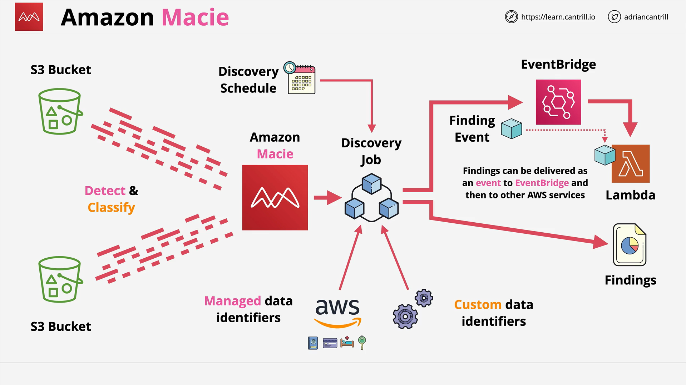

# Amazon Macie

## Introduction to Amazon Macie

Amazon Macie is an advanced data security and data privacy service designed to address the critical need for organizations to maintain visibility and control over sensitive data stored in AWS Simple Storage Service (S3). As one of AWS's foundational and most widely used services, S3 can host enormous quantities of objects ranging from very small to extremely large at massive scale. However, its capability to be configured for public access has historically presented significant security challenges for organizations, making it a potential source of data leakage if improperly configured.

Macie directly addresses these concerns by providing comprehensive capabilities to discover, monitor, and protect data stored within S3 buckets. The primary value proposition of Macie is enabling organizations to develop a thorough awareness of:

- What sensitive data exists in their environment
- The exact content and classification of that data
- The precise location of sensitive data across their AWS infrastructure

This level of visibility is foundational to implementing effective data security governance and compliance protocols.

## Core Functionality and Purpose

Macie operates as a specialized service for data discovery and classification, with particular emphasis on identifying data that falls into regulated or sensitive categories such as:

- **Personally Identifiable Information (PII)**: Data that can be used to identify specific individuals
- **Personal Health Information (PHI)**: Protected health data subject to regulations like HIPAA
- **Financial Data**: Sensitive financial records and identifiers
- **Credentials and Keys**: Critical security components that could enable unauthorized access

More specifically, Macie can detect a wide array of sensitive data types that organizations interact with regularly, including but not limited to:

- AWS Access Keys and secret keys
- SSH Keys and PGP Keys
- Bank account numbers with routing information
- Credit card numbers and expiration dates
- Health insurance identification numbers
- Birth dates and age-related information
- Drivers license and identification numbers
- National insurance and social security numbers
- Passport numbers and government identifiers
- Physical and email addresses
- Proprietary business information

Once enabled, Macie's fundamental purpose is threefold:

1. **Data Discovery**: Identifying where sensitive data resides
2. **Data Classification**: Determining what types of sensitive data exist
3. **Security Monitoring**: Detecting changes to security configurations that might expose data

## Technical Architecture and Implementation



### Data Identification Methodology

Macie employs specialized rules called "data identifiers" to assess S3 objects and their contents. There are two distinct categories of data identifiers, each serving specific purposes:

#### 1. Managed Data Identifiers

These are pre-configured, built-in detection patterns maintained by AWS. They leverage sophisticated detection techniques including:

- **Machine Learning Algorithms**: For contextual analysis and intelligent pattern recognition
- **Pattern Matching**: For identifying known formats of sensitive data
- **Contextual Analysis**: To reduce false positives by examining surrounding content

Managed data identifiers are comprehensively designed to detect sensitive data types across multiple geographic regions and regulatory frameworks. They can identify common patterns for:

- Country-specific identification numbers
- Region-specific personal information formats
- Internationally recognized financial data formats
- Standardized credentials formats

These identifiers undergo regular updates by AWS to improve accuracy and expand coverage of sensitive data types.

#### 2. Custom Data Identifiers

Organizations can create proprietary data identifiers tailored to their specific business requirements. These custom identifiers allow businesses to detect and classify data patterns unique to their operations. The foundation of custom data identifiers includes:

- **Regular Expressions (RegEx)**: Define specific patterns to match within data
- **Keywords**: Optional words or phrases that must appear within proximity to matched patterns
- **Maximum Match Distance**: Configurable parameter defining the character proximity between keywords and regex matches
- **Ignore Words**: Terms that should be excluded from matches to reduce false positives

Custom data identifiers are particularly valuable for identifying organization-specific data such as:

- Employee identification numbers following proprietary formats
- Internal project codes or classification systems
- Custom customer account numbering schemes
- Proprietary document classifications or markings

### Multi-Account Architecture

Macie implements a hierarchical multi-account structure to enable centralized management of security across an organization:

- **Administrator Account**: The central Macie account that manages configuration and monitoring
- **Member Accounts**: Individual AWS accounts brought under Macie management

This structure can be implemented through two primary mechanisms:

1. **AWS Organizations Integration**: Automatically discovering and managing accounts within an organizational structure
2. **Explicit Invitation Method**: Manually inviting individual accounts to join the Macie organization

Once this structure is established, the administrator account gains visibility across all member accounts, allowing centralized:

- Policy setting and enforcement
- Finding collection and analysis
- Compliance reporting

### Discovery Job Workflow

The operational core of Macie is the discovery job process:

1. **Job Creation**: Administrator defines which S3 buckets to analyze
2. **Scheduling Configuration**: Sets when jobs run and at what frequency (one-time or recurring)
3. **Identifier Selection**: Determines which managed and custom data identifiers to apply
4. **Execution**: Macie analyzes the specified buckets according to the schedule
5. **Finding Generation**: Results are produced based on discovered issues
6. **Integration**: Findings can be:
   - Viewed interactively in the AWS Management Console
   - Exported to other AWS services via finding events
   - Used to trigger automated remediation workflows

### Integration with AWS Security Ecosystem

Macie is designed to function as part of a broader security architecture and integrates with:

- **AWS Security Hub**: For centralized security finding management
- **Amazon EventBridge**: For event-driven security automations
- **AWS Lambda**: For serverless remediation functions
- **Amazon CloudWatch**: For monitoring and alerting
- **AWS Organizations**: For multi-account management

## Finding Types and Classification

Macie generates two distinct categories of findings, each providing different insights into potential security concerns:

### 1. Policy Findings

Policy findings are generated when Macie detects changes to S3 bucket configurations that potentially reduce security posture. Importantly, these findings are only generated when changes occur _after_ Macie has been enabled for an account. The specific types of policy findings include:

#### Policy:IAMUser/S3BlockPublicAccessDisabled

This finding indicates that all bucket-level block public access settings were disabled for the bucket. When this occurs, public access to the bucket becomes controlled by:

- Block public access settings at the account level
- Access Control Lists (ACLs)
- The bucket policy
- Other applicable settings and policies

To investigate this finding, Macie provides a detailed breakdown of the bucket's public access settings in the finding details.

#### Policy:IAMUser/S3BucketEncryptionDisabled

This finding signifies that default encryption settings for the bucket were reset to default Amazon S3 encryption behavior.

**Important note**: Since January 5, 2023, Amazon S3 automatically applies server-side encryption with Amazon S3 managed keys (SSE-S3) as the base level of encryption for new objects. Prior to this date, this finding would indicate that default encryption was completely disabled. Currently, it indicates a change from a potentially stronger encryption configuration (such as AWS KMS keys) to the default S3 encryption.

The finding details provide specific information about the previous encryption configuration and the current state.

#### Policy:IAMUser/S3BucketPublic

This finding alerts when an Access Control List (ACL) or bucket policy was modified to allow access by:

- Anonymous users (unauthenticated public access)
- All authenticated AWS Identity and Access Management (IAM) identities

The finding details include specifics about which permissions were changed and how they affect the bucket's security posture.

#### Policy:IAMUser/S3BucketReplicatedExternally

This finding is generated when replication is enabled and configured to copy objects from the monitored bucket to a bucket belonging to an AWS account that's external to the Macie organization.

**Special consideration**: Macie might generate this finding under certain edge conditions even when replication to external accounts isn't configured. This can happen if the destination bucket was created in a different AWS Region during the preceding 24 hours, after Macie's daily metadata refresh cycle.

The finding details include information about the replication configuration and the external accounts involved.

#### Policy:IAMUser/S3BucketSharedExternally

This finding indicates that an ACL or bucket policy was changed to allow the bucket to be shared with an AWS account outside the Macie organization.

**Important caveat**: In some complex policy scenarios, Macie might generate this finding even when the bucket isn't actually shared externally. This can occur when Macie can't fully evaluate the relationship between the Principal element in the bucket policy and certain AWS global condition context keys or Amazon S3 condition keys in the Condition element of the policy.

The finding contains details about the specific policy changes and which external accounts now have access.

#### Policy:IAMUser/S3BucketSharedWithCloudFront

This finding is triggered when the bucket policy was changed to allow sharing with:

- Amazon CloudFront origin access identity (OAI)
- CloudFront origin access control (OAC)
- Both OAI and OAC

This configuration allows users to access the bucket's objects through specified CloudFront distributions.

**Note**: In some cases, Macie generates a Policy:IAMUser/S3BucketSharedExternally finding instead of this one, specifically when:

- The bucket is shared with an external AWS account in addition to CloudFront
- The bucket policy specifies a canonical user ID instead of the Amazon Resource Name (ARN) of a CloudFront OAI

### 2. Sensitive Data Findings

Sensitive data findings are generated when Macie discovers sensitive information in S3 objects during analysis. Unlike policy findings, each sensitive data finding is treated as unique, even if it identifies the same issue in the same object during subsequent scans. The types include:

#### SensitiveData:S3Object/Credentials

This finding indicates that the object contains sensitive credentials data such as:

- AWS secret access keys
- Private keys
- API keys
- Password hashes or credentials

The finding details include the specific types of credentials detected and their location within the object.

#### SensitiveData:S3Object/CustomIdentifier

This finding is generated when the object contains text matching the detection criteria of one or more custom data identifiers. The finding details specify which custom identifiers matched and provide context about the matches.

#### SensitiveData:S3Object/Financial

This finding alerts when the object contains sensitive financial information such as:

- Bank account numbers
- Credit card numbers
- Credit card verification codes
- Credit card expiration dates
- Tax identification numbers

The finding includes details about the types and quantity of financial data discovered.

#### SensitiveData:S3Object/Multiple

This finding indicates that the object contains more than one category of sensitive data — any combination of:

- Credentials data
- Financial information
- Personal information
- Text matching custom data identifiers

The finding provides a comprehensive breakdown of all sensitive data categories and types found within the object.

#### SensitiveData:S3Object/Personal

This finding is generated when the object contains sensitive personal information, which could be:

- Personally identifiable information (PII) such as passport numbers or driver's license IDs
- Personal health information (PHI) such as health insurance or medical identification numbers
- A combination of both PII and PHI

The finding details specify the exact types of personal information detected and their location within the object.

## Custom Data Identifier Configuration

Custom data identifiers provide flexible pattern matching capabilities tailored to organization-specific needs. Their configuration involves several key components:

### 1. Regular Expression (RegEx) Pattern

This is the foundation of a custom data identifier, defining the text pattern to match. Regular expressions can be simple or highly complex depending on the data pattern being targeted. For example:

```
[A-Z]{2}-\d{2}
```

This pattern would match text containing two uppercase letters followed by a hyphen and then two digits (e.g., "AB-12").

### 2. Keywords (Optional)

Keywords are words or phrases that must appear within a specified proximity to text that matches the regex pattern. They help reduce false positives by requiring contextual indicators. Examples might include:

- "Employee ID:" near an employee number pattern
- "Account:" near an account number pattern
- "SSN:" near a social security number pattern

### 3. Maximum Match Distance (Optional)

This defines the maximum number of characters allowed between a keyword and text that matches the regex pattern. For example, setting this to 20 would require any specified keywords to appear within 20 characters of the regex match.

### 4. Ignore Words (Optional)

These are words or phrases that, when present, cause Macie to exclude that particular match from results. Ignore words help reduce false positives by excluding common legitimate uses of patterns that might otherwise match sensitive data patterns. Examples might include:

- "EXAMPLE" when looking for credit card numbers
- "TEST-ONLY" when looking for account numbers
- "DEMO" when looking for identification numbers

### 5. Severity Settings (Optional)

Custom severity configurations allow organizations to define how the severity of findings should be determined based on the number of occurrences of matches. By default, all findings from custom data identifiers receive Medium severity, but this can be customized with thresholds:

- Low: For occurrences below a specified threshold
- Medium: For occurrences between specified thresholds
- High: For occurrences above a specified threshold

## Managed Data Identifiers in Detail

Macie's managed data identifiers use sophisticated techniques to detect a comprehensive range of sensitive data types. These identifiers are categorized into three main groups:

### 1. Credentials Data

Managed data identifiers in this category detect various types of security credentials:

- **AWS Secret Access Keys**: Detects active and rotated keys
- **AWS API Keys**: Various API authentication tokens
- **Private Keys**: Including SSH private keys, PGP private keys, and other cryptographic keys
- **Basic Authentication Headers**: Base64-encoded credentials
- **JSON Web Tokens (JWTs)**: Authentication tokens following JWT format
- **Password Hashes**: Various formats of stored password hashes

### 2. Financial Information

This category includes identifiers for sensitive financial data:

- **Credit Card Numbers**: Supporting major card providers (Visa, Mastercard, American Express, etc.)
- **Credit Card Verification Values**: CVV, CVV2, CVC codes
- **Bank Account Numbers**: For multiple countries and banking systems
- **Bank Routing Numbers**: ABA and international routing codes
- **SWIFT Codes**: International bank identifier codes
- **Tax Identification Numbers**: Various country-specific tax IDs

### 3. Personal Information

This extensive category covers both PII and PHI:

**PII:**

- **National Identification Numbers**: SSN, National Insurance Numbers, etc.
- **Passport Numbers**: For multiple countries
- **Driver's License Numbers**: Region-specific formats
- **Electoral Roll Numbers**: Voter registration identifiers
- **Full Names**: Various name formats
- **Email Addresses**: Various email address formats
- **Telephone Numbers**: Country and region-specific formats
- **Postal Addresses**: Structured and unstructured address formats
- **Date of Birth Information**: Various date formats

**PHI:**

- **Health Insurance Numbers**: Including Medicare, Medicaid, and private insurance
- **Healthcare Common Procedure Coding System (HCPCS) Codes**
- **Current Procedural Terminology (CPT) Codes**
- **National Drug Codes (NDC)**
- **Medical Record Numbers**
- **Health Insurance Claim Numbers (HICN)**

## Data Storage and Retention

Macie manages findings with specific retention and update policies:

- **Storage Duration**: All findings are stored for 90 days
- **Policy Finding Updates**: If Macie detects subsequent occurrences of an existing policy finding, it updates the existing finding by:
  - Adding details about the subsequent occurrence
  - Incrementing the occurrence count
  - Updating the last detected timestamp
- **Sensitive Data Findings**: All sensitive data findings are treated as new (unique) even if they detect the same issue in the same object

## Supported File Types and Formats

Macie can analyze various S3 object types including:

### Storage Classes:

- Standard
- Standard-IA (Infrequent Access)
- One Zone-IA
- Reduced Redundancy Storage (RRS)
- Intelligent-Tiering

### File Formats:

- **Non-binary Files**: CSV, JSON, TXT, etc.
- **Archives**: ZIP, TAR, GZIP, etc.
- **Microsoft Office**: DOCX, XLSX, PPTX, etc.
- **Open Document Format**: ODT, ODS, etc.
- **Adobe PDF**: Both text and image-based PDFs
- **Email**: PST, MBOX, etc.
- **Databases**: Avro data, Parquet files

### Special Analysis Capabilities:

- **Embedded Objects**: Macie can analyze files within archives
- **Nested Content**: Documents embedded within other documents
- **Multi-layer Archives**: Archives within archives up to a certain depth

## Operational Considerations

### Performance and Scaling

Macie is designed to scale with the volume of data being analyzed:

- **Concurrent Analysis**: Macie can analyze multiple S3 buckets simultaneously
- **Throttling Controls**: Jobs can be configured with specific run times and bucket allocations
- **Resource Management**: Automatic resource scaling based on workload

### Cost Management

Macie's cost structure includes:

- **Discovery Cost**: Based on the amount of data analyzed
- **Monitoring Cost**: Based on the number of buckets monitored

Strategies for optimizing costs include:

- Focusing on highest-risk buckets
- Using sampling for initial assessment
- Creating targeted jobs based on bucket prefixes
- Implementing lifecycle policies for S3 objects

### Integration Best Practices

For optimal security posture, integrate Macie with:

1. **Security Hub**: For centralized security finding management
2. **EventBridge**: To create automated workflows when findings are generated
3. **Lambda**: For serverless remediation of security issues
4. **CloudWatch**: For monitoring and alerting on Macie activities
5. **Step Functions**: For complex remediation workflows
6. **S3 Lifecycle Policies**: To address objects with sensitive data
7. **AWS Config**: For compliance and configuration monitoring

## AWS Exam Considerations

For the AWS Certified Security Specialty or Solutions Architect exams, understand:

1. When Macie is the appropriate tool versus other AWS security services
2. How Macie integrates with the broader AWS security ecosystem
3. The differences between policy findings and sensitive data findings
4. How to interpret and respond to different finding types
5. The capabilities and limitations of managed versus custom data identifiers
6. Multi-account architecture considerations and best practices
7. How Macie can be used as part of a comprehensive data security strategy

## Conclusion

Amazon Macie provides a robust solution for discovering, classifying, and protecting sensitive data stored in S3 buckets. Its comprehensive capabilities for both automated discovery through managed data identifiers and customizable options through custom data identifiers make it a vital component of AWS security architecture. The service's integration with other AWS security services enables automated remediation workflows and centralized security management, providing organizations with the tools needed to maintain control over their data security and meet compliance requirements.

Understanding Macie's capabilities, configuration options, and integration points is essential for AWS security professionals, as it represents a critical component in the broader AWS security ecosystem, particularly for data protection and compliance requirements.
