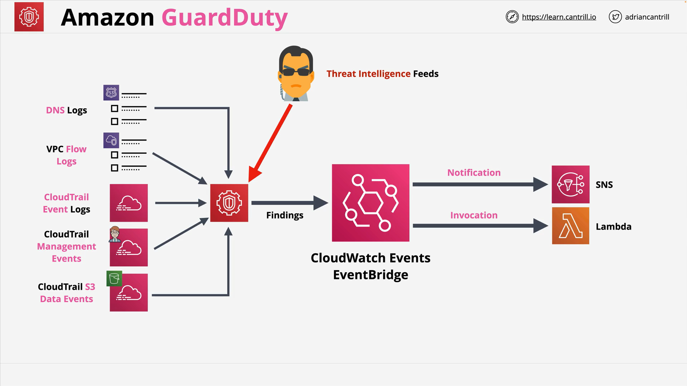

# Amazon GuardDuty

_Amazon GuardDuty_ is a **continuous security monitoring service** designed to help protect AWS accounts and resources from security threats.

## Purpose of Amazon GuardDuty

- Provides **continuous monitoring** for detecting:
  - **Unexpected** or **unauthorized activity** within AWS accounts.
- Works **intelligently** without the need for users to manually define what constitutes "normal" activity.
- Uses:
  - **Machine Learning (ML)** models.
  - **Artificial Intelligence (AI)**.
  - **Threat intelligence feeds** (AWS, third-party sources, public feeds).

## How Amazon GuardDuty Works

- **Constantly reviews** integrated data sources for suspicious activity.
- Learns **normal activity patterns** automatically.
- Allows for **manual adjustments** (e.g., whitelisting specific IPs).

### Findings

- When suspicious or unexpected behavior is detected, it generates a **finding**.
- Findings can:
  - Trigger **notifications**.
  - Initiate **event-driven protection** and/or **automatic remediation**.

## Event-Driven Response

GuardDuty findings can integrate with AWS services to automate security responses:

1. **EventBridge** (formerly CloudWatch Events):
   - Receives GuardDuty findings.
2. **SNS (Simple Notification Service)**:
   - Notifies security teams or systems.
3. **AWS Lambda**:
   - Executes remediation tasks automatically, such as:
     - Modifying security groups.
     - Adding explicit deny rules to network ACLs.
     - Disabling compromised credentials.

## Multi-Account Management

GuardDuty supports managing multiple AWS accounts from a **single master account**:

- **Master Account**:
  - The account where GuardDuty is enabled and control is centralized.
- **Member Accounts**:
  - Other AWS accounts invited to join and monitored from the master account.

This structure enables **centralized security visibility** and management across organizations.

## Data Sources Integrated with GuardDuty

At the time of this lesson creation, GuardDuty consumes the following data sources:

| Data Source | Description |
| - | |
| **Route 53 DNS Logs** | DNS queries made from AWS resources. |
| **VPC Flow Logs** | Metadata about IP traffic moving through VPCs. |
| **CloudTrail Event Logs** | API activity across the AWS account. |
| **CloudTrail Management Events** | Control plane operations (e.g., creating/deleting resources). |
| **CloudTrail S3 Data Events** | Access events for S3 objects (read/write operations).

All these logs, combined with threat intelligence feeds, are analyzed to produce **findings** about potential security issues.

## Typical Workflow Diagram

## Important Exam Notes

- GuardDuty is primarily discussed in **Security Specialty exams**.
- Key concepts to remember:
  - **Continuous monitoring** without manual baselines.
  - **Threat intelligence feeds integration**.
  - **Findings** trigger **automatic notification and remediation**.
  - **Multi-account master-member architecture**.
  - **Event-driven security responses** via EventBridge, SNS, and Lambda.

# Final Thoughts

This lesson provided a **fundamental understanding** of Amazon GuardDuty. It is crucial for **real-world AWS security monitoring** and may appear in more **specialized AWS certifications**.

The service significantly **reduces manual effort** in detecting and responding to security issues by **automating detection and response** through integration with native AWS services.
