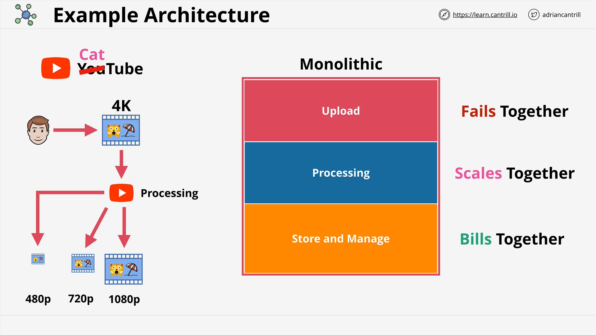
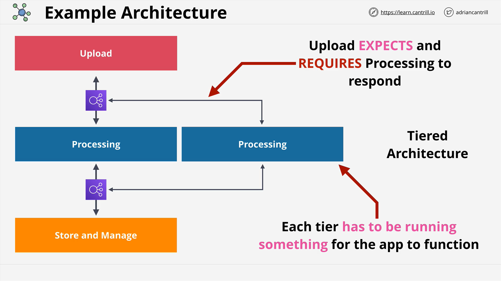

# AWS Solutions Architect Associate - Cantrill.io

## Module: Event-Driven Architecture (Part 1)

## Introduction to Architecture in AWS

As a Solutions Architect, choosing the right architecture is crucial for designing solutions that align with specific business requirements. This lesson introduces **event-driven architecture**, compares it with **monolithic** and **tiered** architectures, and sets the foundation for building scalable, resilient, and efficient systems.

## Example Use Case: CatTube

To illustrate architectural styles, an example is used:

- **CatTube** is a fictional video-sharing platform where users (like Bob) upload videos.
- When a video is uploaded:
  - It is converted into multiple resolutions (e.g., 1080p, 720p, 480p).
  - This conversion process is **resource-intensive**.
  - The platform also needs to support:
    - Displaying videos
    - Managing playlists and channels
    - Storing and retrieving data from databases

## Monolithic Architecture

### Overview

- A **single, tightly-coupled unit** containing all application components.
- Example components:
  - Upload handler
  - Processing engine
  - Storage and management

### Key Characteristics

1. **Single Codebase**:
   - All functionality in one deployable unit.
2. **Failure Impact**:
   - One component failure affects the entire system.
3. **Tight Coupling**:
   - Components expect direct interaction.
4. **Vertical Scaling Only**:
   - To improve performance, the entire system must scale.
5. **Always-On Resource Usage**:
   - All parts must be active and pre-provisioned.
   - Resources are always consumed—even if unused.

### Drawbacks

- **Poor fault isolation**
- **Inefficient resource use**
- **Scalability limitations**
- **High cost**

## Tiered Architecture (n-Tier)

### Evolution from Monolith

- The monolith is **decomposed into logical tiers**:
  - Upload Tier
  - Processing Tier
  - Storage Tier

### Characteristics

- Tiers **may be hosted on the same or different servers**.
- Each tier **communicates directly with the next**.
- Example: Upload → Processing → Storage

### Benefits

1. **Independent Vertical Scaling**:
   - For example, increase CPU on processing tier only.
2. **Better Modularity**:
   - Still tightly coupled, but clearer separation of concerns.

### Example from the Course

- WordPress deployment:
  - Application (Apache + WordPress) on EC2
  - Database on Amazon RDS

Still, both parts must communicate—tight coupling persists.

## Tiered Architecture with Load Balancers

### Architecture Enhancement

- Introduces **internal load balancers** between tiers.

### Benefits

1. **Horizontal Scaling**:
   - More instances of a tier can be added.
2. **High Availability**:
   - If one instance fails, others handle the load.
3. **Abstraction**:
   - Tiers don’t know how many instances exist on the other side.

### Example Flow

- Upload Tier → **Load Balancer** → Processing Tier
- Store Tier → **Load Balancer** → Processing Tier

### Benefits Recap

- Enables both vertical and horizontal scaling.
- Resilient to instance failures.

## Limitations of Load-Balanced Tiered Architecture

1. **Tight Coupling Remains**:
   - Upload tier still requires a response from the processing tier.
   - If the processing tier fails entirely, the upload tier also fails.
2. **Always-On Requirement**:
   - Processing tier **must have at least one running instance**.
   - You cannot scale down to zero due to **synchronous communication**.

### Summary

- This architecture improves upon the monolith and basic tiered designs.
- Still limited in:
  - **Decoupling**
  - **Resource optimization**
  - **Scalability to zero**

## Next Steps

The lesson ends here with a pause before diving into **Part 2**, where event-driven architecture will likely be introduced as a solution to these limitations.

Stay tuned for:

- Decoupling using asynchronous patterns
- Scaling to zero with event-driven services
- More resilient designs using AWS-native services
