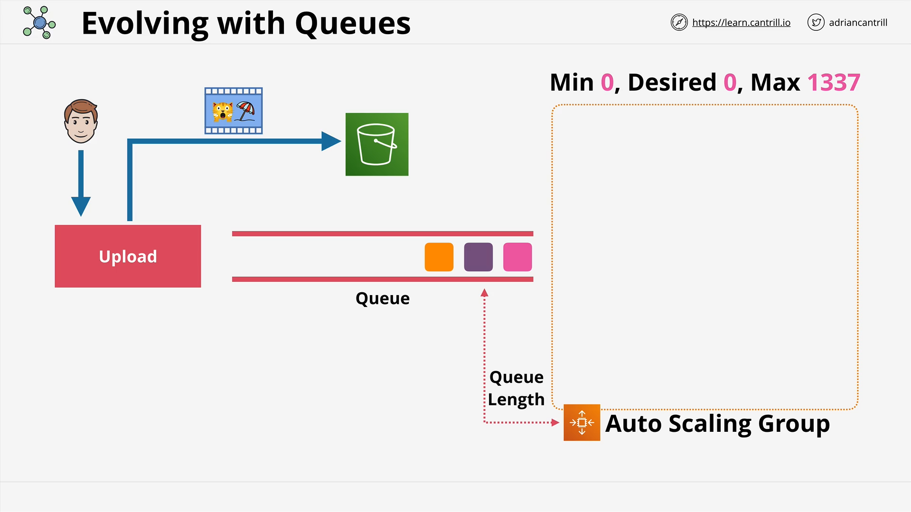
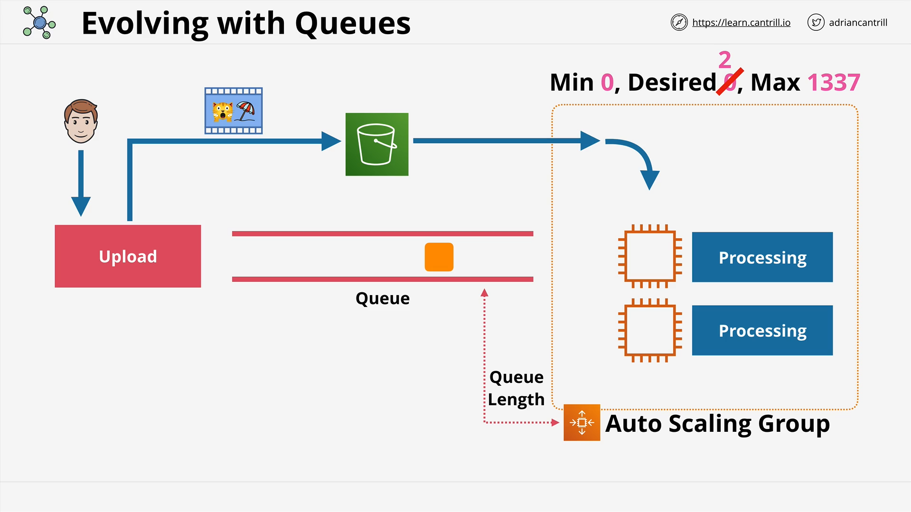
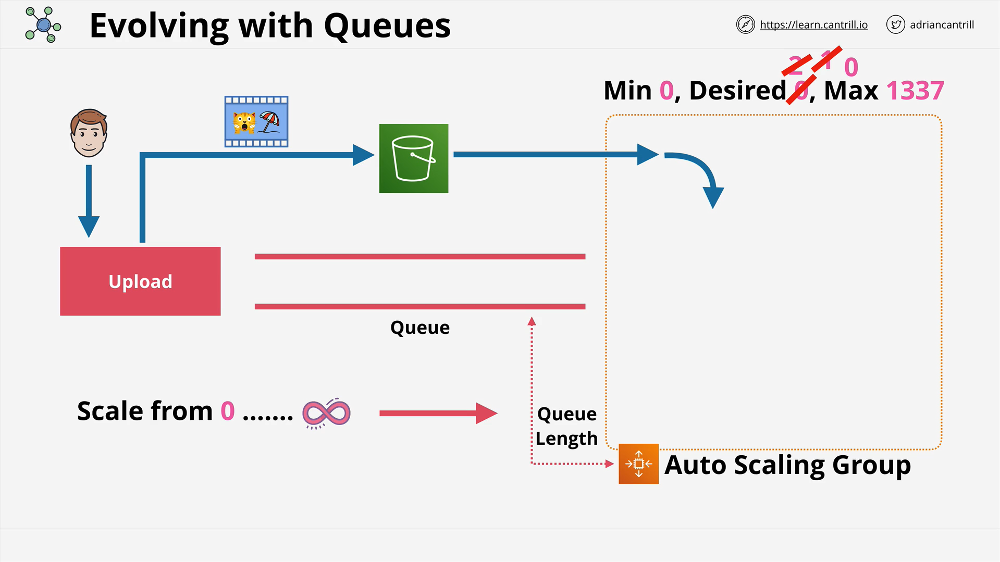
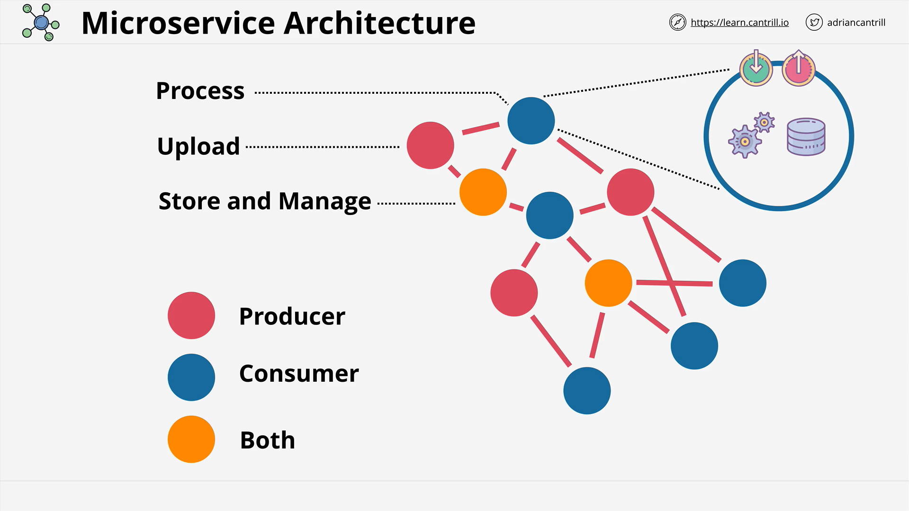
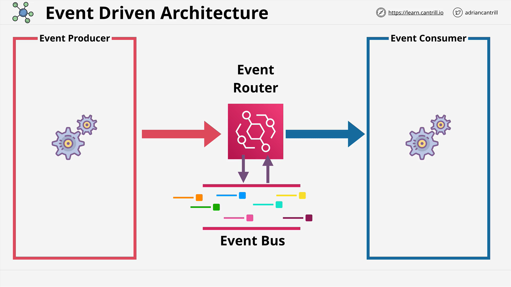

# Part 2 – Evolving Architecture with Queues and Event-Driven Design

## Overview

This lesson expands on the architecture discussed in Part 1 by introducing **message queues** and how they support **decoupled and event-driven architectures** in AWS. The core concepts revolve around improving system scalability, reliability, and efficiency by introducing asynchronous communication patterns.

## Queue-Based Decoupled Architecture

### What is a Queue?

A **queue**:

- Accepts and stores **messages**.
- Uses **FIFO (First-In, First-Out)** ordering, though not always guaranteed.
- Allows **decoupling** between application components (tiers).

### Revised Architecture Using a Queue

1. **Upload Tier**:

   - User (e.g., Bob) uploads a video (e.g., "Whiskers on the Beach").
   - The video is stored in an **Amazon S3** bucket.
   - A **message** is added to a **queue** with metadata (e.g., S3 location, required output formats).

2. **Queue Characteristics**:

   - Ensures **ordered** processing (FIFO).
   - **Upload tier is unaware** of whether the processing tier is functioning.
   - This decouples the upload tier from processing, enabling **asynchronous** communication.

3. **Processing Tier**:

   - Comprised of an **Auto Scaling Group**.
   - Scaling policies are based on **queue length**.
   - Minimum size = `0`, Desired = `0`, Max = `1337`.

4. **Queue-Triggered Processing**:

   - As messages appear in the queue, the Auto Scaling Group increases desired capacity (e.g., to 2).
     

   - EC2 instances launch, **poll the queue**, and retrieve the master video from S3.
   - After processing (e.g., transcoding), messages are deleted from the queue.
   - Once the queue is empty, the Auto Scaling Group scales back to 0.
     

## Benefits of Decoupling with Queues

- **Loose coupling**: Upload and processing tiers are unaware of each other’s status.
- **Independent scaling**: Tiers can scale independently based on demand.
- **Fault isolation**: Failures in one component don't immediately affect others.
- **Resource efficiency**: No idle compute if there’s no work in the queue.

## Transition to Microservices

### From Monolith to Microservices

Breaking a monolithic application into microservices allows for:

- **Focused functionality**: Each service does one thing well.
- **Scalability**: Services can scale independently.
- **Isolation**: Easier debugging, deployment, and upgrades.

**Example microservices** in Catch-U:

- Upload microservice (Producer)
- Processing microservice (Consumer)
- Store/Manage microservice (Producer and Consumer)

## Introduction to Event-Driven Architecture (EDA)

### Key Components

- **Producers**: Generate events in response to actions (e.g., user click, system error).
- **Consumers**: Listen for specific events and respond by performing an action.
- **Events**: Data representing something that occurred (e.g., “Video uploaded”).

### Event Communication Models

#### Using Queues

- Services communicate using **point-to-point** queues.
- Can become **complex** with many microservices due to excessive queue management.

#### Using an Event Bus (Event Router)

- A central hub for event distribution.
- **Producers** publish events to the **event bus**.
- **Consumers** subscribe to events of interest.
- Simplifies architecture and reduces inter-service dependencies.

## Serverless Behavior in EDA

Event-driven systems:

- **Don’t run continuously**.
- Only **consume resources when events occur**.
- Can scale from **zero to many instances** in response to events.
- Example: AWS Lambda functions triggered by S3 uploads, DynamoDB streams, or EventBridge events.

## Summary of EDA Benefits

| Feature               | Benefit                                     |
| --------------------- | ------------------------------------------- |
| Asynchronous Handling | No blocking between producers/consumers     |
| Auto Scaling          | Reacts to demand dynamically                |
| Resource Efficiency   | No idle compute                             |
| Loose Coupling        | Components don’t rely on each other's state |
| Centralized Routing   | Simplified communication via event bus      |

## Final Thoughts

- Understanding the **evolution of architecture** is critical for both the exam and real-world systems.
- This theory forms the foundation for AWS services like **SQS**, **SNS**, **EventBridge**, **Lambda**, and **Step Functions**.
- Upcoming lessons will build on this to explore AWS-specific implementations.
