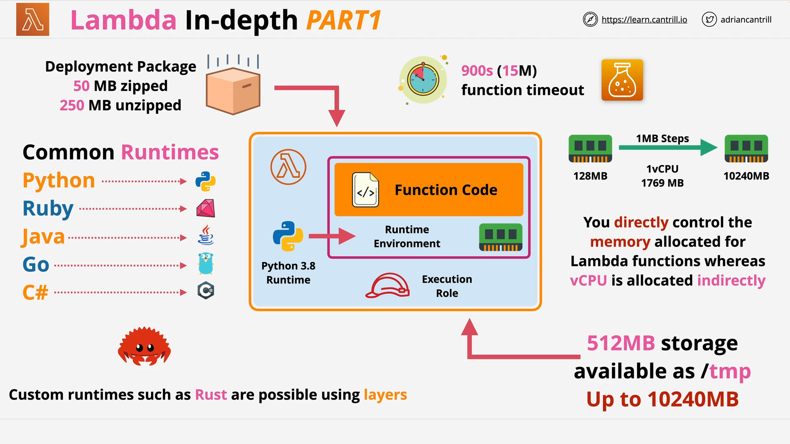

# AWS Lambda Deep Dive - Part 1

## What Is AWS Lambda?



**AWS Lambda** is a _Function-as-a-Service (FaaS)_ that allows you to run small, focused pieces of code without provisioning or managing servers.

### Key Characteristics:

- **Event-driven** and **stateless**
- Only billed for execution time (based on memory allocation and function duration)
- Runs in a **runtime environment** tailored to a specific **language version**

## Lambda Runtime Environment

When a Lambda function is invoked:

- A **new runtime environment** is created.
- Your **deployment package** (code + dependencies) is loaded and executed.
- The environment is **stateless** — no data persists between invocations.

### Supported Runtimes:

- Python (various versions)
- Node.js
- Java
- Ruby
- Go
- C#
- **Custom runtimes** via **Lambda Layers**

## Runtime Configuration

### Choosing a Runtime

You must define:

- The **runtime version** (e.g., `python3.8`)
- The **deployment package**
- The **memory allocation**

> The more memory you allocate, the more **vCPUs** are proportionally assigned.

### Resource Configuration

| Resource        | Notes                                    |
| --------------- | ---------------------------------------- |
| **Memory**      | 128 MB – 10,240 MB (1 MB increments)     |
| **vCPU**        | Scales **linearly** with memory          |
| **Disk Space**  | 512 MB (`/tmp`) default, up to 10,240 MB |
| **Max Timeout** | 900 seconds (15 minutes)                 |

> ✅ You must remember the 15-minute timeout for the **exam**.

## Lambda vs Docker

- **Traditional Docker** (e.g., ECS) ≠ **Lambda**
- You _can_ use Docker _images_ with Lambda, but it's **not traditional Docker usage**
- For the exam: If you see **Docker**, it typically refers to **ECS**/**EKS** (not Lambda)

## Lambda Function Lifecycle

### Example Invocation Flow:

1. Event triggers the Lambda function.
2. A new runtime is provisioned.
3. The code is executed.
4. The environment is destroyed.

This means:

- No leftover state
- Every function run starts "fresh"
- Use `/tmp` for **temporary** files only

## Execution Role (IAM)

Lambda functions need permissions to interact with other AWS services:

- This is done through an **Execution Role**
- Defined using **IAM roles**
- The role is **assumed by the function** at runtime

```yaml
# Example of IAM execution role policy (YAML-style representation)
{ "Version": "2012-10-17", "Statement": [{ "Effect": "Allow", "Action": "s3:PutObject", "Resource": "arn:aws:s3:::my-bucket/*" }] }
```

### Explanation:

- `Action`: What the Lambda can do (e.g., upload files)
- `Resource`: Which resources it can access (e.g., a specific S3 bucket)
- This is **attached to the function** during creation

## Use Cases for AWS Lambda

### 1. **Serverless Web Applications**

- Using **API Gateway**, **Lambda**, and **S3**
- Typical use case: Static website + backend logic

### 2. **File Processing**

- S3 triggers Lambda on file upload
- Common task: Image watermarking or resizing

### 3. **Database Triggers**

- **DynamoDB Streams** trigger Lambda on table changes (Insert/Update/Delete)

### 4. **Scheduled Tasks (Cron Jobs)**

- Use **EventBridge** or **CloudWatch Events**
- Schedule periodic tasks (e.g., nightly backups)

### 5. **Real-Time Stream Processing**

- Lambda reads from **Kinesis Streams**
- Scales based on incoming data volume

## Important Exam Points

| Concept             | Notes                                                      |
| ------------------- | ---------------------------------------------------------- |
| **Stateless**       | Lambda functions don’t retain state between runs           |
| **Cold Start**      | First invocation may be slower due to environment creation |
| **Docker ≠ Lambda** | Docker in exam usually means ECS/EKS                       |
| **Max Timeout**     | 900 seconds (15 mins)                                      |
| **Execution Role**  | IAM role attached to Lambda for service permissions        |
| **Memory & CPU**    | More memory = more vCPU                                    |
| **/tmp directory**  | Use for temporary storage only                             |

## Summary

Lambda is:

- Ideal for **short-lived**, **event-driven**, **scalable** workloads
- Priced on **usage**, not uptime
- Stateless, so code must always be ready to run from scratch
- Highly integrated into AWS ecosystem (e.g., S3, API Gateway, DynamoDB, Kinesis)
